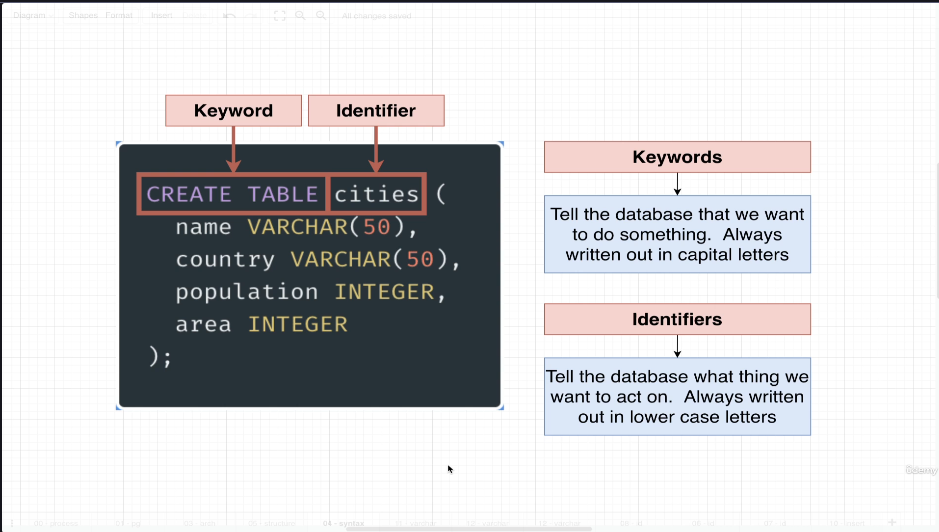
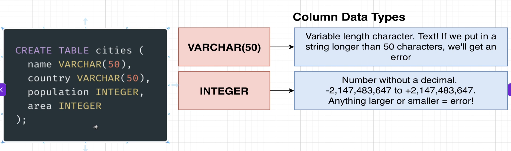
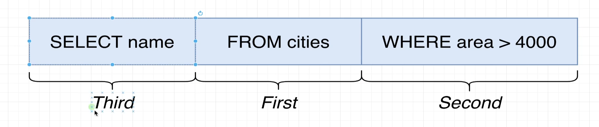
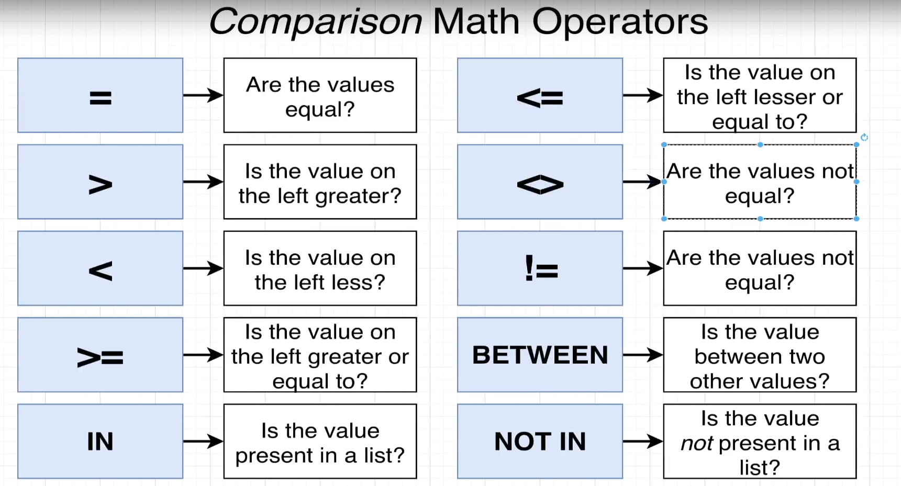
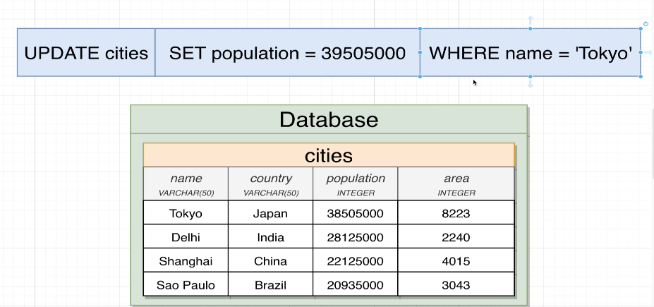
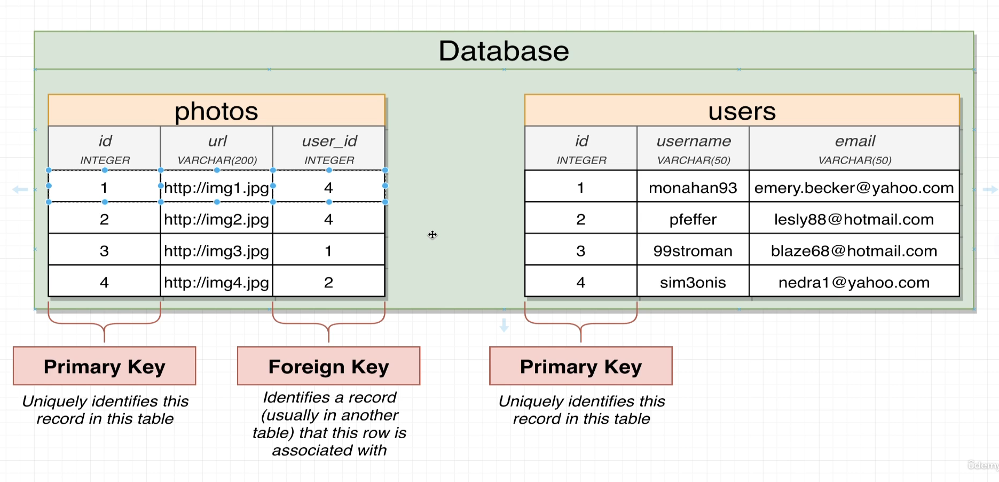
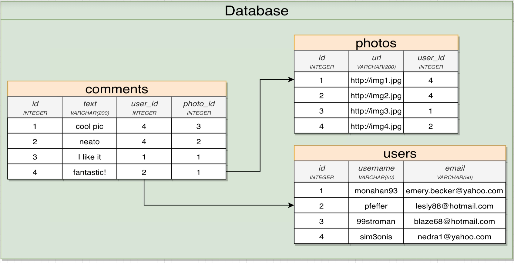
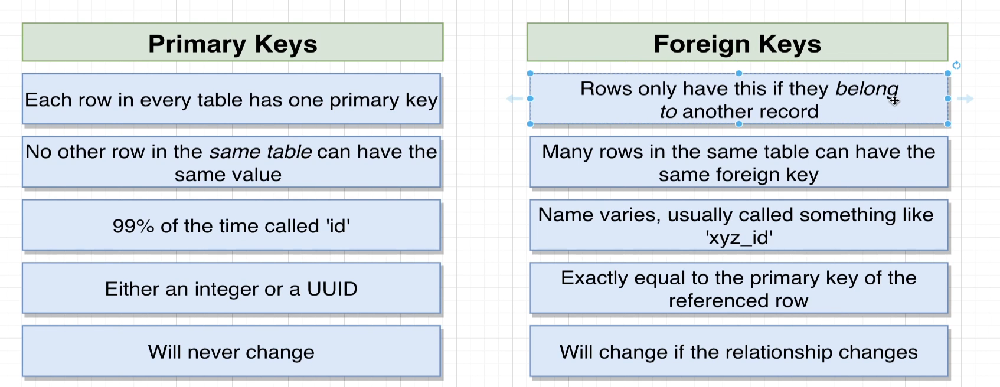
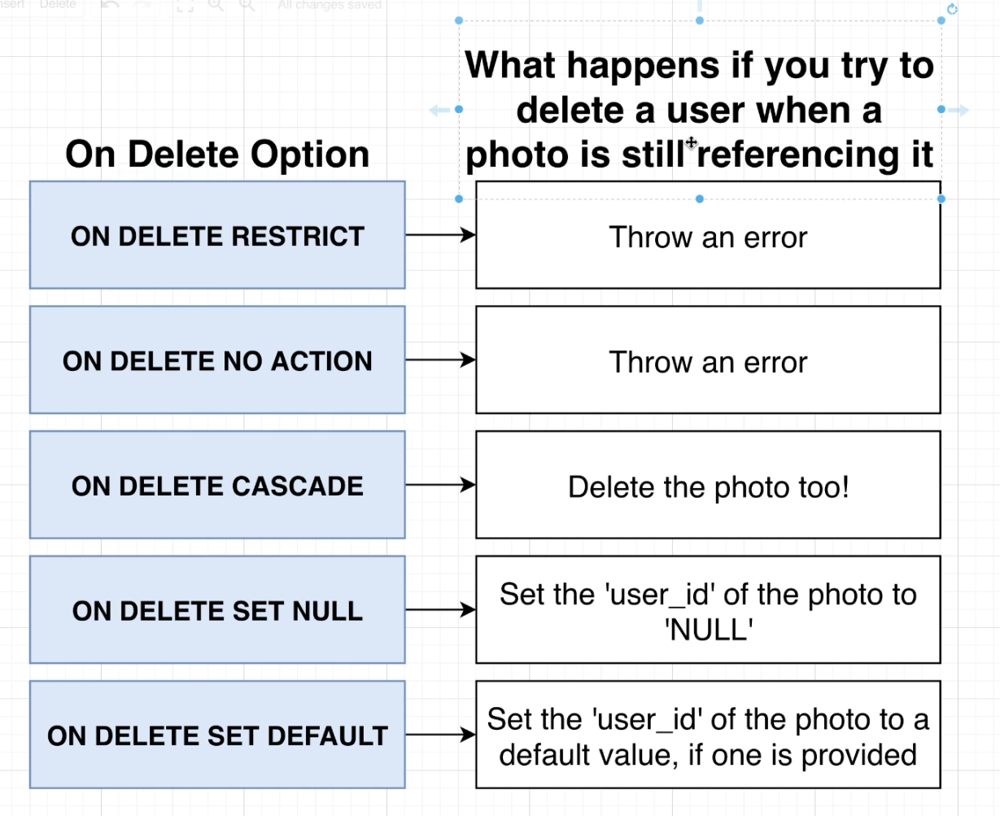

*** Course Name: SQL and PostgreSQL: The Complete Developer's Guide

# Section 1

## Creating a table :
```sql
CREATE TABLE table_name (
    column1 datatype PRIMARY KEY,
    column2 datatype,
    column3 datatype,
   ....
);
```

## Analysing the table structure :

1. keyword & identifier:


2. Coloumns data type:


## Inserting data into table :
```sql
INSERT INTO
  cities(name, country, population, area)
VALUES
  ('Delhi', 'India', 285000000, 2240),
  ('Shanghai', 'China', 22125000, 4015),
  ('Sao Paulo', 'Brazil', 203043000, 3043); 
```
## Retrieving data from table :
```sql
SELECT * FROM cities;
```

## Filtering data :
also we can use WHERE clause to filter data
```sql
SELECT * FROM cities WHERE country='India';
```

## Calculate columns:
SELECT
  name,
  population / area AS population_density
FROM
  cities;   

## String operations:

1. Concatenation:
```sql
SELECT
  name || ' , ' || country AS location
FROM
  cities;
```
2. CONCAT function:
```sql
SELECT
  CONCAT(name, ' - ', country) AS location
FROM
  cities;
```

3. uppercase and lowercase:
```sql
SELECT
  UPPER(CONCAT(name, ' - ', country)) AS location
FROM
  cities;
```


# Section 2 : Filtering records

## Filtering with WHERE clause:
```sql
SELECT
  name,
  area
FROM
  cities
WHERE
  area > 4000;
```
Working of Query:


```sql
SELECT
  name,
  area
FROM
  cities
WHERE
  area != 4015;
```

Comparison Operators:


* between operator:
```sql
SELECT
  name,
  population
FROM  cities
WHERE
  population BETWEEN 2000000 AND 25000000;
```

* IN operator: Is the value present in the list of values
```sql
SELECT
  name,
  country
FROM  cities
WHERE
  country IN ('India', 'China');
```

* Not IN operator:
```sql
SELECT
  name,
  country
FROM  cities
WHERE
  country NOT IN ('India', 'China');
```

## Calculating with WHERE clause:
```sql
SELECT
	name,
  population / area AS population_density
FROM
	cities
WHERE
	population / area > 6000;
```

## updating Rows or Records:
```sql
UPDATE cities
SET population = 30000000
WHERE name = 'Delhi';
```

Output:
 UPDATE successful!
1 row(s) updated

x   

## Deleting rows or records:
```sql
DELETE FROM cities
WHERE name = 'Sao Paulo';
```

# Section 3 : Working with Tables

## Database For a Photo Sharing App:
This will contains 4 tables:
1. users
2. photos
3. comments
4. likes

Note: To get DB design, search like "sql schema upvote system"
To get relationship :


## Primary Key and Foreign Key:
1. Primary Key: A primary key is a column or a set of columns that uniquely identifies each row in a table. It must contain unique values and cannot contain NULL values. A table can have only one primary key, which can consist of single or multiple columns (composite primary key).
2. Foreign Key: A foreign key is a column or a set of columns in one table that refers to the primary key in another table. It establishes a relationship between the two tables and ensures referential integrity. A foreign key can contain duplicate values and can also contain NULL values.



Note: The 'many' side of the realtionship gets the foreign key

ex: For above photo has many comments, so the foreign key will be in the comments table and it will refer to the primary key of the photos table. so, comment table has photo_id as foreign key which will refer to the primary key of photos table.
Also users can have many comments, so the foreign key will also be in the comments table and it will refer to the primary key of the users table. so, comment table has user_id as foreign key which will refer to the primary key of users table.



primary key vs foreign key:



* Auto generating primary key values (ID for users, photos, comments, likes):
```sql
CREATE TABLE users(
  id SERIAL PRIMARY KEY,
  username VARCHAR(50)
);
```
serial data type will automatically generate unique integer values for the id column, starting from 1 and incrementing by 1 for each new record inserted into the users table.

* Creating foreign key relationships:
```sql
CREATE TABLE photos(
  id SERIAL PRIMARY KEY,
  url VARCHAR(200),
  user_id INTEGER REFERENCES users(id)
);
```
In this example, the user_id column in the photos table is defined as a foreign key that references the id column in the users table. This means that any value inserted into the user_id column must correspond to an existing id in the users table, ensuring referential integrity between the two tables.

* Find all the photos created by a specific user:
```sql
SELECT
  *
FROM
  photos
WHERE
  user_id = 4;
```

* List all the photos with details about associated user for each photo:
```sql
SELECT url, username FROM photos
JOIN users ON users.id = photos.user_id;
```

## Foreign Key Constraints:
* Inseting a photo with non existing user_id (we inserted a photo with user_id 999 but there is no user with id 999 in users table):
```sql
INSERT INTO photos (url, user_id) VALUES ('http://example.com/photo1.jpg', 999);
```
Output:
ERROR:  insert or update on table "photos" violates foreign key constraint "photos_user_id_fkey"
DETAIL:  Key (user_id)=(999) is not present in table "users".

* Inserting a photo which is not tied to any user (we inserted a photo with user_id as NULL):
```sql
INSERT INTO photos (url, user_id) VALUES ('http://example.com/photo2.jpg', NULL);
```
Output:
INSERT SUCCESSFUL!

## Constraints on Deletion:


What happens if we try to delete a user who has photos associated with them?

These are the options we have for handling this situation:


RESTRICT: This is the default behavior. It prevents the deletion of a user if there are any photos associated with that user. If you try to delete a user who has photos, you will get an error message indicating that the deletion cannot be performed due to the existing foreign key constraint.
```sql
DELETE FROM users WHERE id = 4;
```
Output:
ERROR:  update or delete on table "users" violates foreign key constraint "photos_user_id_fkey" on table "photos"

### On delete cascade: This option allows you to automatically delete all photos associated with a user when that user is deleted. If you choose this option, when you delete a user, all photos that have a foreign key reference to that user will also be deleted.
```sql
CREATE TABLE photos(
  id SERIAL PRIMARY KEY,
  url VARCHAR(200),
  user_id INTEGER REFERENCES users(id) ON DELETE CASCADE
);
```

### On delete set null: This option allows you to set the foreign key reference to NULL for all photos associated with a user when that user is deleted. If you choose this option, when you delete a user, all photos that have a foreign key reference to that user will have their user_id set to NULL.
```sql
CREATE TABLE photos(
  id SERIAL PRIMARY KEY,
  url VARCHAR(200),
  user_id INTEGER REFERENCES users(id) ON DELETE SET NULL
);
```

# Section 4 : Relating Records with Joins

# Section 5 : Aggregation of Records

# Section 6 : Working with Large Datasets

# Section 7 : Sorting Records

# Section 8 : Unions and Intersections with Sets

# Section 9 : Assembling Queries with Subqueries

# Section 10 : Selecting Distinct Records

# Section 11 :  Utility operators, Keywords and Functions

# S