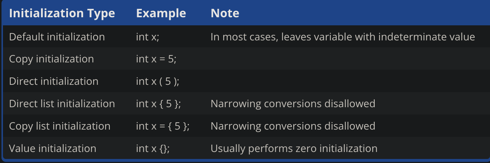
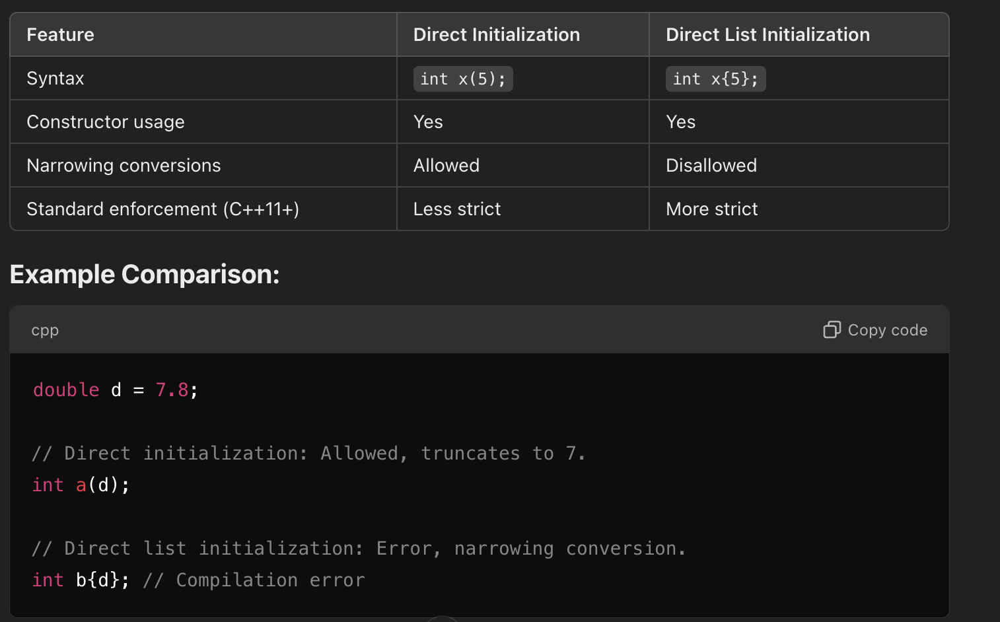
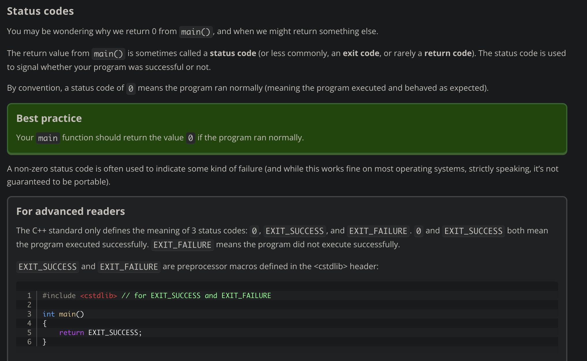

****************************************************************

Note symbols to follow: 
(#) heading
(*) subheading
(->) body title
(-) bullet

****************************************************************

# Compiling and Executing Our Program:--

* Running the Compiler from the CommandLine:

-> for Windows :

    s1 Compiling 
        $ CC prog1.cc

    s2 Run Executuable Program:
        $ prog1
        or
        $ .\prog1

-> for Unix :

    s1. compiling
        $ prog1

    s2 Run Executuable Program
        $ a.out
        or
        $ ./a.out

* How to check status of the program

->In windows:

    $ echo %ERRORLEVEL%

->In unix:

    $ echo $?
    
-> special case:
    
    - Running on GNU Compiler:
        $ g++ -o prog1 prog1.cc

    - for specific standard:`
        $ g++ -std=c++17 -o prog1 prog1.cc
        

# Difference between c++ core language vs Standard library vs STL:

Core features: It is basic fundamental blocks that constitute c++ programming language

Standard library: third party predefined libraries that we are using programm, ex iostream

STL: It is part of the standard library but it is collection of containers (algortithms, iterators helps to navigate through containers)

# Configuring your compiler: Build configurations

1) release configuration : The release configuration is designed to be used when releasing your program to the public.  

This version is typically optimized for size and performance,and doesn't contain the extra debugging information. 

Because the release configuration includes all optimizations, this mode is also useful for testing the performance of 

your code 

2) debug configuration: The debug configuration is designed to help you debug your program, and is generally the one 

you will use when writing your programs. This configuration turns off all optimizations, and includes debugging 

information, which makes your programs larger and slower, but much easier to debug. The debug configuration is usually 

selected as the active configuration by default. 

****************************************************************

# Basic Details:

-> Space taking characters:

    getline(cin,variable_name)

# Operator Details:

-> output Instruction:

    - cout is predefined object

    - (<<) insertion or put to operator 

    - example : cout<<"Hello World"

-> Input Instruction:

    - cin is predefined object

    - (>>) extraction / get from

#endl is manipulator operator

# Reference Variable:

-> It is model type of variable i.e. it is internal pointer

-> Address and referece are said in context of pointer and reference variable.

        int a=10;
        int &b = a;
        b++ == a++;

# variable assignment:

// five() is a function that returns the value 5
int five()
{
    return 5;
}

int main()
{
    int a{ 2 };             // initialize variable a with literal value 2
    int b{ 2 + 3 };         // initialize variable b with computed value 5
    int c{ (2 * 3) + 4 };   // initialize variable c with computed value 10
    int d{ b };             // initialize variable d with variable value 5
    int e{ five() };        // initialize variable e with function return value 5

    return 0;
}

        

************************************************************************************************

# Functions:

-> Functions Declaration are Functions prototypes

-> They are the formal placeholders or variables defined in the function declaration or definition.

-> These arguments form the formal interface of the function, specifying the type and number of inputs the function  expects.

-> They don't hold any value until the function is called and the actual arguments are assigned to them.

-> return_type function_name(int *,int *) when formal arguments are reference variable it is function of call by address

-> return_type function_name(int &,int &) when formal arguments are reference variable it is function of call by     reference.

# inline function: 
    
-> it is request made to compiler to replace function call with functionn definition.

-> Use: inline function_name () during declaration of function.

-> compiler will not accept request:

    - loops,switches,go to...

    - recursive calls

    - contain static variable: (fundamental voilation : Are initialized only once, regardless of how many times the function is called.)

# Status Code:

# Unreferenced parameters

In certain cases, you will encounter functions that have parameters that are not used in the body of the function. These are called unreferenced parameters.

As a trivial example:

void doSomething(int count) // warning: unreferenced parameter count
{
    // This function used to do something with count but it is not used any longer
}

int main()
{
    doSomething(4);

    return 0;
}

Just like with unused local variables, your compiler will probably warn that variable count has been defined but not used.

In a function definition, the name of a function parameter is optional. Therefore, in cases where a function parameter needs to exist but is not used in the body of the function, you can simply omit the name. A parameter without a name is called an unnamed parameter:

    void doSomething(int) // ok: unnamed parameter will not generate warning
    {
    }
The Google C++ style guide recommends using a comment to document what the unnamed parameter was:

    void doSomething(int /*count*/)
    {
    }
Note:
        You’re probably wondering why we’d write a function that has a parameter whose value isn’t used. This happens most often in cases similar to the following:

        Let’s say we have a function with a single parameter. Later, the function is updated in some way, and the value of the parameter is no longer needed. If the now-unused function parameter were simply removed, then every existing call to the function would break (because the function call would be supplying more arguments than the function could accept). This would require us to find every call to the function and remove the unneeded argument. This might be a lot of work (and require a lot of retesting). It also might not even be possible (in cases where we did not control all of the code calling the function). So instead, we might leave the parameter as it is, and just have it do nothing.

