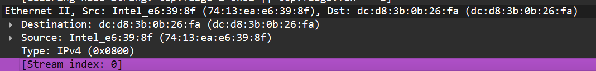
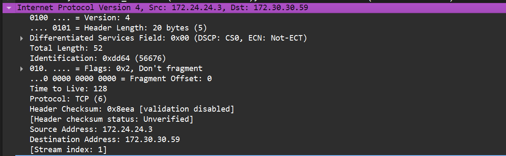
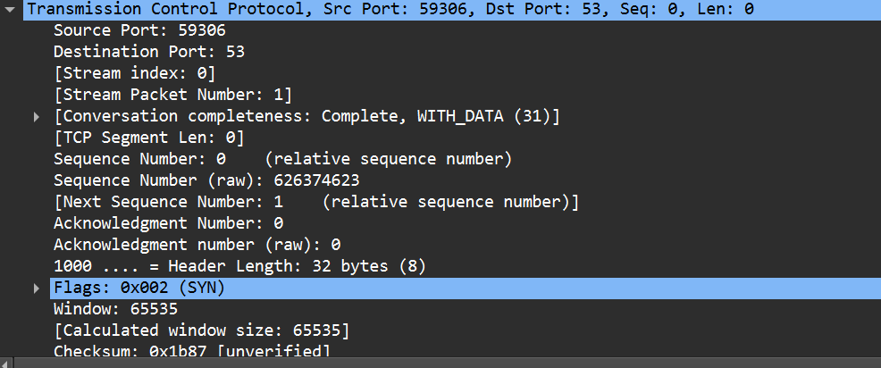

How does Communication Happen in OSI Model?

When a user in New York sends an email to a colleague in London, the process starts at the Application Layer (Layer 7). The user’s email client, such as Outlook, uses SMTP (Simple Mail Transfer Protocol) to handle the email message.
The email is then passed to the Presentation Layer (Layer 6), where it is formatted and encrypted to ensure proper transmission.
Next, the email moves to the Session Layer (Layer 5), where a session is established between the sender’s email server in New York and the receiver’s email server in London. This layer manages the session, keeping the connection open long enough to send the email.
The email data then reaches the Transport Layer (Layer 4), where it is divided into smaller packets. TCP ensures these packets are sent reliably and in the correct order.
At the Network Layer (Layer 3), each packet is assigned source and destination IP addresses, allowing it to be routed through multiple networks, including routers and switches, to reach the recipient in London.
The Data Link Layer (Layer 2) then uses MAC addresses to handle the packets’ journey across local networks and correcting any errors that occur.
Finally, the Physical Layer (Layer 1) converts the data into electrical signals, which are transmitted over fiber-optic cables under the Atlantic Ocean.
Upon reaching the recipient’s server in London, the process is reversed:

The Physical Layer converts the signals back into data packets, which are reassembled at the Data Link Layer.
The Network Layer ensures the packets have arrived correctly, and the Transport Layer reorders them if necessary.
The Session Layer maintains the session until the email is fully received.
The Presentation Layer decrypts and formats the email, and the Application Layer delivers the email to the client, where it appears in their inbox.

# OSI Model on Wireshark:
Wireshark is a powerful network protocol analyzer that allows you to capture and interactively browse the traffic running on a computer network. It provides a detailed view of the OSI model layers by dissecting network packets and displaying information about each layer.

When you capture packets in Wireshark, you can see how data is encapsulated and decapsulated as it moves through the OSI layers. Each packet is broken down into its constituent parts, allowing you to analyze the headers and payloads associated with each layer.

Step by step example of OSI layers in Wireshark:

1. Open Wireshark and start a packet capture on your network interface.
2. To capture specific traffic, you can apply filters (e.g., `http` for web traffic).
3. Once you have captured some packets, select a packet from the list to view its details
4. In the packet details pane, you will see a hierarchical view of the packet structure, which corresponds to the OSI layers:
   - **Layer 1 (Physical Layer)**: Interface name, arrival time, total packet length. 
   ex.:
    - Frame 27: 988 bytes on wire Interface name: \Device\NPF_{6B082648-4295-400F-800C-3829556654CE}.
    - Interface name, arrival time, total packet length.
    - Encapsulation type: Ethernet (1)

   - **Layer 2 (Data Link Layer)**: MAC Addresses of your computer and your router. Look for Ethernet II or other link-layer protocols. You will see MAC addresses and frame information.
   ex.:
    - Ethernet II, Src: Intel_e6:39:8f (74:13:ea:e6:39:8f), Dst: dc:d8:3b:0b:26:fa (dc:d8:3b:0b:26:fa)
    
   - **Layer 3 (Network Layer)**: IP Addresses of the sender and receiver. Look for IP headers, which contain source and destination IP addresses.
   
   
   - **Layer 4 (Transport Layer)**: Look for TCP or UDP headers, which include port numbers and sequence information.
   
   - **Layer 5 (Session Layer)**: While not explicitly shown, session management can be inferred from protocols like TCP that establish connections.

   - **Layer 6 (Presentation Layer)**: Look for encryption protocols like SSL/TLS that handle data formatting and encryption.
   - **Layer 7 (Application Layer)**: Look for application-specific protocols like HTTP, FTP, or DNS that provide services to end-users.
   ex. Hypertext Transfer Protocol
   The HTTP GET request, User-Agent, and Cookies.

   Note: The "Missing" Layers: You won't usually see "Layer 5" or "Layer 6" labeled. In modern networking (TCP/IP), the Session and Presentation functions are handled within the Application layer protocol (like the TLS handshake or HTTP headers).

--------------------------------------------------------------------------------------------------------
Concept of headers, trailers, PDU names (bits → frame → packet → segment → data)

What Happens Step by Step (Encapsulation – Sending Computer)

Application Layer
→ Your application (browser, email client, etc.) creates the raw data
→ PDU name = Data
Transport Layer (TCP or UDP)
→ Adds Transport header (source & destination port numbers, sequence numbers for TCP, etc.)
→ Result = Segment (TCP) or Datagram (UDP)
→ Think: "Which application on the other computer should get this data?"
Network Layer (IP)
→ Adds IP header (source IP, destination IP, protocol type, TTL, etc.)
→ Result = Packet
→ Think: "Which device (host) on the entire network should receive this?"
Data Link Layer (Ethernet, Wi-Fi, etc.)
→ Adds Data Link header (source & destination MAC addresses, type field)
→ Adds Trailer (usually FCS – Frame Check Sequence for error detection)
→ Result = Frame
→ Think: "Which device on this local network segment should get this frame?"
Physical Layer
→ Converts the entire frame into electrical signals, light pulses, or radio waves
→ Result = Bits (0s and 1s traveling on the wire/cable/air)