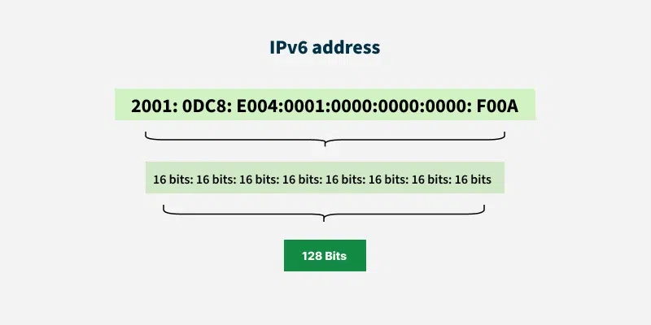
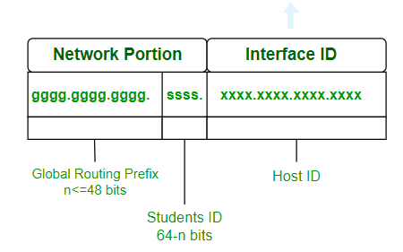

An Internet Protocol (IP) address is the unique identifying number assigned to every device connected to the internet.

IP addresses have two distinct versions or standards. The Internet Protocol version 4 (IPv4) address is the older of the two, which has space for up to 4 billion IP addresses and is assigned to all computers. The more recent Internet Protocol version 6 (IPv6) has space for trillions of IP addresses, which accounts for the new breed of devices in addition to computers. There are also several types of IP addresses, including public, private, static, and dynamic IP addresses.

How does an IP address work?
    When a device connects to the internet, it is assigned an IP address by the Internet Service Provider (ISP). This IP address serves two main functions: identifying the host or network interface and providing the location of the host in the network.

    When you send data over the internet, such as accessing a website, your device uses its IP address to communicate with the server hosting that website. The data is broken down into smaller packets, each containing the source IP address (your device) and the destination IP address (the server). Routers and switches along the way use these IP addresses to determine the best path for the packets to reach their destination.

Public IP address : 
    A public IP address, or external-facing IP address, applies to the main device people use to connect their business or home internet network to their internet service provider (ISP). In most cases, this will be the router. All devices that connect to a router communicate with other IP addresses using the router’s IP address.

Private IP address : 
    A private IP address, or internal-facing IP address, is assigned by an office or home intranet (or local area network) to devices, or by the internet service provider (ISP). The home/office router manages the private IP addresses to the devices that connect to it from within that local network. Network devices are thus mapped from their private IP addresses to public IP addresses by the router.

    Private IP addresses are reused across multiple networks, thus preserving valuable IPv4 address space and extending addressability beyond the simple limit of IPv4 addressing (4,294,967,296 or 2^32).

    In the IPv6 addressing scheme, every possible device has its own unique identifier assigned by the ISP or primary network organization, which has a unique prefix. Private addressing is possible in IPv6, and when it's used it's called Unique Local Addressing (ULA).

Static IP address
    All public and private addresses are defined as static or dynamic. An IP address that a person manually configures and fixes to their device’s network is referred to as a static IP address. A static IP address cannot be changed automatically. An internet service provider may assign a static IP address to a user account. The same IP address will be assigned to that user for every session.

Dynamic IP address
    A dynamic IP address is an IP address that is assigned automatically to a device when it connects to a network. Most devices use dynamic IP addresses, which are assigned by a Dynamic Host Configuration Protocol (DHCP) server. The DHCP server maintains a pool of available IP addresses and assigns one to a device when it connects to the network. The assigned IP address may change each time the device connects to the network, depending on the DHCP server's configuration and the availability of IP addresses.

How to find your IP address?
    There are several ways to find your IP address, depending on the device and operating system you are using.
    Windows:
        Press the Windows key and type Command Prompt, then press Enter.
        In the Command Prompt window, type ipconfig and press Enter.
        Look for the "IPv4 Address" entry under your active network connection; this is your IP address. Alternatively:
        Click the Start menu and select Settings.
        Navigate to Network & Internet > Status.
        Click on View hardware and connection properties.
        Find the IP address listed under your active network connection.
    Linux:
        Open a terminal window.
        Type ifconfig or ip addr show and press Enter.
        Locate your network interface (e.g., eth0, wlan0).
        Find the IP address listed under "inet" for IPv4 or "inet6" for IPv6.

What Is IPv4?
    IPv4 is currently assigned to all computers. An IPv4 address uses 32-bit binary numbers to form a unique IP address. It takes the format of four sets of numbers, each of which ranges from 0 to 255 and represents an eight-digit binary number, separated by a period point.

IP Address Classes:
    Some IP addresses are reserved by the Internet Assigned Numbers Authority (IANA). These are typically reserved for networks that carry a specific purpose on the Transmission Control Protocol/Internet Protocol (TCP/IP), which is used to interconnect devices. Four of these IP address classes include:
    0.0.0.0: This IP address in IPv4 is also known as the default network. It is the non-routeable meta address that designates an invalid, non-applicable, or unknown network target.
    127.0.0.1: This IP address is known as the loopback address, which a computer uses to identify itself regardless of whether it has been assigned an IP address.
    169.254.0.1 to 169.254.254.254: A range of addresses that are automatically assigned if a computer is unsuccessful in an attempt to receive an address from the DHCP.
    255.255.255.255: An address dedicated to messages that need to be sent to every computer on a network or broadcasted across a network.

    Furthermore, IP addresses are divided into five classes (A, B, C, D, and E) based on the number of networks and hosts they can support. Classes A, B, and C are used for unicast addressing, while Class D is used for multicast addressing, and Class E is reserved for experimental purposes.
    Class A: Supports 16 million hosts on each of 126 networks. The first octet ranges from 1 to 126.
    Class B: Supports 65,000 hosts on each of 16,000 networks. The first octet ranges from 128 to 191.
    Class C: Supports 254 hosts on each of 2 million networks. The first octet ranges from 192 to 223.
    Class D: Used for multicast groups. The first octet ranges from 224 to 239.
    Class E: Reserved for experimental use. The first octet ranges from 240 to 255.

what is IPv6?
    IPv6 is the most recent version of the Internet Protocol (IP), designed to replace IPv4 due to the exhaustion of available IPv4 addresses. IPv6 uses 128-bit binary numbers to form a unique IP address, allowing for a vastly larger number of unique addresses compared to IPv4. An IPv6 address is represented as eight groups of four hexadecimal digits, separated by colons (e.g., 2001:0db8:85a3:0000:0000:8a2e:0370:7334).
    

Representation of IPv6 Address:
    An IPv6 address consists of eight groups of four hexadecimal digits separated by ' . ' and each Hex digit representing four bits so the total length of IPv6 is 128 bits. Structure given below.
    
    The first 48 bits represent Global Routing Prefix. The next 16 bits represent the student ID and the last 64 bits represent the host ID. The first 64 bits represent the network portion and the last 64 bits represent the interface id.

    - Global Routing Prefix: The Global Routing Prefix is the portion of an IPv6 address that is used to identify a specific network or subnet within the larger IPv6 internet. It is assigned by an ISP or a regional internet registry (RIR).
    - Student Id: The portion of the address used within an organization to identify subnets. This usually follows the Global Routing Prefix.
    - Host Id: The last part of the address, is used to identify a specific host on a network.
    
