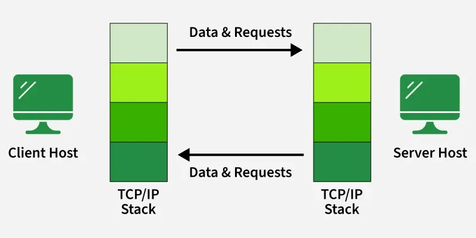
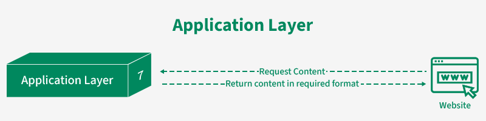
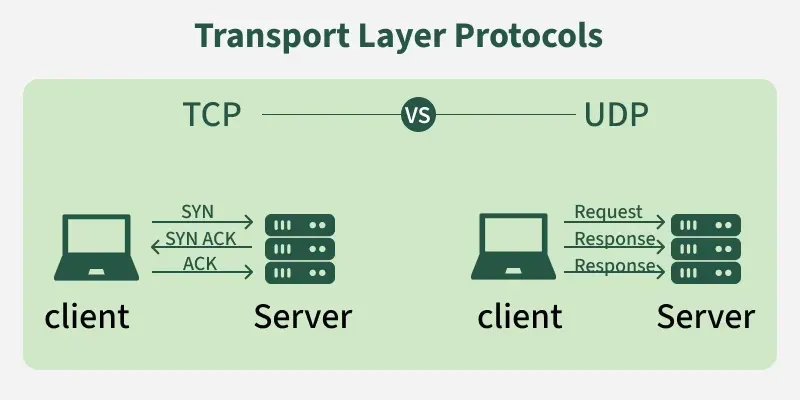
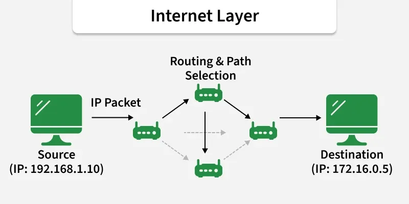
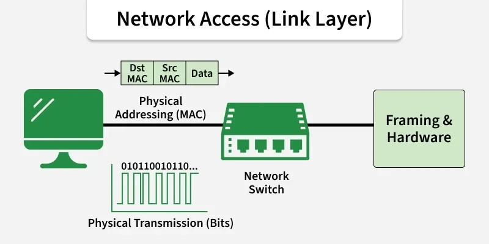

The TCP/IP model is a framework that is used to model the communication in a network. It is mainly a collection of network protocols and organization of these protocols in different layers for modeling the network.

The original TCP/IP standard (defined in RFC 1122) consists of four layers: Application, Transport, Internet, and Network Access.

In practice and teaching, it is often shown as a 5-layer model by separating the Physical layer from the Network Access layer. This helps clearly distinguish physical hardware (cables, signals) from data framing and MAC addressing.

Role of TCP/IP:

    One of its main goals is to make sure that the data sent by the sender arrives safely and correctly at the receiver’s end. To do this, the data is broken down into smaller parts called packets before being sent.

    

Layers of TCP/IP Model:

    1. Application Layer
    The Application Layer is the top layer of the TCP/IP model and the one closest to the user. This is where all the apps you use like web browsers, email clients, or file sharing tools connect to the network.
        
    - It acts like a bridge between your software (like Chrome, Gmail, or WhatsApp) and the lower layers of the network that actually send and receive data.
    
    - It also manages things like data formatting, so both sender and receiver understand the data, encryption to keep data safe, and session management to keep track of ongoing connections.

    2. Transport Layer
    The Transport Layer is responsible for making sure that data is sent reliably and in the correct order between devices. It checks that the data you send like a message, file, or video arrives safely and completely.

    This layer mainly uses two protocols: TCP and UDP, depending on whether the communication needs to be more reliable or faster.

    

    3. Internet Layer
    The Internet Layer (also known as the Network Layer) is responsible for routing data across different networks to ensure it reaches the correct destination. While the Transport Layer handles "how" data is sent, the Internet Layer handles "where" it goes.

    It acts like the postal service of the network, taking segments from the Transport Layer and placing them into "envelopes" called packets with a destination address.

    IP Addressing: Assigns unique IP addresses (like 192.168.1.1) to identify every device on the network.
    Routing: Calculates the most efficient path for packets to travel across the internet to reach their destination.
    Main Protocols: IP, ICMP and ARP.

    

    4. Network Access (Link Layer)
    The Internet Layer is used for finding the best path for data to travel across different networks so it can reach the right destination. It works like a traffic controller, helping data packets move from one network to another until they reach the correct device.

    Framing: Wraps IP packets into Frames and adds physical MAC addresses for local delivery.
    Physical Delivery: Converts digital bits (1s and 0s) into electrical signals, light pulses (fiber), or radio waves (Wi-Fi).
    Hardware Interaction: Manages the actual Network Interface Cards (NIC), Ethernet cables, and wireless drivers.
    
    
    
