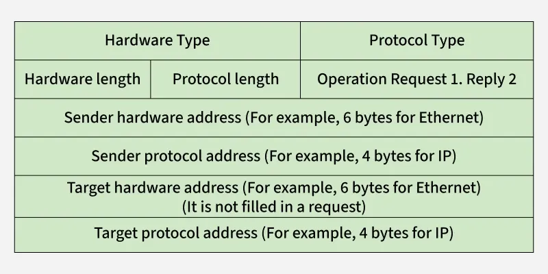
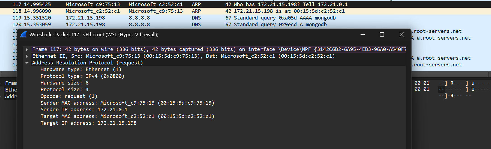

1. Basic Network Information Commands

Windows:
- ipconfig /all : Displays all current TCP/IP network configuration values.

``` example:
Wireless LAN adapter Wi-Fi:

   Connection-specific DNS Suffix  . : GSLAB.COM
   Description . . . . . . . . . . . : Intel(R) Wi-Fi 6E AX211 160MHz
   Physical Address. . . . . . . . . : 74-13-EA-E6-39-8F
   DHCP Enabled. . . . . . . . . . . : Yes
   Autoconfiguration Enabled . . . . : Yes
   Link-local IPv6 Address . . . . . : fe80::6afe:d5b2:63b7:3368%11(Preferred)
   IPv4 Address. . . . . . . . . . . : 172.24.24.3(Preferred)
   Subnet Mask . . . . . . . . . . . : 255.255.255.0
   Lease Obtained. . . . . . . . . . : Tuesday, January 13, 2026 10:47:47 AM
   Lease Expires . . . . . . . . . . : Wednesday, January 21, 2026 4:02:28 PM
   Default Gateway . . . . . . . . . : 172.24.24.254
   DHCP Server . . . . . . . . . . . : 172.30.30.250
   DHCPv6 IAID . . . . . . . . . . . : 175379434
   DHCPv6 Client DUID. . . . . . . . : 00-01-00-01-2E-7D-28-C6-F4-A8-0D-AB-BF-7A
   DNS Servers . . . . . . . . . . . : 172.30.30.250
                                       172.30.30.59
                                       10.0.2.111
   NetBIOS over Tcpip. . . . . . . . : Enabled
```

linux:
- ifconfig -a : Displays all network interfaces and their configurations.

example:
```br-bc82ab1dbe92: flags=4099<UP,BROADCAST,MULTICAST>  mtu 1500
        inet 172.19.0.1  netmask 255.255.0.0  broadcast 172.19.255.255
        ether de:91:ba:c8:14:09  txqueuelen 0  (Ethernet)
        RX packets 0  bytes 0 (0.0 B)
        RX errors 0  dropped 0  overruns 0  frame 0
        TX packets 0  bytes 0 (0.0 B)
        TX errors 0  dropped 0 overruns 0  carrier 0  collisions 0
````


2. Ping – Test Connectivity Step by Step:

    1. ping 127.0.0.1
        - Tests the local TCP/IP stack to ensure it is functioning correctly.
    2. ping <Local_IP_Address>
        - Tests connectivity to the local network (LAN).
    3. ping <Default_Gateway_IP>
        - Tests connectivity to the router.
    4. ping <Public_DNS_Server_IP> 
        - Tests connectivity to an external network (internet).
        - Example: ping

3. Address Resolution Protocol - ARP
    ARP (Address Resolution Protocol) is a network protocol used to determine the MAC address (hardware address) corresponding to an IP address.

        When one device in a LAN (Local Area Network) wants to communicate with another, it must know the destination’s MAC address.
        Since users and applications work with IP addresses, ARP acts as the translator, converting IP addresses into MAC addresses.
    
    Important ARP Terms
        ARP Cache: A table where resolved MAC addresses are stored for quick future use.
        ARP Cache Timeout: The duration for which an entry remains valid in the ARP cache.
        ARP Request: A broadcast message asking, "Who has this IP address?”
        ARP Reply/Response: A unicast message containing the MAC address of the requested IP.
    
    How ARP Works:
        Sender checks ARP Cache: If the MAC address for the destination IP is already cached, communication starts immediately.
        ARP Request Broadcast: If not cached, the sender broadcasts an ARP request on the LAN.
        All Devices Receive Request: Each device checks whether the requested IP matches its own.
        Destination Replies: The device with the matching IP sends an ARP reply (unicast) containing its MAC address.
        Cache Update: The sender updates its ARP cache with the new MAC address for future use.

    ARP Message Format:
        Hardware Type (2 bytes): Defines hardware (Ethernet = 1).
        Protocol Type (2 bytes): Defines protocol (IPv4 = 0x0800).
        Hardware Address Length (1 byte): Length of MAC address (6 for Ethernet).
        Protocol Address Length (1 byte): Length of IP address (4 for IPv4).
        Operation Code (2 bytes): 1 for request, 2 for reply.
        Sender Hardware Address: MAC of the sender.
        Sender Protocol Address: IP of the sender.
        Target Hardware Address: Empty in request; receiver’s MAC in reply.
        Target Protocol Address: Receiver’s IP.

    

    Viewing ARP Cache:
        Windows: Open Command Prompt and type arp -a
        Linux: Open terminal and type arp -n or ip neigh show

    Wireshark ARP Analysis: 

    Step A: Check Initial State

        # Windows
        ipconfig          # Note your IP (e.g. 192.168.1.100) & Gateway (e.g. 192.168.1.1)
        arp -a            # Should NOT show gateway

        # Linux
        ip route show default  # Gateway
        ip neigh show          # ARP cache (modern arp -a)
    
    Step B: Start Wireshark

        1. Open Wireshark → Select Wi-Fi or Ethernet interface → Start capture
        2. Filter:arp or icmp → Apply (only see relevant packets)
        3. Minimize Wireshark (keep capturing)
    
    Step C: Trigger ARP

        # CLEAR ARP CACHE FIRST (important for demo)
        arp -d *          # Windows (Admin required)
        # Linux: sudo ip neigh flush all

        # Now ping gateway
        ping <your-gateway-IP> -n 4   # Send exactly 4 pings

    Step D: Stop Wireshark & Analyze

        

    Note: ARP request is only made if the MAC address is not already in the ARP cache. If you ping the same IP again, you will see only ICMP replies without ARP requests. 
    if we have different subnets, the ARP request will be for the router's MAC address, not the final destination. eg ping 8.8.8.8