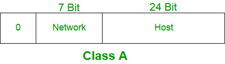
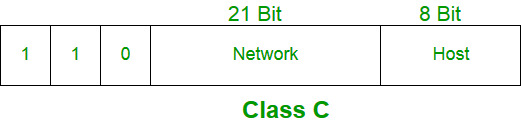
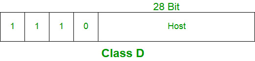
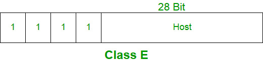

Classful IP addressing was an early method (1981–1993) used to assign IP addresses and divide the IPv4 address space into fixed classes. Each IP address was categorized based on its leading bits, and the class determined its network and host portions

Classes & thier purposes:
 
    IP addresses were divided into five classes: A, B, C, D, and E.
    The class of an IP address was identified by its first few bits.
    Classes A, B, and C were used for unicast communication, supporting large, medium, and small networks, respectively.
    Class D was reserved for multicast communication.
    Class E was intended for experimental and research purposes.

Dotted Decimal Notation
    Dotted decimal notation is a human-readable format used to represent IPv4 addresses, where the 32-bit binary address is divided into four 8-bit segments (bytes) and written as decimal numbers separated by dots. This notation makes IP addresses easier to read, write, and understand compared to their binary form.

    Key Points of Dotted Decimal Notation

    An IPv4 address consists of four decimal segments (bytes) separated by dots.
    The value of each segment ranges from 0 to 255, inclusive.
    Leading zeros are not allowed in any segment (for example, 054 is invalid, while 54 is valid).

Hexadecimal Notation
    Hexadecimal notation is another way of representing IPv4 addresses, where the 32-bit binary address is written using base-16 numbers. In this notation, each 8-bit segment (byte) of the IP address is converted into a two-digit hexadecimal value, making the address shorter and easier to read than its binary form. Hexadecimal notation is mainly used in low-level networking and debugging.

    Key Points of Hexadecimal Notation

    Uses base-16 digits (0–9 and A–F).
    Each byte (8 bits) is represented by two hexadecimal digits.
    An IPv4 address is written as four hexadecimal numbers, usually separated by dots.
    Provides a compact representation compared to binary notation.
    Less commonly used than dotted decimal notation in everyday networking.

Class A:
    Class A IP addresses are assigned to networks that require a very large number of hosts.
    The network ID in Class A is 8 bits long, while the host ID is 24 bits long.
    The most significant bit (MSB) of the first octet is always 0, and the remaining 7 bits are used to identify the network.
    The 24-bit host ID uniquely identifies hosts within the same network.
    The default subnet mask for Class A is 255.0.0.0.
    The total number of usable host addresses per network is 224 − 2 = 16,777,214 (excluding network and broadcast addresses).
    The IP address range for Class A is 0.0.0.0 to 127.255.255.255.
    

Class B
    Class B IP addresses are assigned to medium to large-sized networks.
    The network ID is 16 bits long, and the host ID is also 16 bits long.
    The first two bits of the first octet are always 10, which identifies a Class B address.
    The remaining 14 bits are used to determine the network ID.
    The 16-bit host ID uniquely identifies hosts within the same network.
    The default subnet mask for Class B is 255.255.0.0.
    The total number of Class B networks is 214 = 16,384 networks.
    The total number of usable host addresses per network is 216 − 2 = 65,534 hosts.
    The IP address range for Class B is 128.0.0.0 to 191.255.255.255.
    

Class C
    Class C IP addresses are assigned to small-sized networks.
    The network ID is 24 bits long, while the host ID is 8 bits long.
    The first three bits of the first octet are always 110, which identifies a Class C address.
    The remaining 21 bits are used to determine the network ID.
    The 8-bit host ID uniquely identifies hosts within the same network.
    The default subnet mask for Class C is 255.255.255.0.
    The total number of Class C networks is 2²¹ = 2,097,152 networks.
    The total number of usable host addresses per network is 2⁸ − 2 = 254 hosts.
    The IP address range for Class C is 192.0.0.0 to 223.255.255.255.
    

Class D
    Class D IP addresses are reserved for multicast communication.
    The first four bits of the first octet are always 1110, which identifies a Class D address.
    The remaining 28 bits are used to represent the multicast group address that interested hosts can join.
    Class D addresses do not have a network ID or host ID division.
    No subnet mask is defined for Class D addressing.
    The IP address range for Class D is 224.0.0.0 to 239.255.255.255.
    

Class E
    Class E IP addresses are reserved for experimental and research purposes.
    The first four bits of the first octet are always 1111, which identifies a Class E address.
    Class E addresses do not have network ID and host ID divisions.
    No subnet mask is defined for Class E addressing.
    The IP address range for Class E is 240.0.0.0 to 255.255.255.255.
    

    Range of Special IP Addresses
    169.254.0.0 – 169.254.255.255
    Used as link-local addresses when a device cannot obtain an IP address from a DHCP server.
    127.0.0.0 – 127.255.255.255
    Reserved for loopback addresses, used to test network functionality on the local machine.
    0.0.0.0 – 0.255.255.255 (0.0.0.0/8)
    Represents the current network and is used during initialization before a device is assigned a valid IP address.

    Rules for Assigning Host ID
        Host IDs are used to uniquely identify a host within a network and must follow these rules:

        Uniqueness: Each host ID must be unique within the same network.
        All-zeros restriction: A host ID with all bits set to 0 is not allowed, as it represents the network address.
        All-ones restriction: A host ID with all bits set to 1 is not allowed, as it is reserved for the broadcast address used to reach all hosts in the network.

    Rules for Assigning Network ID
        The network ID identifies the physical network to which hosts belong. All hosts on the same physical network share the same network ID and it must follow these rules:

        Loopback restriction: A network ID must not start with 127, as this range belongs to Class A and is reserved for loopback functions.
        All-ones restriction: A network ID with all bits set to 1 is reserved for broadcast purposes and cannot be assigned to a network.
        All-zeros restriction: A network ID with all bits set to 0 represents the local network, is not routed, and therefore is not used for general network identification.