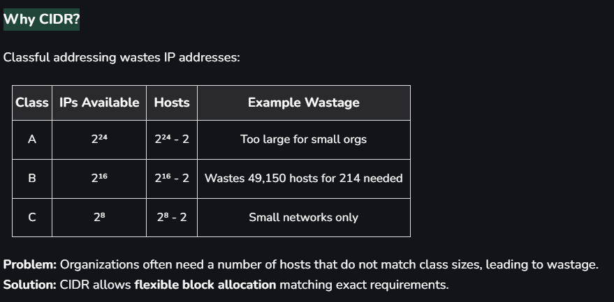
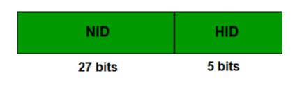

CIDR(Classless Inter Domain Routing) is a method of IP address allocation and routing that allows more efficient use of IP addresses. Unlike traditional class-based addressing, CIDR allocates IP addresses based on a network prefix rather than a fixed class (A, B, or C).

CIDR Notation: a.b.c.d/n

n = number of bits in the network prefix.
Example: 192.168.1.0/24 first 24 bits are the network, and the remaining 8 bits are the host ID.

Why CIDR?

Rules for Forming CIDR Blocks
All IPs must be contiguous.
Block size must be a power of 2 (2ⁿ) simplifies network division.
First IP of block divisible by block size least significant bits of host ID should be 0.
Example: If the Block size is 25 then, Host Id will contain 5 bits and Network will contain 32 - 5 = 27 bits. 

Example: Check whether 100.1.2.32 to 100.1.2.47 is a valid IP address block or not?

All the IP addresses are contiguous.
Total number of IP addresses in the Block = 16 = 24.
1st IP address: 100.1.2.00100000 Since, Host Id will contains last 4 bits and all the least significant 4 bits are zero. Hence, first IP address is evenly divisible by the size of the block.