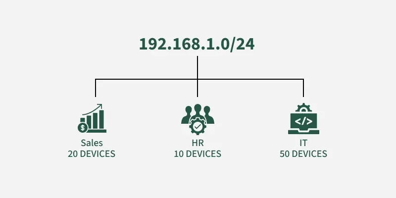
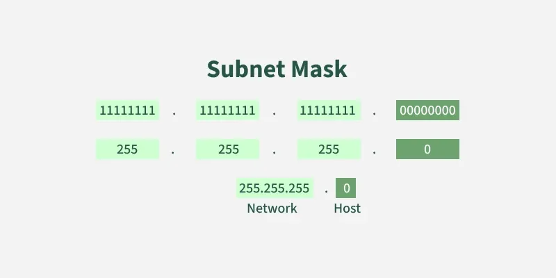
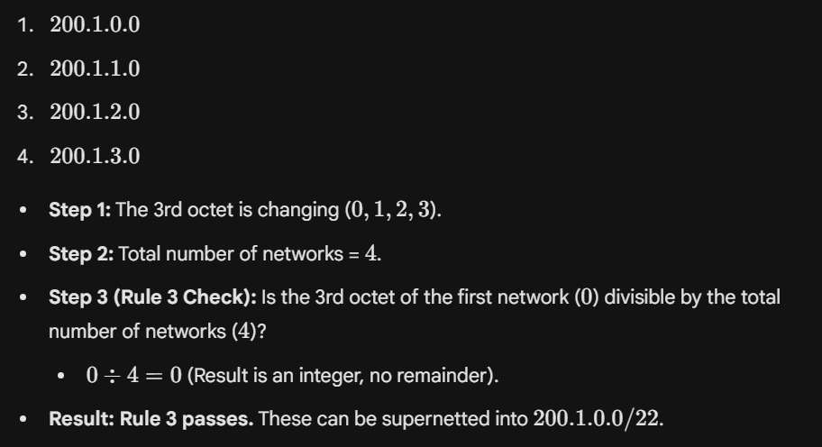

Subnetting is the process of dividing a large IP network into smaller logical networks called subnets. Each subnet allows devices to communicate efficiently, improving network performance, security, and manageability.

Example: In a company, a single network, such as 192.168.5.0/24, can be divided into multiple subnets for different departments, including Sales, HR, and IT.

- Each department is assigned a separate subnet
- Devices within a department communicate using their own subnet
- Inter-department traffic is routed through a router
- Broadcast traffic is limited to each subnet
- Network performance, security, and management are improved

Why Subnetting is Important
Subnetting enables a single IP network to be divided into smaller, logical networks, allowing for efficient IP address usage, improved performance, and enhanced security control.

Subnet MASK: 

    A subnet mask is a 32-bit number used with an IP address to divide it into two parts:
        the network ID, and
        the host ID.
    In a subnet mask:
        Binary 1s represent the network portion of the IP address.
        Binary 0s represent the host portion.

Let's consider a company that follows classful addressing. It has a Class C network (192.168.1.0/24) with 256 IP addresses. It has three departments:
    

Without subnetting:

    - All departments share the same network
    - Only 80 IP addresses are used, leaving 176 unused
    - Broadcast traffic floods the entire network
    - Devices from different departments can access each other freely
With subnetting:

    - The network is divided into three smaller subnets
    - Each department receives only the IPs it needs
    - Traffic remains within each subnet, improving performance
    - Departments are logically isolated, improving security
    - IP addresses are used efficiently, with room for future growth

What is a Subnet Mask?
A subnet mask is a 32-bit number used in IP addressing to separate the network portion of an IP address from the host portion. It helps computers and devices determine which part of an IP address refers to the network they are present, and which part refers to their specific location or address within that network.

Working of Subnetting

    The working of subnets starts in such a way that firstly it divides the subnets into smaller subnets. For communicating between subnets, routers are used. Each subnet allows its linked devices to communicate with each other. Subnetting for a network should be done in such a way that it does not affect the network bits.

    In class C the first 3 octets are network bits so it remains as it is. 

        For Subnet-1: The first bit which is chosen from the host id part is zero and the range will be from (193.1.2.00000000 till you get all 1's in the host ID part i.e, 193.1.2.01111111) except for the first bit which is chosen zero for subnet id part.
        Thus, the range of subnet 1 is: 193.1.2.0 to 193.1.2.127 

        Subnet id of Subnet 1 is: 193.1.2.0
        The direct Broadcast id of Subnet-1 is: 193.1.2.127
        The total number of hosts possible is: 126 (Out of 128, 2 id's are used for Subnet id & Direct Broadcast id)
        The subnet mask of Subnet- 1 is: 255.255.255.128

        For Subnet-2: The first bit chosen from the host id part is one and the range will be from (193.1.2.100000000 till you get all 1's in the host ID part i.e, 193.1.2.11111111).
        Thus, the range of subnet-2 is: 193.1.2.128 to 193.1.2.255 

        Subnet id of Subnet 2 is : 193.1.2.128
        The direct Broadcast id of Subnet-2 is: 193.1.2.255
        The total number of hosts possible is: 126 (Out of 128, 2 id's are used for Subnet id &  Direct Broadcast id)
        The subnet mask of Subnet- 2 is: 255.255.255.128
        The best way to find out the subnet mask of a subnet is to set the fixed bit of host-id to 1 and the rest to 0.

        Finally, after using the subnetting the total number of usable hosts is reduced from 254 to 252. 

Supernetting in Network Layer:

    Supernetting is the opposite of subnetting. While subnetting splits a large network into smaller subnets, supernetting combines multiple smaller networks with similar prefixes into a larger network (supernet). It reduces routing table size, simplifies routing, and optimizes IP address usage, primarily through route summarization.

    Benefits of Supernetting:
        - Saves storage space in routing tables
        - Reduces the number of routing updates
        - Simplifies routing decisions
        - Helps manage the growth of routing tables as the Internet expands

    Important Points for Supernetting 
        - All the Networks should be contiguous. 
        - The block size of every network should be equal and must be in form of 2^n. 
        - First Network id should be exactly divisible by whole size of supernet. 

    Example of Supernetting:
        Consider four Class C networks:
        - 200.1.0.0, 
        - 200.1.1.0,
        - 200.1.2.0,
        - 200.1.3.0

    

    First, let's check whether three conditions are satisfied or not:
         1. Contiguous Networks

        All networks must be next to each other without gaps.
        Example: 200.1.0.0 – 200.1.0.255 is the first network.
        Add 1 to the last IP (200.1.0.255 + 1 = 200.1.1.0) to get the next network.
        Repeat to ensure all networks are contiguous.

        2. Equal Network Size

        All networks must have the same number of IP addresses.
        For Class C networks, each has 256 addresses (/24).

        3. Divisibility of First Network ID

        Is the 3rd octet of the first network ($0$) divisible by the total number of networks (4) 0\div 4 = 0 (Result is an integer, no remainder).Result: Rule 3 passes. These can be supernetted into $200.1.0.0/22.

        