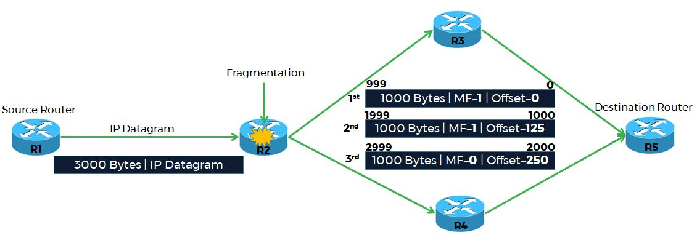

* It is a connectionless protocol used in packet-switched networks.
* It provides logical addressing to uniquely identify each device on a network.
* IPv4 can be configured in different ways, including manual (static) and automatic (dynamic) configuration, depending on the network type.

IPv4 Packet Structure: 

Understanding Bit and Byte Order in the IP Header:

    In the IPv4 Packer header format, the bits and bytes are organized in a specific way to ensure seamless communication across devices. Look at the above diagram, we see at the top it starts with 0 and ends with 31.

    It represents a 32-bit value which has bits numbered from 0 (leftmost) to 31 (rightmost). The most significant bit (MSB) is on the left, and the least significant bit (LSB) is on the right.

    A 32-bit value is divided into 4 bytes as follows

    ● Bits 0-7 (First Byte)

    ● Bits 8-15 (Second Byte)

    ● Bits 16-23 (Third Byte)

    ● Bits 24-31 (Fourth Byte)

    These bytes are sent in order, starting with the most significant byte (bits 0-7). This is called Big Endian Byte Ordering. TCP/IP always uses Big Endian for consistency.

What are the Essential IPv4 Header Fields?
    There are 13 fields in an IPv4 packet header, each with its unique function:
    1. Version
        It is a 4-bit field that tells the version of the Internet Protocol. Since only IPv4 uses this field in its header, it will always hold the decimal value 4.
    2. The IPv4 Packer header length field tells how big the header is, but instead of using bytes, it uses 32-bit blocks called "words." Each word is 4 bytes. So if the field says "5," it means the header is 5 × 4 = 20 bytes long. The maximum is 15 words = 60 bytes.
    3. Type Of Service (TOS)
    It is an 8-bit field. In the initial implementations, it consists of 3-bit precedence, 4 TOS bits, and an unused bit, which should be 0. The 4 TOS bits are:
    ● Minimize Delay
    ● Maximize Throughput
    ● Maximize Reliability
    ● Minimize Monetary Cost
    4. Total Length
    The Total Length field tells us how big the IP packet is (in bytes), which includes the header and data payload. By using the Total Length and another field called the Header Length, we can figure out where the header ends and where the actual data begins.
    It is a 16-bit field, meaning the largest packet size it can handle is 65,535 bytes. If a packet is too big for the network, the packet gets broken into smaller pieces called fragments. Each fragment is sent separately but can be reassembled at the destination.
    Some networks, like Ethernet, require a minimum packet size of 46 bytes. If the packet is too small, padding (extra space) is added to meet this requirement. The Total Length field ensures we know the actual size of the packet, even if padding is present. Without a Total Length field, the receiver wouldn’t know where the real data ends and the padding starts.
    hough it is possible to send a large datagram, most applications stick to smaller sizes to avoid fragmentation. For example
    ● UDP applications like DNS send packets under 576 bytes
    ● TCP automatically breaks data into smaller chunks to fit the network's requirements

    IP header handles the fragmentation process using the three key field:
    
    When we send data over a network, it is often broken into packets called IP datagrams. Each datagram must fit within the size limits of the network it travels through. However, different networks have different size limits, called the Maximum Transmission Unit (MTU). If an IP datagram is larger than the MTU, it needs to be fragmented into smaller pieces to pass through. The receiver later reassembles these pieces into the original data.

    5. Identification
    The identification field of the IPv4 Packer header format is like a unique ID assigned to every IP datagram sent by a host.
    ● When a large IP datagram is fragmented, all fragments get the same Identification number.
    ● This helps the receiver understand which fragments belong to the same original datagram.

    6. Flags
    The Flags field has 3 bits, and each bit has a specific purpose:

    ● Bit 0: It is a Reserved bit and always be 0, which is not used.
    ● Bit 1: It is a Don’t Fragment (DF) bit. If this bit is set to 1, the router will not fragment the datagram. If the datagram is too large to pass through, it will simply be dropped, and the sender will get an error.
    ● Bit 2: It is a More Fragments (MF) bit. If this bit is set to 1, it means more fragments are coming. For all fragments except the last one, the MF bit = 1. For the last fragment, the MF bit = 0, signaling the end of the original datagram.

    7. Fragment Offset
        It is a 13-bit value field. When an IP datagram is fragmented, each packet has a Fragment Offset set, which tells the receiver where this fragment fits in the original datagram. The offset is measured in 8-byte blocks.

        For example, if the first fragment starts at byte 0, its offset is 0, and if the second fragment starts at byte 1000, its offset is 125 (because 1000 ÷ 8 = 125). The Fragment Offset ensures that all pieces are put back together in the correct order at the receiver’s end.
        
    8. Time To Live (TTL)
        It is an 8-bit value in the format of an IPv4 Packer header. It sets the limit on the number of hops (routers) an IP datagram can pass through, meaning it defines the lifetime of the datagram.

        The sender initiated the TTL value (32, 64, or 255, based on operating systems) in the IP header, and it is then decremented by one at every hop it crosses. When it reaches 0, the datagram is discarded, and an ICMP message is sent back to the sender. This prevents routing loops at layer 3 of the OSI layer model.

    9. Protocol
        It is an 8-bit field in the IP header. It identifies the type of protocol that is encapsulated inside the IP packet. This helps the receiving device know which upper-layer protocol should process the data. The protocol has a specific number, for example:

        ● 6 for TCP (Transmission Control Protocol).

        ● 17 for UDP (User Datagram Protocol).

        ● 1 for ICMP (Internet Control Message Protocol).

    10. Header Checksum
        The IP checksum is a mechanism used in the IP header to ensure that the data hasn't been corrupted during transmission. It is a 16-bit field and is used to calculate the checksum for the IP header only. It does not cover any data followed by the header. Other protocols like TCP and UDP have their own checksum fields for the header and data..
    11. Source IP Address
        It contains a 32-bit value of the sender's IP address.

    12. Destination IP Address
        It contains a 32-bit value of the receiver IP address.
    13. IP header Options Field
        It is a variable-length list and always ends on a 32-bit boundary. Pad bytes with a value of 0 are added if necessary. This assures that the IP header is always a multiple of 32 bits (as required for the header length). The options are as follows
            ● Security and Handling Restrictions
            ● Record Route
            ● Timestamp
            ● Loose Source Route
            ● Strict Source Routing

Why is the IPv4 Packet Header Important?
The IPv4 datagram header enables efficient and reliable data transfer on the Internet. Some other benefits of the IPv4 Packer header are:

1. Packet Identification: The identification field helps in fragment reassembly, ensuring that packets split into smaller parts can be correctly reassembled at their destination.
2. Error Detection: The Header Checksum field checks for errors while data transfer, allowing devices to detect and discard corrupted packets during transmission.
3. Control Over Traffic: The Time to Live (TTL) field prevents packets from circulating indefinitely in the network by limiting the number of hops a packet can take before being discarded.
4. Quality of Service (QoS): The Type of Service (ToS) field allows for prioritization of certain traffic, which helps in managing network performance.
5. Fragmentation Management: The Flags and Fragment Offset fields facilitate the fragmentation of packets when necessary, allowing larger packets to be sent over networks with smaller maximum transmission units (MTUs).