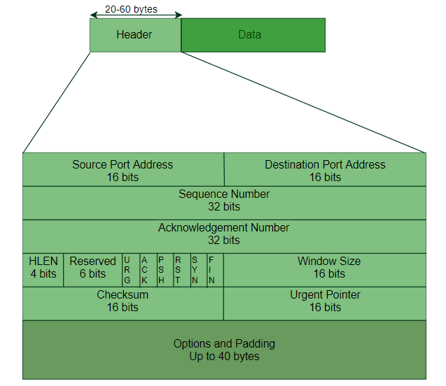

Transmission Control Protocol (TCP) is a connection-oriented protocol for communications that helps in the exchange of messages between different devices over a network. It is one of the main protocols of the TCP/IP suite. In OSI model, it operates at the transport layer(Layer 4). It lies between the Application and Network Layers which are used in providing reliable delivery services. The Internet Protocol (IP), which establishes the technique for sending data packets between computers, works with TCP.

* TCP establishes a reliable connection between sender and receiver using the three-way handshake (SYN, SYN-ACK, ACK) and it uses a four-step handshake (FIN, ACK, FIN, ACK) to close connections properly.
* It ensures error-free, in-order delivery of data packets.
* It uses acknowledgments (ACKs) to confirm receipt.
* It prevents network congestion using algorithms like Slow Start, Congestion Avoidance, Fast Retransmit, and * Fast Recovery.
* TCP header uses checksum to detect corrupted data and requests retransmission if needed.
* It is used in applications requiring reliable and ordered data transfer, such as web browsing, email, and * remote login.

Features of TCP
* Segment Numbering: Each byte of data is numbered, and segments carry sequence numbers. Acknowledgment numbers confirm successful receipt.
* Connection-Oriented: Sender and receiver remain connected until data transfer is complete. Data order is preserved.
* Full Duplex: Data can flow in both directions simultaneously, improving efficiency.
* Flow Control: Uses a sliding window to prevent the sender from overwhelming the receiver.
* Error Control: Detects and manages corrupted, lost, duplicate, or out-of-order segments to ensure reliability.
* Congestion Control: Adjusts the sending rate based on network congestion to avoid overload.

Working of Transmission Control Protocol (TCP) :
* Data Segmentation: The application data is divided into small segments for efficient transmission instead of sending it all at once.
* Routing: Each segment can take a different route through the network, depending on traffic or congestion, but all segments eventually reach the same destination.
* Reassembly: At the receiver’s end, TCP reassembles these segments into the original message using sequence numbers.
* Acknowledgment: The receiver sends ACK (acknowledgment) messages back to confirm successful receipt of each segment.
* If an acknowledgment isn’t received, TCP retransmits the missing segment.
* Error and Flow Control: TCP uses checksums to detect errors and a sliding window mechanism to control the flow of data, ensuring the receiver isn’t overwhelmed.

TCP
Example: When a user requests a webpage:

The browser (client) uses HTTP, which relies on TCP to create a connection.
TCP breaks the web page (HTML file) into packets and hands them to the IP layer for delivery.
At the user’s end, TCP reassembles the packets and confirms successful transmission through acknowledgments.

TCP 3-Way Handshake Process
The TCP 3-Way Handshake is a process used by the Transmission Control Protocol (TCP) to establish a reliable connection between a client and a server before data transfer. It ensures that both sides are synchronized and ready to communicate.

TCP Segment Structure:
A TCP segment consists of data bytes to be sent and a header that is added to the data by TCP as shown:

1. Source Port / Destination Port (16 bits each): Identify sending and receiving applications.
2. Sequence Number (32 bits): Position of the first byte in this segment, used for ordering.
3. Acknowledgement Number (32 bits): Next byte expected by the receiver (confirms data received).
4. Header Length (HLEN): Size of the header (5–15 words, i.e., 20–60 bytes).

5. Control Flags (1 bit each):

    URG: Urgent data
    ACK: Acknowledgement valid
    PSH: Push data immediately
    RST: Reset connection
    SYN: Synchronize sequence numbers
    FIN: Terminate connection
6. Window Size: Receiver’s buffer size (for flow control).
7. Checksum: Error detection (mandatory).
8. Urgent Pointer: Position of urgent data (if URG flag is set).

TCP 3-way Handshake Process:
* Each segment sent must be acknowledged.
* If a segment is lost or corrupted (detected using the checksum), the receiver discards it, and the sender retransmits.

Step 1 (SYN): In the first step, the client wants to establish a connection with a server, so it sends a segment with SYN(Synchronize Sequence Number) which informs the server that the client is likely to start communication and with what sequence number it starts segments with
Step 2 (SYN + ACK): Server responds to the client request with SYN-ACK signal bits set. Acknowledgement(ACK) signifies the response of the segment it received and SYN signifies with what sequence number it is likely to start the segments with
Step 3 (ACK): In the final part client acknowledges the response of the server and they both establish a reliable connection with which they will start the actual data transfer.