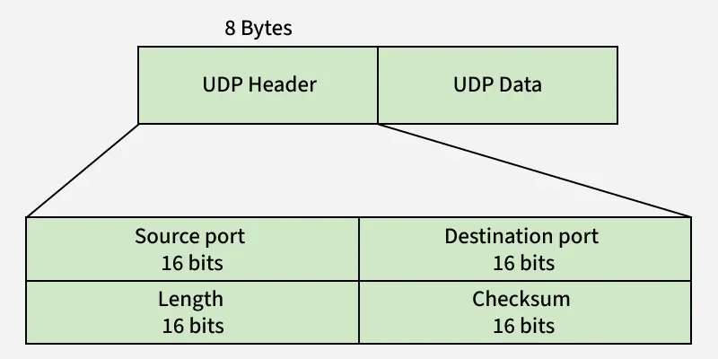
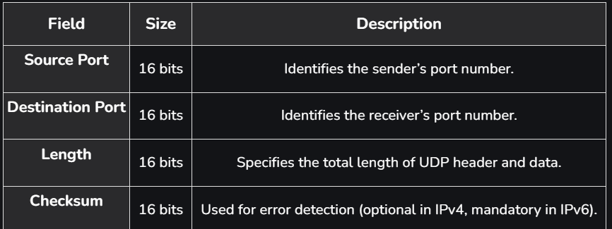

User Datagram Protocol (UDP) is a Transport Layer protocol of the Internet Protocol (IP) that provides fast, connectionless, and lightweight communication between processes. It does not guarantee delivery, order, or error checking, making it suitable for real-time and time-sensitive applications such as video streaming, DNS, and VoIP.

UDP Header:

UDP header is 8 bytes long, followed by the data payload. It contains all the essential information needed for transmission. Each port number field is 16 bits, giving a range from 0 to 65535, where port 0 is reserved. Port numbers are used to identify and separate different user requests or processes.

* DNS uses UDP for fast query/response lookups since domain name queries are small and need quick replies.
* DHCP uses UDP to dynamically assign IP addresses to devices, where small control messages are exchanged.
* VoIP uses UDP for real-time voice communication, as it tolerates some packet loss but not delays.
* RIP uses UDP to send periodic routing updates between routers efficiently.
* NTP uses UDP to synchronize system clocks across networks with minimal overhead.

How UDP Interacts with IP? 
* The application provides the data along with destination details to UDP.
* UDP attaches its header, which includes the source port, destination port, length, and checksum.
* The UDP datagram is passed to the IP layer for addressing and routing.
* IP adds its own header and forwards the packet to the destination host.
* At the receiver’s end, UDP removes its header and delivers the data to the target application.
