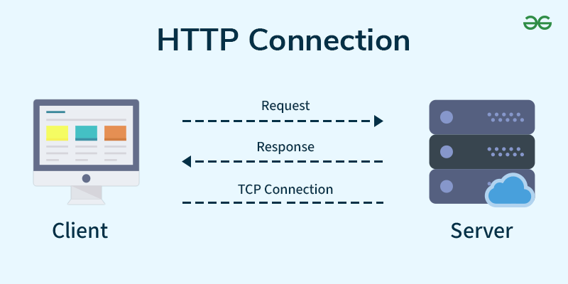

HTTP stands for Hypertext Transfer Protocol, and it’s the system that allows communication between web browsers (like Google Chrome or Firefox) and websites. When you visit a website, your browser uses HTTP to send a request to the server hosting that site, and the server sends back the data needed to display the page.

HTTP is a set of rules that lets your browser and web server communicate, ensuring websites load correctly.

When you visit a website using HTTP, here’s what happens step-by-step:

* Open Web Browser: First, you open your web browser and type a website URL (e.g., www.example.com).
* DNS Lookup: Your browser asks a Domain Name System (DNS) server to find out the IP address associated with that URL. Think of this as looking up the phone number of the website.
* Send HTTP Request: Once the browser has the website’s IP address, it sends an HTTP request to the server. The request asks the server for the resources needed to display the page (like text, images, and videos).
* Server Response: The server processes your request and sends back an HTTP response. This response contains the requested resources (like HTML, CSS, JavaScript) needed to load the page.
* Rendering the Web Page: Your browser receives the data from the server and displays the webpage on your screen.

What is HyperText? 
HyperText is a way of structuring text so that it can contain links (called "hyperlinks") to other documents or resources. When you click on a link in a webpage, you are typically directed to another page or resource on the internet. HTML (HyperText Markup Language) is used to create and format this type of text for web pages.

Understanding HTTP Request and Response :

1. HTTP Request 
    An HTTP request is how your browser asks the server for something. It includes:

    HTTP Version: The version of HTTP (like HTTP/1.1 or HTTP/2) being used.
    URL: The specific address of the resource (e.g., https://www.example.com/about).
    HTTP Method: The type of action being requested (e.g., GET to retrieve information or POST to send data).
    HTTP Request Headers: Extra information about the request, like what kind of browser you're using or what kind of content you’re expecting.
    HTTP Request Body: In some cases, the request will include a body that contains data (e.g., when you submit a form).

    The most commonly used HTTP request methods are GET, POST, PUT, PATCH, and DELETE. These are equivalent to the CRUD operations (create, read, update, and delete).

    Different HTTP requests are:

    GET: GET request is used to read/retrieve data from a web server. GET returns an HTTP status code of 200 (OK) if the data is successfully retrieved from the server.
    POST: POST request is used to send data (file, form data, etc.) to the server. On successful creation, it returns an HTTP status code of 201.
    PUT: A PUT request is used to modify the data on the server. It replaces the entire content at a particular location with data that is passed in the body payload. If there are no resources that match the request, it will generate one.
    PATCH: PATCH is similar to PUT request, but the only difference is, it modifies a part of the data. It will only replace the content that you want to update.
    DELETE: A DELETE request is used to delete the data on the server at a specified location.

2. HTTP Response
    An HTTP response is the server’s answer to your request. It includes:

    HTTP Status Code: A number that tells you if the request was successful or not (e.g., 200 OK means everything is fine, 404 Not Found means the requested page doesn’t exist).
    Response Headers: Information about the response, like what kind of data is being sent (e.g., Content-Type: text/html means it’s an HTML page).
    Response Body: The content that the server sends back (e.g., HTML code that the browser will use to display the webpage).

What is HTTP Status Code?
    HTTP Status codes are three-digit numbers that servers use to tell your browser what happened with the request you sent. There are different types of status codes:

    Informational (1xx): These codes just give you information (e.g., 100 Continue means the request is still being processed).
    Successful(2xx): These codes tell you everything went fine (e.g., 200 OK means the request was successful).
    Redirection(3xx): These codes tell the browser to take additional action (e.g., 301 Moved Permanently means the requested page has moved to a new address).
    Client Error (4xx): These codes indicate that there was a problem with your request (e.g., 404 Not Found means the page doesn’t exist).
    Server Error (5xx): These codes tell you that something went wrong on the server side (e.g., 500 Internal Server Error means the server had an issue processing the request).   

Comparing HTTP, HTTP/2, and HTTP/3:
    HTTP/1.1: The Original Version
        HTTP/1.1, introduced in 1997, is the most widely used version of HTTP. It allows for persistent connections, meaning multiple requests and responses can be sent over a single connection. However, it has some limitations:
        Head-of-Line Blocking: If one request takes a long time, it can delay all other requests in the queue.
        Multiple Connections: Browsers often open multiple connections to the same server to work around these delays, which can lead to inefficiencies.

    HTTP/2: Improved Performance
        HTTP/2 is an improved version of HTTP introduced in 2015. It made several changes to make websites load faster:

        Multiplexing: Multiple requests can be sent over one connection at the same time, reducing delays.
        Header Compression: HTTP/2 compresses the data sent in headers to make it smaller and faster.
        Server Push: This allows the server to send additional resources (like images or scripts) to the browser before the browser even asks for them.

    HTTP/3: The Latest Version
        HTTP/3, released in 2022, builds on HTTP/2 but with a key improvement: it uses the QUIC protocol instead of TCP. QUIC is faster and more reliable because it:

        Reduces connection setup time.
        Handles data loss better, especially in poor network conditions.
        Offers better security by integrating encryption directly into the protocol.

Cookies in HTTP
    An HTTP cookie (web cookie, browser cookie) is a little piece of data that a server transmits to a user's web browser. When making subsequent queries, the browser may keep the cookie and transmit it back to the same server. An HTTP cookie is typically used, for example, to maintain a user's login state and to determine whether two requests originate from the same browser.