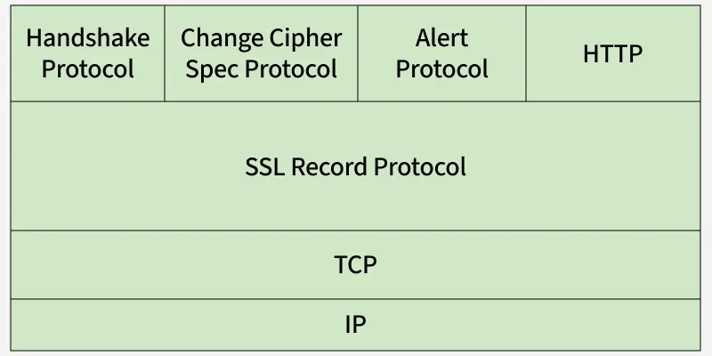
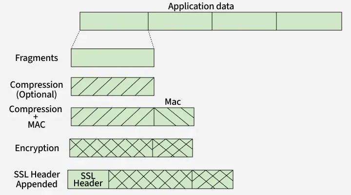
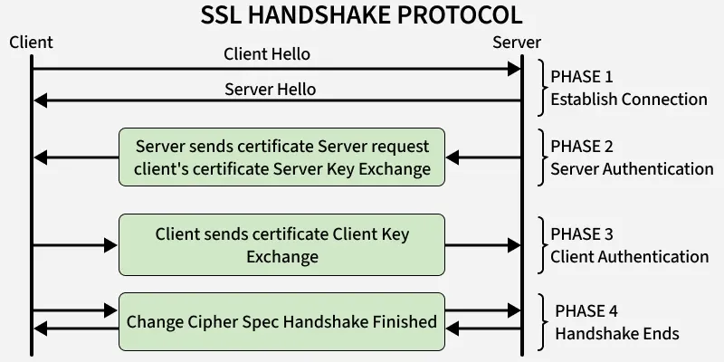
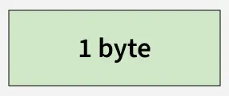
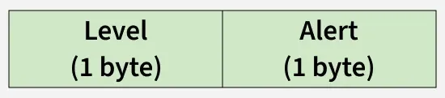

Secure Sockets Layer (SSL) is an Internet security protocol that encrypts data to ensure secure communication between devices over a network. SSL provides privacy, authentication and data integrity for online communications. SSL is the predecessor of TLS (Transport Layer Security), which is now the standard protocol for secure communications on the Internet.

Working of SSL: 
    SSL ensures secure communication through three main mechanisms:

        Encryption: Data transmitted over the network is encrypted, preventing unauthorized parties from reading it. If intercepted, encrypted data appears as an unreadable jumble of characters.
        Authentication: SSL uses a handshake process to authenticate both the client and server, ensuring each party is legitimate and not an imposter.
        Data Integrity: SSL digitally signs transmitted data to detect any tampering, ensuring that the data received is exactly what was sent.

SSL Protocols
    SSL consists of several protocols, each handling a different aspect of secure communication
    

1. SSL Record Protocol :

    

    * Provides confidentiality and message integrity.
    * Application data is divided into fragments, optionally compressed and appended with a Message Authentication Code (MAC).
    * The data is then encrypted and transmitted with an SSL header.

2. Handshake Protocol
    
    Establishes SSL sessions and authenticates clients and servers.

    Four phases:

    * Client and server exchange hello packets, protocol versions and cipher suites.
    * Server sends its certificate and server key information.
    * Client responds with its certificate and key exchange.
    * Change Cipher Spec finalizes the handshake, activating secure communication.

3. Change-Cipher Spec Protocol :
    
    Signals that pending cryptographic parameters from the handshake should now become active.
    Consists of a single 1-byte message.

4. Alert Protocol :
    
    Communicates SSL-related warnings or errors.
    Warning alerts (level 1): Non-critical issues, such as expired or unsupported certificates.
    Fatal alerts (level 2): Critical errors, such as handshake failures, bad record MAC or illegal parameters, which terminate the connection.

   
Versions of SSL/TLS:
    SSL 2.0: Released in 1995, it had several security flaws and was quickly replaced by SSL 3.0.
    SSL 3.0: Released in 1996, it improved security but was later found to be vulnerable to attacks like POODLE.
    TLS 1.0: Released in 1999 as the successor to SSL 3.0, it provided better security and is considered the first version of TLS.
    TLS 1.1: Released in 2006, it introduced improvements over TLS 1.0, including protection against certain types of attacks.
    TLS 1.2: Released in 2008, it is widely used today and offers significant security enhancements, including support for stronger encryption algorithms.
    TLS 1.3: Released in 2018, it further improves security and performance by simplifying the handshake process and removing outdated features.
 
SSL Certificates
    SSL certificates are digital certificates issued by trusted Certificate Authorities (CAs) to secure and verify websites.

    Key Features
        Encryption: Protects sensitive information during transmission.
        Authentication: Confirms the identity of the website or service.
        Integrity: Ensures transmitted data is not altered.
        Non-repudiation: Prevents denial of transmitted messages.
        Public-key cryptography: Facilitates secure key exchange.
        Session management: Allows resumption of secure sessions after interruptions.

    Types of SSL Certificates
        Single-Domain: Secures one domain.
        Wildcard: Secures one domain and all its subdomains.
        Multi-Domain: Secures multiple unrelated domains in one certificate.
    Validation Levels
        Domain Validation (DV): Confirms domain ownership.
        Organization Validation (OV): Confirms the organization's identity.
        Extended Validation (EV): Rigorous verification, highest trust level, often indicated by a green address bar.