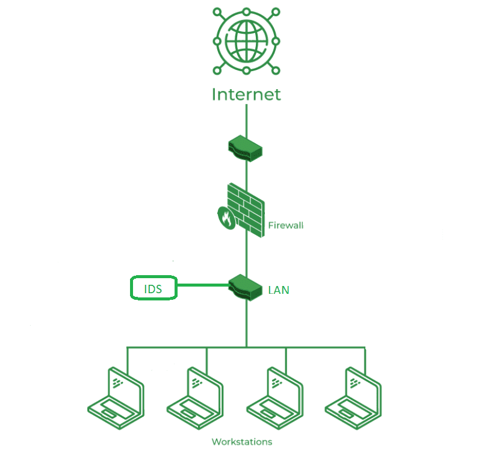

Intrusion Detection System :

Intrusion Detection System (IDS) observes network traffic for malicious transactions and sends immediate alerts when it is observed. It is software that checks a network or system for malicious activities or policy violations. Each illegal activity or violation is often recorded either centrally using an SIEM system or notified to an administration. IDS monitors a network or system for malicious activity and protects a computer network from unauthorized access from users, including perhaps insiders.

Common Methods of Intrusion:
    Address Spoofing: Hiding the source of an attack by using fake or unsecured proxy servers making it hard to identify the attacker.
    Fragmentation: Sending data in small pieces to slip past detection systems.
    Pattern Evasion: Changing attack methods to avoid detection by IDS systems that look for specific patterns.
    Coordinated Attack: Using multiple attackers or ports to scan a network, confusing the IDS and making it hard to see what is happening

working of IDS:
    Data Collection: IDS collects data from various sources like network traffic, system logs, and application logs.
    Data Analysis: The collected data is analyzed using various techniques to identify potential threats. This can include signature-based detection, anomaly-based detection, and behavior-based detection.
    Alert Generation: When a potential threat is identified, the IDS generates an alert. This alert can be sent to a centralized management system or directly to the system administrator.
    Response: Depending on the configuration, the IDS may take automated actions in response to detected threats, such as blocking traffic from a suspicious IP address or terminating a session.

    

Classification of Intrusion Detection System(IDS):
    Network-based IDS (NIDS): Monitors network traffic for suspicious activity. It is typically deployed at strategic points within the network to monitor traffic to and from all devices on the network.
    Host-based IDS (HIDS): Monitors a single host for suspicious activity by analyzing events occurring within that host. It can detect unauthorized access attempts, changes to system files, and other malicious activities.
    Signature-based IDS: Uses a database of known attack patterns (signatures) to identify potential threats. It compares incoming data against these signatures to detect malicious activity.
    Anomaly-based IDS: Establishes a baseline of normal behavior for a system or network and monitors for deviations from this baseline. It can detect previously unknown threats by identifying unusual patterns of activity.
    Hybrid IDS: Combines both signature-based and anomaly-based detection methods to provide a more comprehensive approach to intrusion detection.
    Application Protocol-Based Intrusion Detection System (APIDS): Monitors and analyzes the communication protocols used by applications to detect malicious activity. It focuses on specific application protocols, such as HTTP, FTP, or DNS, to identify protocol-specific attacks.

    
Detection Method of IDS:
    Signature-Based Method: Signature-based IDS detects the attacks on the basis of the specific patterns such as the number of bytes or a number of 1s or the number of 0s in the network traffic. It also detects on the basis of the already known malicious instruction sequence that is used by the malware. The detected patterns in the IDS are known as signatures. Signature-based IDS can easily detect the attacks whose pattern (signature) already exists in the system but it is quite difficult to detect new malware attacks as their pattern (signature) is not known.
    Anomaly-Based Method: Anomaly-based IDS was introduced to detect unknown malware attacks as new malware is developed rapidly. In anomaly-based IDS there is the use of machine learning to create a trustful activity model and anything coming is compared with that model and it is declared suspicious if it is not found in the model. The machine learning-based method has a better-generalized property in comparison to signature-based IDS as these models can be trained according to the applications and hardware configurations.

Comparison of IDS with Firewalls
    IDS and firewall both are related to network security but an IDS differs from a firewall as a firewall looks outwardly for intrusions in order to stop them from happening. Firewalls restrict access between networks to prevent intrusion and if an attack is from inside the network it doesn't signal. An IDS describes a suspected intrusion once it has happened and then signals an alarm.

Placement of IDS in Network
        The most optimal and common position for an IDS to be placed is behind the firewall. The 'behind-the-firewall' placement allows the IDS with high visibility of incoming network traffic and will not receive traffic between users and network.