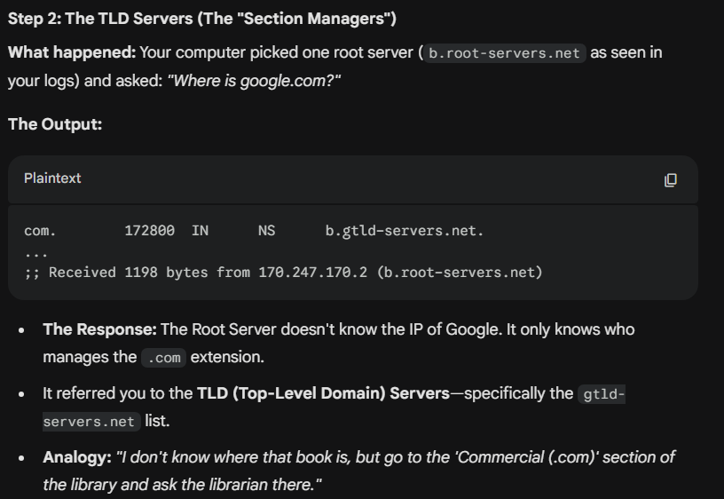
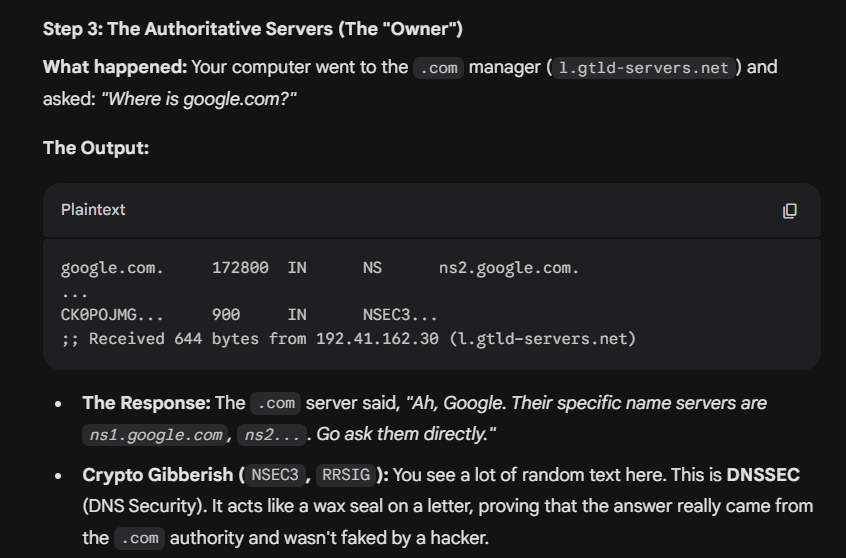
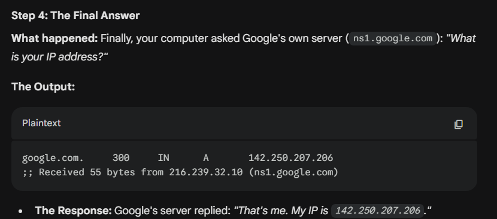

1. curl – Fetching web content (HTTP & HTTPS) : Curl is commonly used to send GET, POST, PUT, DELETE, and other HTTP methods to APIs or websites. For example, it can fetch web pages, submit forms, or interact with RESTful services.

Goal: Understand HTTP/HTTPS requests, headers, SSL negotiation

# Basic GET request
curl https://www.google.com

# Show response headers + body (-i = include headers)
curl -i https://example.com

    root@2024PUNLTP07415:~/Abhay/Security/Day3/labwork# curl -i https://www.google.com
    HTTP/2 200
    date: Sun, 18 Jan 2026 14:42:23 GMT
    expires: -1
    cache-control: private, max-age=0
    content-type: text/html; charset=ISO-8859-1
    content-security-policy-report-only: object-src 'none';base-uri 'self';script-src 'nonce-N_GKJ22tqyyo-CHVleUgfQ' 'strict-dynamic' 'report-sample' 'unsafe-eval' 'unsafe-inline' https: http:;report-uri https://csp.withgoogle.com/csp/gws/other-hp
    accept-ch: Sec-CH-Prefers-Color-Scheme
    p3p: CP="This is not a P3P policy! See g.co/p3phelp for more info."
    server: gws
    x-xss-protection: 0
    x-frame-options: SAMEORIGIN
    set-cookie: __Secure-STRP=AD6Dogs4prZeCGj4TDM0h7xfRkK2ColXbG9tDKei_RMOi1K1vyhjEO1fy8lRLY2eP9hazbgXZ-LkZoZckO2CeBniAR_x1wKPUaHq; expires=Sun, 18-Jan-2026 14:47:23 GMT; path=/; domain=.google.com; Secure; SameSite=strict
    set-cookie: AEC=AaJma5vgrKRvYhTDJUkrGoN3mLyKW2z7sgSYm4jM714jwhva7-Bf7IbUYw; expires=Fri, 17-Jul-2026 14:42:23 GMT; path=/; domain=.google.com; Secure; HttpOnly; SameSite=lax
    set-cookie: NID=528=WhP3Spgl3Q-X8dOr4L3Vv_Y2_jN_33Dep6LHnjEPQLdmJTmvs-SLdFtBwchoayGsEvyFuQBlVFkbhydk7zUE1mI6PyPZD1uoaWfJtGoD9ukGFAE-KjvV09SdahSBjFcaym7oAnRxGgvm-6Cy0tHyDcDjoPp_HwEkvavMZhD9n9EoMKtjgUb4wg_7GpecmEPKDV8FdNRqOM78b43wugfaqLGg4ASNSBNnPA; expires=Mon, 20-Jul-2026 14:42:23 GMT; path=/; domain=.google.com; HttpOnly
    set-cookie: __Secure-BUCKET=CJsC; expires=Fri, 17-Jul-2026 14:42:23 GMT; path=/; domain=.google.com; Secure; HttpOnly
    alt-svc: h3=":443"; ma=2592000,h3-29=":443"; ma=2592000
    accept-ranges: none
vary: Accept-Encoding

# Very verbose (shows everything including TLS handshake details)
curl -v https://www.github.com

            *   Trying 20.207.73.82:443...
        * Connected to www.github.com (20.207.73.82) port 443 (#0)
        * ALPN, offering h2
        * ALPN, offering http/1.1
        *  CAfile: /etc/ssl/certs/ca-certificates.crt
        *  CApath: /etc/ssl/certs
        * TLSv1.0 (OUT), TLS header, Certificate Status (22):
        * TLSv1.3 (OUT), TLS handshake, Client hello (1):
        * TLSv1.2 (IN), TLS header, Certificate Status (22):
        * TLSv1.3 (IN), TLS handshake, Server hello (2):
        * TLSv1.2 (IN), TLS header, Finished (20):
        * TLSv1.2 (IN), TLS header, Supplemental data (23):
        * TLSv1.3 (IN), TLS handshake, Encrypted Extensions (8):
        * TLSv1.2 (IN), TLS header, Supplemental data (23):
        * TLSv1.3 (IN), TLS handshake, Certificate (11):
        * TLSv1.2 (IN), TLS header, Supplemental data (23):
        * TLSv1.3 (IN), TLS handshake, CERT verify (15):
        * TLSv1.2 (IN), TLS header, Supplemental data (23):
        * TLSv1.3 (IN), TLS handshake, Finished (20):
        * TLSv1.2 (OUT), TLS header, Finished (20):
        * TLSv1.3 (OUT), TLS change cipher, Change cipher spec (1):
        * TLSv1.2 (OUT), TLS header, Supplemental data (23):
        * TLSv1.3 (OUT), TLS handshake, Finished (20):
        * SSL connection using TLSv1.3 / TLS_AES_128_GCM_SHA256
        * ALPN, server accepted to use h2
        * Server certificate:
        *  subject: CN=github.com
        *  start date: Jan  6 00:00:00 2026 GMT
        *  expire date: Apr  5 23:59:59 2026 GMT
        *  subjectAltName: host "www.github.com" matched cert's "www.github.com"
        *  issuer: C=GB; O=Sectigo Limited; CN=Sectigo Public Server Authentication CA DV E36
        *  SSL certificate verify ok.
        * Using HTTP2, server supports multiplexing
        * Connection state changed (HTTP/2 confirmed)
        * Copying HTTP/2 data in stream buffer to connection buffer after upgrade: len=0
        * TLSv1.2 (OUT), TLS header, Supplemental data (23):
        * TLSv1.2 (OUT), TLS header, Supplemental data (23):
        * TLSv1.2 (OUT), TLS header, Supplemental data (23):
        * Using Stream ID: 1 (easy handle 0x5bfd0eb339f0)
        * TLSv1.2 (OUT), TLS header, Supplemental data (23):
        > GET / HTTP/2
        > Host: www.github.com
        > user-agent: curl/7.81.0
        > accept: */*
        >
        * TLSv1.2 (IN), TLS header, Supplemental data (23):
        * TLSv1.3 (IN), TLS handshake, Newsession Ticket (4):
        * TLSv1.2 (IN), TLS header, Supplemental data (23):
        * TLSv1.3 (IN), TLS handshake, Newsession Ticket (4):
        * old SSL session ID is stale, removing
        * TLSv1.2 (IN), TLS header, Supplemental data (23):
        * TLSv1.2 (OUT), TLS header, Supplemental data (23):
        * TLSv1.2 (IN), TLS header, Supplemental data (23):
        < HTTP/2 301
        < content-length: 0
        < location: https://github.com/
        < strict-transport-security: max-age=31536000; includeSubDomains; preload
        <
        * Connection #0 to host www.github.com left intact

# Follow redirects (-L), user-agent change
curl -L -A "Mozilla/5.0 (Windows NT 10.0; Win64; x64)" https://www.whatismybrowser.com

# Download a file
curl -O https://example.com/image.jpg

# POST data (simulate form)
curl -X POST -d "username=admin&password=test123" https://httpbin.org/post

2. dig – DNS lookups 
Goal: Understand DNS resolution process

# Basic lookup
dig google.com

root@2024PUNLTP07415:~/Abhay/Security/Day3/labwork# dig google.com

    ; <<>> DiG 9.18.39-0ubuntu0.22.04.2-Ubuntu <<>> google.com
    ;; global options: +cmd
    ;; Got answer:
    ;; ->>HEADER<<- opcode: QUERY, status: NOERROR, id: 38570
    ;; flags: qr rd ra; QUERY: 1, ANSWER: 1, AUTHORITY: 0, ADDITIONAL: 1

    ;; OPT PSEUDOSECTION:
    ; EDNS: version: 0, flags:; udp: 4000
    ;; QUESTION SECTION:
    ;google.com.                    IN      A

    ;; ANSWER SECTION:
    google.com.             222     IN      A       142.250.77.78

    ;; Query time: 14 msec
    ;; SERVER: 10.255.255.254#53(10.255.255.254) (UDP)
    ;; WHEN: Mon Jan 19 10:48:55 IST 2026
    ;; MSG SIZE  rcvd: 55

# Short answer only
dig +short google.com
    abhaysoni1121@2024PUNLTP07415:~$ dig +short google.com
    142.250.206.14
# Query specific record types
dig google.com MX          # Mail servers

    abhaysoni1121@2024PUNLTP07415:~$ dig google.com MX

    ; <<>> DiG 9.11.3-1ubuntu1.18-Ubuntu <<>> google.com MX
    ;; global options: +cmd
    ;; Got answer:
    ;; ->>HEADER<<- opcode: QUERY, status: NOERROR, id: 50082
    ;; flags: qr rd ra; QUERY: 1, ANSWER: 1, AUTHORITY: 0, ADDITIONAL: 1

    ;; OPT PSEUDOSECTION:
    ; EDNS: version: 0, flags:; udp: 1232
    ;; QUESTION SECTION:
    ;google.com.                    IN      MX

    ;; ANSWER SECTION:
    google.com.             300     IN      MX      10 smtp.google.com.

    ;; Query time: 33 msec
    ;; SERVER: 1.1.1.1#53(1.1.1.1)
    ;; WHEN: Mon Jan 19 10:51:29 IST 2026
    ;; MSG SIZE  rcvd: 60
dig google.com TXT         # SPF, DMARC, etc.

    TXT (Text) records act like public "sticky notes" attached to a domain. They don't affect where traffic goes, but they provide information to other services.

    example: SPF records help email servers verify that messages claiming to be from your domain are sent from authorized servers, reducing spam and phishing.
             DMARC records help domain owners specify how email receivers should handle messages that fail SPF or DKIM checks, enhancing email security.

             '''
                abhaysoni1121@2024PUNLTP07415:~$ dig google.com TXT

                ; <<>> DiG 9.11.3-1ubuntu1.18-Ubuntu <<>> google.com TXT
                ;; global options: +cmd
                ;; Got answer:
                ;; ->>HEADER<<- opcode: QUERY, status: NOERROR, id: 61494
                ;; flags: qr rd ra; QUERY: 1, ANSWER: 12, AUTHORITY: 0, ADDITIONAL: 1

                ;; OPT PSEUDOSECTION:
                ; EDNS: version: 0, flags:; udp: 1232
                ;; QUESTION SECTION:
                ;google.com.                    IN      TXT

                ;; ANSWER SECTION:
                google.com.             300     IN      TXT     "onetrust-domain-verification=6d685f1d41a94696ad7ef771f68993e0"
                google.com.             300     IN      TXT     "google-site-verification=4ibFUgB-wXLQ_S7vsXVomSTVamuOXBiVAzpR5IZ87D0"
                google.com.             300     IN      TXT     "facebook-domain-verification=22rm551cu4k0ab0bxsw536tlds4h95"
                google.com.             300     IN      TXT     "globalsign-smime-dv=CDYX+XFHUw2wml6/Gb8+59BsH31KzUr6c1l2BPvqKX8="
                google.com.             300     IN      TXT     "docusign=05958488-4752-4ef2-95eb-aa7ba8a3bd0e"
                google.com.             300     IN      TXT     "docusign=1b0a6754-49b1-4db5-8540-d2c12664b289"
                google.com.             300     IN      TXT     "google-site-verification=TV9-DBe4R80X4v0M4U_bd_J9cpOJM0nikft0jAgjmsQ"
                google.com.             300     IN      TXT     "google-site-verification=wD8N7i1JTNTkezJ49swvWW48f8_9xveREV4oB-0Hf5o"
                google.com.             300     IN      TXT     "v=spf1 include:_spf.google.com ~all"
                google.com.             300     IN      TXT     "apple-domain-verification=30afIBcvSuDV2PLX"
                google.com.             300     IN      TXT     "cisco-ci-domain-verification=47c38bc8c4b74b7233e9053220c1bbe76bcc1cd33c7acf7acd36cd6a5332004b"
                google.com.             300     IN      TXT     "MS=E4A68B9AB2BB9670BCE15412F62916164C0B20BB"

                ;; Query time: 49 msec
                ;; SERVER: 1.1.1.1#53(1.1.1.1)
                ;; WHEN: Mon Jan 19 10:51:40 IST 2026
                ;; MSG SIZE  rcvd: 886
                            '''
dig google.com AAAA        # IPv6 :
    
        abhaysoni1121@2024PUNLTP07415:~$ dig google.com AAAA

        ; <<>> DiG 9.11.3-1ubuntu1.18-Ubuntu <<>> google.com AAAA
        ;; global options: +cmd
        ;; Got answer:
        ;; ->>HEADER<<- opcode: QUERY, status: NOERROR, id: 11170
        ;; flags: qr rd ra; QUERY: 1, ANSWER: 1, AUTHORITY: 0, ADDITIONAL: 1

        ;; OPT PSEUDOSECTION:
        ; EDNS: version: 0, flags:; udp: 1232
        ;; QUESTION SECTION:
        ;google.com.                    IN      AAAA

        ;; ANSWER SECTION:
        google.com.             42      IN      AAAA    2404:6800:4009:80b::200e

        ;; Query time: 33 msec
        ;; SERVER: 1.1.1.1#53(1.1.1.1)
        ;; WHEN: Mon Jan 19 11:11:12 IST 2026
        ;; MSG SIZE  rcvd: 67
dig google.com NS          # Name servers

# Query from specific DNS server 
dig @8.8.8.8 facebook.com
    Instead of asking your local network settings (which used 1.1.1.1 in your previous examples), you explicitly forced the computer to ask Google's Public DNS server (8.8.8.8) for the answer.

    example:
        abhaysoni1121@2024PUNLTP07415:~$ dig @8.8.8.8 facebook.com

        ; <<>> DiG 9.11.3-1ubuntu1.18-Ubuntu <<>> @8.8.8.8 facebook.com
        ; (1 server found)
        ;; global options: +cmd
        ;; Got answer:
        ;; ->>HEADER<<- opcode: QUERY, status: NOERROR, id: 59959
        ;; flags: qr rd ra; QUERY: 1, ANSWER: 1, AUTHORITY: 0, ADDITIONAL: 1

        ;; OPT PSEUDOSECTION:
        ; EDNS: version: 0, flags:; udp: 512
        ;; QUESTION SECTION:
        ;facebook.com.                  IN      A

        ;; ANSWER SECTION:
        facebook.com.           60      IN      A       57.144.56.1

        ;; Query time: 12 msec
        ;; SERVER: 8.8.8.8#53(8.8.8.8)
        ;; WHEN: Mon Jan 19 11:14:09 IST 2026
        ;; MSG SIZE  rcvd: 57
        
        explaination:
        1. The Command Components
            dig @8.8.8.8 facebook.com

            dig: The command-line tool (Domain Information Groper).
            @8.8.8.8: This is the override. It tells the tool: "Do not use my default settings. Connect directly to the server at IP 8.8.8.8 (Google) to ask this question."
            facebook.com: The domain you want to find.
            (Implied A Record): Since you didn't type MX or TXT, dig assumes you want the standard A Record (the IPv4 address used for web browsing).

            ;; ->>HEADER<<- opcode: QUERY, status: NOERROR, id: 59959
            status: NOERROR: This is the most important part. It means the server found the name successfully. (If it failed, you would see NXDOMAIN or SERVFAIL).

            ;; QUESTION SECTION:
            ;facebook.com.          IN      A

            This confirms what the server thought you asked: "What is the Internet Address for facebook.com?"

            ;; ANSWER SECTION:
            facebook.com.       60      IN      A       57.144.56.1
            This line contains the actual data:

            facebook.com.: The name being resolved.
            60 (TTL - Time To Live): This is interesting! It means this specific answer is valid for only 60 seconds.
            Why so short? Huge sites like Facebook use Load Balancing. They want your computer to "forget" this IP quickly and ask again in a minute, just in case they need to shift traffic to a different server.
            IN A: Internet Address record.
            57.144.56.1: This is the destination IP address your browser would connect to.

    # Trace the full resolution path (very educational!)
    dig +trace google.com
    abhaysoni1121@2024PUNLTP07415:~$     dig +trace google.com

            ; <<>> DiG 9.11.3-1ubuntu1.18-Ubuntu <<>> +trace google.com
            ;; global options: +cmd
            .                       510950  IN      NS      a.root-servers.net.
            .                       510950  IN      NS      b.root-servers.net.
            .                       510950  IN      NS      c.root-servers.net.
            .                       510950  IN      NS      d.root-servers.net.
            .                       510950  IN      NS      e.root-servers.net.
            .                       510950  IN      NS      f.root-servers.net.
            .                       510950  IN      NS      g.root-servers.net.
            .                       510950  IN      NS      h.root-servers.net.
            .                       510950  IN      NS      i.root-servers.net.
            .                       510950  IN      NS      j.root-servers.net.
            .                       510950  IN      NS      k.root-servers.net.
            .                       510950  IN      NS      l.root-servers.net.
            .                       510950  IN      NS      m.root-servers.net.
            .                       510950  IN      RRSIG   NS 8 0 518400 20260131170000 20260118160000 21831 . PGR/u4jOyMSlXBDx0I2vXxfzft0vVjEURvLXrSKJ70ufHchZBn3XY3fC DaEnXMuxogkEVAZQGYQ48dKXYdDXFse8sby9oi7Sf3CfOAH1Qun4iw2s 31J7LjAPyG4Hv0bXUdCPKWTbqxnOc5ux9RkXGC1kJTIHZPsMb0eLqPBl ldotV51j+7ViikEPlDbLB87jf10CFouG/7k+AXpFc/AdjB5vQ223V4oi lzunibmhSkKVtjrTRc3pJyEFl+4cQcJ1CTalYUfhE9xsLiwTfpjJSBkR lfwgfnoFZpblOVhBwtvkIkt+/EGO0v3H+cQWSzZtx+TsvSlM4ieLGLiM XmhcRQ==
            ;; Received 525 bytes from 1.1.1.1#53(1.1.1.1) in 30 ms

            com.                    172800  IN      NS      b.gtld-servers.net.
            com.                    172800  IN      NS      d.gtld-servers.net.
            com.                    172800  IN      NS      e.gtld-servers.net.
            com.                    172800  IN      NS      h.gtld-servers.net.
            com.                    172800  IN      NS      j.gtld-servers.net.
            com.                    172800  IN      NS      l.gtld-servers.net.
            com.                    172800  IN      NS      g.gtld-servers.net.
            com.                    172800  IN      NS      c.gtld-servers.net.
            com.                    172800  IN      NS      m.gtld-servers.net.
            com.                    172800  IN      NS      f.gtld-servers.net.
            com.                    172800  IN      NS      i.gtld-servers.net.
            com.                    172800  IN      NS      a.gtld-servers.net.
            com.                    172800  IN      NS      k.gtld-servers.net.
            com.                    86400   IN      DS      19718 13 2 8ACBB0CD28F41250A80A491389424D341522D946B0DA0C0291F2D3D7 71D7805A
            com.                    86400   IN      RRSIG   DS 8 1 86400 20260201050000 20260119040000 21831 . O7Z8p1ccLSngNVwEM17Dm9x+b7BwF55pD0uHVnrGoJLYfZaLCGeP1ffO o5A85ddpRQTd1s+aSUluKV+CGf4mJMEqEaJtU+a+sitpVhXGp20rg6Ij qSmBZS3p9aX3iy39fc0HPChfnv/KDVj8cyKGOBBrnwEvqCnPKK/jqOV6 kYJZZna5/BUGba8ZGlwX3FGm2k1BfxFJFup9PbZJchlff+RUQJXxSg8Z KTj/5XTC+jvpGAS7dlJ/M2NJC1XpCbGcvfam3FQk3bIMfrkuwX16jxH/ kNkbAQBnri6ad0qRwJmQwX4QDyrIGKKZGpPOWP08fwCEYWOe1LN4kP1E g8/67Q==
            ;; Received 1198 bytes from 170.247.170.2#53(b.root-servers.net) in 59 ms

            google.com.             172800  IN      NS      ns2.google.com.
            google.com.             172800  IN      NS      ns1.google.com.
            google.com.             172800  IN      NS      ns3.google.com.
            google.com.             172800  IN      NS      ns4.google.com.
            CK0POJMG874LJREF7EFN8430QVIT8BSM.com. 900 IN NSEC3 1 1 0 - CK0Q3UDG8CEKKAE7RUKPGCT1DVSSH8LL  NS SOA RRSIG DNSKEY NSEC3PARAM
            CK0POJMG874LJREF7EFN8430QVIT8BSM.com. 900 IN RRSIG NSEC3 13 2 900 20260126002710 20260118231710 35511 com. 0bNytozFV1z10ZDaGdUh2zPszt/f7UxjqIddWwwh4sshp0Cd0hizxKrl +LU0xu3xVugr78hdtQdRRiuxb/3GAw==
            S84BOR4DK28HNHPLC218O483VOOOD5D8.com. 900 IN NSEC3 1 1 0 - S84BR9CIB2A20L3ETR1M2415ENPP99L8  NS DS RRSIG
            S84BOR4DK28HNHPLC218O483VOOOD5D8.com. 900 IN RRSIG NSEC3 13 2 900 20260123013320 20260116002320 35511 com. EEOGN1qjzEvco2KUOxzl+RjHYJLo+G2DB1EHqVrJgcQJ16OoRVSYjrkG mPBF1xZKa5gNBl844S3M0kERWR+A9w==
            ;; Received 644 bytes from 192.41.162.30#53(l.gtld-servers.net) in 135 ms

            google.com.             300     IN      A       142.250.207.206
            ;; Received 55 bytes from 216.239.32.10#53(ns1.google.com) in 70 ms

            explanation:
            This command dig +trace google.com reveals the "Chain of Command" of the internet.

            Instead of asking just one server for the answer (like you did before), your computer performed the entire lookup process itself, starting from the very top of the internet hierarchy and working its way down.
            1. Starting at the Root
                The first section shows the 13 Root Name Servers (a.root-servers.net through m.root-servers.net). These are the ultimate authorities that know where to find information about all top-level domains (.com, .org, .net, etc.).
                

            2. Moving to TLD Servers
                Next, your computer asked one of the Root Servers for information about the .com domain. The Root Server responded with a list of Top-Level Domain (TLD) Name Servers responsible for .com (like a.gtld-servers.net, b.gtld-servers.net, etc.).
                
            3. Querying Authoritative Servers
                Then, your computer picked one of those .com TLD Servers and asked it where to find google.com. The TLD Server replied with the authoritative name servers for google.com (ns1.google.com, ns2.google.com, etc.).
                
            4. Final Answer
                Finally, your computer contacted one of Google's authoritative name servers and asked for the actual IP address of google.com. The server responded with the A record containing the IP address 
                    
    # Reverse DNS (PTR record)
    dig -x 142.250.190.174     # Usually a Google IP

3. ssh – Secure Shell

Goal: Understand SSH protocol, key exchange, encryption
(You need at least one SSH server — easiest is your own machine or free test servers like ssh test.rebex.net for learning.)

# Normal connection (add -v for verbose)
ssh -v user@your-server-ip

    bhaysoni1121@2024PUNLTP07415:~$ ssh -v demo@test.rebex.net
        OpenSSH_7.6p1 Ubuntu-4ubuntu0.7, OpenSSL 1.0.2n  7 Dec 2017
        debug1: Reading configuration data /etc/ssh/ssh_config
        debug1: /etc/ssh/ssh_config line 19: Applying options for *
        debug1: Connecting to test.rebex.net [194.108.117.16] port 22.
        debug1: Connection established.
        debug1: key_load_public: No such file or directory
        debug1: identity file /home/abhaysoni1121/.ssh/id_rsa type -1
        debug1: key_load_public: No such file or directory
        debug1: identity file /home/abhaysoni1121/.ssh/id_rsa-cert type -1
        debug1: key_load_public: No such file or directory
        debug1: identity file /home/abhaysoni1121/.ssh/id_dsa type -1
        debug1: key_load_public: No such file or directory
        debug1: identity file /home/abhaysoni1121/.ssh/id_dsa-cert type -1
        debug1: key_load_public: No such file or directory
        debug1: identity file /home/abhaysoni1121/.ssh/id_ecdsa type -1
        debug1: key_load_public: No such file or directory
        debug1: identity file /home/abhaysoni1121/.ssh/id_ecdsa-cert type -1
        debug1: identity file /home/abhaysoni1121/.ssh/id_ed25519 type 3
        debug1: key_load_public: No such file or directory
        debug1: identity file /home/abhaysoni1121/.ssh/id_ed25519-cert type -1
        debug1: Local version string SSH-2.0-OpenSSH_7.6p1 Ubuntu-4ubuntu0.7
        debug1: Remote protocol version 2.0, remote software version RebexSSH_8.0.9483.0
        debug1: no match: RebexSSH_8.0.9483.0
        debug1: Authenticating to test.rebex.net:22 as 'demo'
        debug1: SSH2_MSG_KEXINIT sent
        debug1: SSH2_MSG_KEXINIT received
        debug1: kex: algorithm: curve25519-sha256
        debug1: kex: host key algorithm: ecdsa-sha2-nistp256
        debug1: kex: server->client cipher: chacha20-poly1305@openssh.com MAC: <implicit> compression: none
        debug1: kex: client->server cipher: chacha20-poly1305@openssh.com MAC: <implicit> compression: none
        debug1: expecting SSH2_MSG_KEX_ECDH_REPLY
        debug1: Server host key: ecdsa-sha2-nistp256 SHA256:OzvpQxRUzSfV9F/ECMXbQ7B7zbK0aTngrhFCBUno65c
        debug1: Host 'test.rebex.net' is known and matches the ECDSA host key.
        debug1: Found key in /home/abhaysoni1121/.ssh/known_hosts:2
        debug1: rekey after 134217728 blocks
        debug1: SSH2_MSG_NEWKEYS sent
        debug1: expecting SSH2_MSG_NEWKEYS
        debug1: SSH2_MSG_NEWKEYS received
        debug1: rekey after 134217728 blocks
        debug1: SSH2_MSG_EXT_INFO received
        debug1: kex_input_ext_info: server-sig-algs=<rsa-sha2-256,ssh-rsa-sha256@ssh.com,rsa-sha2-512,x509v3-rsa2048-sha256,x509v3-sign-rsa-sha256@ssh.com,x509v3-sign-rsa,x509v3-sign-dss,ssh-ed25519,ecdsa-sha2-nistp256,x509v3-ecdsa-sha2-nistp256,ecdsa-sha2-nistp384,x509v3-ecdsa-sha2-nistp384,ecdsa-sha2-nistp521,x509v3-ecdsa-sha2-nistp521,ecdsa-sha2-1.3.132.0.10,ssh-rsa,ssh-dss>
        debug1: SSH2_MSG_SERVICE_ACCEPT received
        Welcome to test.rebex.net! See https://test.rebex.net/ for more information.
        debug1: Authentications that can continue: password,keyboard-interactive
        debug1: Next authentication method: keyboard-interactive
        Password:

# Very verbose (shows key exchange, algorithms)
ssh -vvv test.rebex.net

# Specify key
ssh -i ~/.ssh/mykey.pem ubuntu@ec2-instance

# Port forwarding example (local)
ssh -L 8080:localhost:80 user@remote-server

# Copy files with scp (same auth as ssh)
scp file.txt user@remote:/home/user/

4. openssl – Deep SSL/TLS inspection

// topics to study:

    Generating Keys
    Creating and Managing Certificates
    Encryption and Decryption
    Hashing and Signing
    SSL/TLS Configuration and Testing
    Verification and Auditing
OpenSSL is a powerful open-source toolkit for implementing SSL/TLS protocols and general cryptography. It's widely used for tasks like generating keys, certificates, and ensuring secure communications. When it comes to security compliance (e.g., standards like PCI DSS, NIST, GDPR, or ISO 27001)

Basic SSL/TLS inspection commands:
1. Generating keys:
    Generate an RSA Private Key:
        openssl genpkey -algorithm RSA -out private_rsa.key -pkeyopt rsa_keygen_bits:2048 -aes256
    Generate an ECDSA Private Key (Preferred for Efficiency)
        openssl genpkey -algorithm EC -out private_ecdsa.key -pkeyopt ec_paramgen_curve:prime256v1 -aes256
    Generate a public key from a private key:
        openssl rsa -in private_rsa.key -pubout -out public_rsa.key
        openssl ec -in private_ecdsa.key -pubout -out public_ecdsa.key

    * Viweing a private key:
        openssl pkey -in private_rsa.key -text -noout
        openssl pkey -in private_ecdsa.key -text -noout
    * View a Public Key
        openssl pkey -in public_rsa.key -pubin -text -noout
        openssl pkey -in public_ecdsa.key -pubin -text -noout
    * view an ECDSA Private Key
        openssl ec -in private_ecdsa.key -text -noout
2. Creating and Managing Certificates
    Certificates provide trust and identity binding.
    What it does: Creates a CSR containing the public key and subject details, ready for CA signing.
    Why it's required: CSRs are submitted to Certificate Authorities (CAs) for issuance, ensuring third-party validation of identity (CA/Browser Forum baselines). Accurate subjects prevent man-in-the-middle (MITM) attacks.
    1. Generate a Certificate Signing Request (CSR):
        openssl req -new -key private_rsa.key -out csr.csr -subj "/C=IN/ST=Maharashtra/L=Pune/O=YourOrg/CN=example.com"
        Why it's required: A CSR is the standard way to request a certificate from a trusted CA (e.g., Let's Encrypt or DigiCert), ensuring the CA validates your identity before issuance. This prevents unauthorized certificates, aligning with trust models in browsers and OSes. For compliance, accurate subject info (e.g., CN matching domain) is mandatory to avoid hostname mismatches, which could violate standards like HIPAA's data integrity requirements or RBI's cybersecurity guidelines for financial apps in India.

        Compliance nuances: Include Subject Alternative Names (SANs) for multi-domain support—add -addext "subjectAltName = DNS:example.com,DNS:www.example.com" or use a config file (-config openssl.cnf) with [req_extensions]. This is critical for modern HTTPS, as browsers deprecate non-SAN certs. Validity isn't set here; the CA decides.

    2. Generate a Self-Signed Certificate (for testing/dev only):
        openssl req -x509 -new -nodes -key private_rsa.key -sha256 -days 365 -out selfsigned.crt -subj "/CN=example.com"

        What it does: Combines CSR creation and signing into one step, producing a self-signed X.509 v3 certificate (selfsigned.crt) valid for 365 days. It uses your private key to sign itself (no external CA), with SHA-256 for the signature. -nodes means "no DES" (no passphrase on output for simplicity). Output: A PEM-encoded cert file.

        Why it's required: Self-signed certs are ideal for development, internal testing, or private networks where public trust isn't needed (e.g., local APIs or intranet). They enforce encryption without CA costs/delays. For compliance, they're acceptable internally but not for public-facing services, as they violate trust anchors (e.g., browsers show warnings, breaching usability standards in ISO 27001).
    3. Sign a CSR with a CA Key (Simulate CA) :
        Signing turns the CSR into a valid X.509 certificate that can be used for TLS/SSL (e.g., securing a website like example.com).

        Why sign a CSR with a CA key?
        Security and Trust: A CSR is just a request; signing it with a trusted CA binds the public key to the identity (e.g., CN=example.com), creating a verifiable certificate. This prevents unauthorized use and enables chain-of-trust validation in browsers/servers

        Prerequisites and Setup:
        CA Key and Certificate: You need a CA private key (ca.key) and a self-signed CA certificate (ca.crt) to sign the CSR.
        
        Steps :
        1. Generate the CA Private Key :
            openssl genpkey -algorithm RSA -out ca.key -pkeyopt rsa_keygen_bits:4096 -aes256
            Why this step?: The CA key signs certificates, so it must be highly secure (NIST SP 800-57 recommends ≥3072 bits post-2030, but 4096 is safer). Encryption protects against theft.
        
        2. Create a Self-Signed CA Certificate :
            openssl req -x509 -new -nodes -key ca.key -sha256 -days 1825 -out ca.crt -subj "/CN=RootCA"
            What it does: Creates a self-signed root CA certificate (ca.crt) valid for ~5 years (1825 days), using SHA-256 for signing. Prompts for CA key passphrase.
            Why this step?: The CA cert serves as the trust root; clients (e.g., browsers) must trust it to validate signed certs. Short CA validity isn't needed, but leaf certs should be (≤398 days per CA/Browser Forum).
        Signing the CSR :-

            openssl x509 -req -in csr.csr -CA ca.crt -CAkey ca.key -CAcreateserial -out signed.crt -days 365 -sha256

            ente

            What it does: Takes your CSR (csr.csr), signs it using the CA key (ca.key) and cert (ca.crt), assigns a unique serial number, sets 365-day validity, and outputs the signed certificate (signed.crt) in PEM format. Prompts for CA key passphrase.
            Why this step?: This transforms the CSR into a usable certificate, inheriting trust from the CA. It adds issuer details, serial, and validity, enabling verification and revocation—key for compliance audits (e.g., ISO 27001 logging requirements).

    4. Create a Full Certificate Chain: 
             cat signed.crt ca.crt > chain.crt
             Why?: Servers send the chain during TLS handshakes for full validation.

    5. For viewing certificates:
        openssl x509 -in signed.crt -text -noout

    6. local server testing with the created certs:
        openssl s_server -accept 4433 -cert signed.crt -key private_rsa.key -CAfile ca.crt -Verify 1

3. Encryption and Decryption:

    Protects data confidentiality.

    1. Symmetric Encryption (AES) :-
        Command: openssl enc -aes-256-cbc -in plaintext.txt -out encrypted.bin -pbkdf2 -iter 100000
            What it does: Encrypts a file using AES-256 in CBC mode, deriving a key from a passphrase with PBKDF2.
            Why it's required: Symmetric encryption is efficient for bulk data; high iterations slow brute-force attacks, complying with NIST SP 800-132 (password storage).
            In-depth clarity: CBC (Cipher Block Chaining) adds IV (Initialization Vector) for randomness. PBKDF2 uses HMAC-SHA1 by default—upgrade to -pbkdf2 -md sha256
    2. Symetric Decryption :-
        Command: openssl enc -d -aes-256-cbc -in encrypted.bin -out decrypted.txt -pbkdf2 -iter 100000
            What it does: Decrypts the file using the same AES-256-CBC method and passphrase.
            Why it's required: Necessary to retrieve original data securely.

    3. Asymmetric Encryption (RSA) :-
        Commands: Encrypt with public, decrypt with private.
            openssl pkeyutl -encrypt -inkey public_rsa.key -pubin -in plaintext.txt -out encrypted.bin
            openssl pkeyutl -decrypt -inkey private_rsa.key -in encrypted.bin -out decrypted.txt
            What it does: Uses RSA to encrypt data with the public key and decrypt with the private key.
            Why it's required: Asymmetric encryption secures small data pieces (e.g., keys), enabling secure key exchange.
4. Hashing and Signing
    Ensures integrity and authenticity.
    Compute a Hash:
        Command: openssl dgst -sha256 -out hash.txt plaintext.txt
        What it does: Generates a SHA-256 digest.
        Why it's required: Hashes detect tampering; SHA-2 is collision-resistant, mandated post-SHA-1 deprecation (2017).
        In-depth clarity: Outputs hex; use -binary for raw. Pitfall: Preimage attacks on weak hashes—SHA-3 alternatives for future-proofing.
    Signing and Verifying Data with OpenSSL:
    s1. Sign Data:
        command: openssl dgst -sha256 -sign private_rsa.key -out signature.sig plaintext.txt
        What it does: Computes a SHA-256 hash of plaintext.txt, then signs that hash using your private key (private_rsa.key). Outputs the signature to signature.sig (binary file). Prompts for the private key's passphrase if encrypted.
        Why it's required: Signing creates a digital signature that verifies the data's origin and integrity. For compliance (e.g., SOX Section 404), this ensures audit trails—e.g., signing logs or documents proves they weren't altered post-creation. It enables non-repudiation: Only the private key holder could have signed it.
    s2. Verify Signature:
        command: openssl dgst -sha256 -verify public_rsa.key -signature signature.sig plaintext.txt
        What it does: Computes the SHA-256 hash of plaintext.txt and verifies it against the provided signature (signature.sig) using the corresponding public key (public_rsa.key). Outputs "Verified OK" if the signature matches, or "Verification Failure" if it doesn't.
        Why it's required: Verification ensures that the data hasn't been altered and confirms the signer's identity. This is crucial for compliance with regulations like GDPR, which require data integrity and authenticity for sensitive information. It helps prevent fraud and unauthorized changes to critical documents.
5. SSL/TLS Configuration and Testing:
    This builds on your keys and certificates from earlier (e.g., private_rsa.key, signed.crt, ca.crt). SSL/TLS (Secure Sockets Layer/Transport Layer Security) secures communications by encrypting data in transit, authenticating endpoints, and ensuring integrity. Configuration involves setting up servers/clients with strong parameters, while testing verifies compliance against vulnerabilities like weak ciphers or outdated protocols.

    Why this section matters: Misconfigured TLS can lead to breaches (e.g., POODLE or Logjam attacks). Compliance standards like PCI DSS Req 4 (encrypt transmissions), NIST SP 800-52 (TLS guidelines), HIPAA (data protection), and GDPR (secure processing) mandate TLS 1.2+ (preferably 1.3), strong ciphers, and regular testing. In 2026, TLS 1.3 is standard, with quantum-resistant options emerging.
    
    S1. Generate a Diffie-Hellman (DH) Parameter (For Perfect Forward Secrecy - PFS) :
        command: openssl dhparam -out dhparam.pem 2048
        What it does: Generates a 2048-bit Diffie-Hellman parameter file (dhparam.pem) for key exchange. This can take time (minutes on low-end hardware) as it computes safe primes. Output: A PEM-encoded file with the prime (p) and generator (g).
        Why it's required: DH enables ephemeral key exchanges in TLS (e.g., DHE/ECDHE ciphers), providing PFS—compromised long-term keys (like your private_rsa.key) don't expose past sessions. NIST SP 800-77 mandates PFS for high-security (e.g., government or healthcare). Without it, servers default to weaker static exchanges, risking session decryption if keys leak.

        in depth clearity: 
        How it works:
        Core Mechanism: DH is a key agreement protocol (invented in 1976, RFC 2631) allowing two parties to derive a shared secret over an insecure channel without exchanging the secret itself. It relies on modular arithmetic: A large prime (p) and generator (g) are public; each side picks a private exponent, computes a public value (g^private mod p), exchanges them, and computes the shared key (other's_public^private mod p). In TLS, this enables ephemeral DHE/ECDHE ciphers during the handshake's key exchange phase, ensuring each session has unique keys (PFS).
        OpenSSL Process: The command generates 'safe' primes (p where (p-1)/2 is also prime, resisting small-subgroup attacks). It uses probabilistic primality tests (e.g., Miller-Rabin) with entropy from the OS RNG. The 2048-bit size provides ~112 bits of security (per NIST SP 800-57), balancing computation vs. strength. Output is PEM-encoded ASN.1 (DHParameter structure).
        In TLS Context: Servers load this param during startup; clients propose DHE in ClientHello, server responds with ServerKeyExchange including signed DH params/public value. This prevents replay or downgrade attacks when combined with signatures.

        How we're testing it:
        Basic Validation: openssl dhparam -in dhparam.pem -check -text -noout—verifies primality and shows details (e.g., prime hex, generator=2 or 5). Expected: "DH Parameters: (2048 bit)" and "dh_check: OK".
        Integration Test: Start a server with it: openssl s_server -key private_rsa.key -cert signed.crt -dhparam dhparam.pem -port 8443. Connect with client: openssl s_client -connect localhost:8443 -cipher DHE-RSA-AES256-GCM-SHA384. Check output for "Cipher: DHE-..." (confirms PFS use). Use Wireshark to capture handshake: Look for ServerKeyExchange message with DH params.

        output when client connects to server: 

                root@2024PUNLTP07415:~/Abhay/Security/Day3/labwork/openssl-demo# openssl s_client -connect example.com:443 -tls1_3
                CONNECTED(00000003)
                depth=3 C = US, O = SSL Corporation, CN = SSL.com TLS ECC Root CA 2022
                verify return:1
                depth=2 C = US, O = SSL Corporation, CN = SSL.com TLS Transit ECC CA R2
                verify return:1
                depth=1 C = US, O = SSL Corporation, CN = Cloudflare TLS Issuing ECC CA 3
                verify return:1
                depth=0 CN = example.com
                verify return:1
                ---
                Certificate chain
                0 s:CN = example.com
                i:C = US, O = SSL Corporation, CN = Cloudflare TLS Issuing ECC CA 3
                a:PKEY: id-ecPublicKey, 256 (bit); sigalg: ecdsa-with-SHA256
                v:NotBefore: Dec 16 19:39:32 2025 GMT; NotAfter: Mar 16 18:32:44 2026 GMT
                1 s:C = US, O = SSL Corporation, CN = Cloudflare TLS Issuing ECC CA 3
                i:C = US, O = SSL Corporation, CN = SSL.com TLS Transit ECC CA R2
                a:PKEY: id-ecPublicKey, 256 (bit); sigalg: ecdsa-with-SHA384
                v:NotBefore: May 29 19:49:45 2025 GMT; NotAfter: May 27 19:49:44 2035 GMT
                2 s:C = US, O = SSL Corporation, CN = SSL.com TLS Transit ECC CA R2
                i:C = US, O = SSL Corporation, CN = SSL.com TLS ECC Root CA 2022
                a:PKEY: id-ecPublicKey, 384 (bit); sigalg: ecdsa-with-SHA384
                v:NotBefore: Oct 21 17:02:23 2022 GMT; NotAfter: Oct 17 17:02:22 2037 GMT
                3 s:C = US, O = SSL Corporation, CN = SSL.com TLS ECC Root CA 2022
                i:C = GB, ST = Greater Manchester, L = Salford, O = Comodo CA Limited, CN = AAA Certificate Services
                a:PKEY: id-ecPublicKey, 384 (bit); sigalg: RSA-SHA256
                v:NotBefore: Aug  1 00:00:00 2025 GMT; NotAfter: Dec 31 23:59:59 2028 GMT
                ---
                Server certificate
                -----BEGIN CERTIFICATE-----
                MIID5jCCA4ygAwIBAgIQHt6YMH6gWUgj6oG69hVKZzAKBggqhkjOPQQDAjBRMQsw
                CQYDVQQGEwJVUzEYMBYGA1UECgwPU1NMIENvcnBvcmF0aW9uMSgwJgYDVQQDDB9D
                bG91ZGZsYXJlIFRMUyBJc3N1aW5nIEVDQyBDQSAzMB4XDTI1MTIxNjE5MzkzMloX
                DTI2MDMxNjE4MzI0NFowFjEUMBIGA1UEAwwLZXhhbXBsZS5jb20wWTATBgcqhkjO
                PQIBBggqhkjOPQMBBwNCAAQxGeN57lXS1F2bzwodXUhr+ATB5io3CVYr/hHs4/rb
                3mvCUW52NRIbNkrRHQ2uMGU5uwBkjIaIDqay+5zgOsOUo4ICfzCCAnswDAYDVR0T
                AQH/BAIwADAfBgNVHSMEGDAWgBSDA/3n9vVKTRVB9O0iFtMyCj7KZjBsBggrBgEF
                BQcBAQRgMF4wOQYIKwYBBQUHMAKGLWh0dHA6Ly9pLmNmLWkuc3NsLmNvbS9DbG91
                ZGZsYXJlLVRMUy1JLUUzLmNlcjAhBggrBgEFBQcwAYYVaHR0cDovL28uY2YtaS5z
                c2wuY29tMCUGA1UdEQQeMByCC2V4YW1wbGUuY29tgg0qLmV4YW1wbGUuY29tMCMG
                A1UdIAQcMBowCAYGZ4EMAQIBMA4GDCsGAQQBgqkwAQMBATATBgNVHSUEDDAKBggr
                BgEFBQcDATBTBgNVHR8ETDBKMEigRqBEhkJodHRwOi8vYy5jZi1pLnNzbC5jb20v
                YWU4MDFlZDFjNTViYjU3OWQ3OTIwOGIwZDc3MmFjZmI4Y2MzYTIwOC5jcmwwDgYD
                VR0PAQH/BAQDAgeAMA8GCSsGAQQBgtpLLAQCBQAwggEDBgorBgEEAdZ5AgQCBIH0
                BIHxAO8AdgBkEcRspBLsp4kcogIuALyrTygH1B41J6vq/tUDyX3N8AAAAZsotfor
                AAAEAwBHMEUCIH6tkhTl46lP0v/8OqzmV0Vv6DV2BwGM4ti3XoDRQ1nFAiEA86Rz
                a7JZdJ606/IiceXynxVojyGT9ln8CuejwqnEv0EAdQDLOPcViXyEoURfW8Hd+8lu
                8ppZzUcKaQWFsMsUwxRY5wAAAZsotfpMAAAEAwBGMEQCIHy1dzJqqc7jEtWwPemT
                AYGpiVj3fLkRhQ3yac050aCYAiAaMfO5uaoqMBAyDjjmGbPuXR+Zj+0srsBcuev+
                5cHDajAKBggqhkjOPQQDAgNIADBFAiEA8GtCQg+hhl3iG0L+9oJoB11mxvmgxw1W
                ItuzTEQUqM8CIEsu4IvUQFmf2RYc3XiMWn+jQHISY/4G22VAmCdC9W28
                -----END CERTIFICATE-----
                subject=CN = example.com
                issuer=C = US, O = SSL Corporation, CN = Cloudflare TLS Issuing ECC CA 3
                ---
                No client certificate CA names sent
                Peer signing digest: SHA256
                Peer signature type: ECDSA
                Server Temp Key: X25519, 253 bits
                ---
                SSL handshake has read 3981 bytes and written 325 bytes
                Verification: OK
                ---
                New, TLSv1.3, Cipher is TLS_AES_256_GCM_SHA384
                Server public key is 256 bit
                Secure Renegotiation IS NOT supported
                Compression: NONE
                Expansion: NONE
                No ALPN negotiated
                Early data was not sent
                Verify return code: 0 (ok)
                ---
                ---
                Post-Handshake New Session Ticket arrived:
                SSL-Session:
                    Protocol  : TLSv1.3
                    Cipher    : TLS_AES_256_GCM_SHA384
                    Session-ID: E95ADA076ACA3220FA9D390F8C7C9F338454899A9E4EEB5729240B702FC1B917
                    Session-ID-ctx:
                    Resumption PSK: 209E73F54F5B22385DDC3674FBF133DDD9FAEA3B26F3A65F03F3B102EF87F56AB640B41EE0686F81DD907A1A816CB0C8
                    PSK identity: None
                    PSK identity hint: None
                    SRP username: None
                    TLS session ticket lifetime hint: 64800 (seconds)
                    TLS session ticket:
                    0000 - 4f 44 39 53 94 a4 ea 90-6c dc 47 ae d9 70 7f 84   OD9S....l.G..p..
                    0010 - cb be 2c 17 56 4e 96 5b-aa 1a dc 45 e6 b5 3f 58   ..,.VN.[...E..?X
                    0020 - 8a 27 76 e4 f3 a8 3f 16-22 22 aa 7d bf 78 bd 2d   .'v...?."".}.x.-
                    0030 - 02 ad 28 ba 29 7c 4b 5a-ff a7 cd 31 69 c4 10 1c   ..(.)|KZ...1i...
                    0040 - 68 b6 35 03 e3 40 dc 54-35 e6 4f 8e 37 34 a4 a7   h.5..@.T5.O.74..
                    0050 - 96 c8 6d 1d 0f 54 a1 36-f1 a3 10 99 02 36 85 3c   ..m..T.6.....6.<
                    0060 - 8c 10 e3 82 ff 08 f7 34-c2 53 94 cd f5 40 24 05   .......4.S...@$.
                    0070 - 18 2a 3e 2e 2e 4d 89 03-8a 07 17 0d 8c a6 79 64   .*>..M........yd
                    0080 - 4e 1e c4 d6 d4 7f 9b 0f-f9 74 c5 cb 1d 87 56 1a   N........t....V.
                    0090 - 79 69 42 5a 8d e5 55 b2-a8 d1 bc b6 5d 34 fc 23   yiBZ..U.....]4.#
                    00a0 - f1 3e 73 7f 1d 83 4c b3-d4 8c f1 76 89 e4 03 2d   .>s...L....v...-
                    00b0 - a7 86 b3 1f af 07 12 f0-cd 7d 57 db 4c 45 27 99   .........}W.LE'.

                    Start Time: 1768820386
                    Timeout   : 7200 (sec)
                    Verify return code: 0 (ok)
                    Extended master secret: no
                    Max Early Data: 0
                ---
                read R BLOCK
                ---
                Post-Handshake New Session Ticket arrived:
                SSL-Session:
                    Protocol  : TLSv1.3
                    Cipher    : TLS_AES_256_GCM_SHA384
                    Session-ID: 5EF44DEFA750BA0A35EA98DE962095845EE677A8236551C472FF486CC8B495A5
                    Session-ID-ctx:
                    Resumption PSK: 542915C1CB6B964EA8267CA715D0FDC9F0CCC25493F3F0C90586470202D627812178D8C9514A677DA4173FAF4B095AB6
                    PSK identity: None
                    PSK identity hint: None
                    SRP username: None
                    TLS session ticket lifetime hint: 64800 (seconds)
                    TLS session ticket:
                    0000 - 4f 44 39 53 94 a4 ea 90-6c dc 47 ae d9 70 7f 84   OD9S....l.G..p..
                    0010 - b6 a1 dc 35 35 0f 17 9d-b8 61 60 23 c7 43 e2 4a   ...55....a`#.C.J
                    0020 - e7 62 94 0e de 9f 38 8c-81 ec b1 cd ba 4f 2e f2   .b....8......O..
                    0030 - bc e4 aa 17 d0 b2 b8 02-57 04 62 2d 05 0f ca 13   ........W.b-....
                    0040 - 4c 68 28 91 f8 0e 37 cd-5b 4c 4c 10 33 de 30 b2   Lh(...7.[LL.3.0.
                    0050 - f2 69 43 dc 39 f1 a8 df-66 8a 23 f7 f6 09 d9 ff   .iC.9...f.#.....
                    0060 - 98 eb bd b4 13 3e 5f fc-5b 9b 64 45 12 c6 b2 e3   .....>_.[.dE....
                    0070 - 17 6f 89 1f b1 bc 3b 09-d7 ba 70 a0 c2 ec 48 f9   .o....;...p...H.
                    0080 - e0 01 25 6a 65 ab c7 10-fb 63 20 a5 f9 de 74 6d   ..%je....c ...tm
                    0090 - bf 6f 23 cb dc 53 9c b4-03 76 ef 5a 02 ff 2c 1f   .o#..S...v.Z..,.
                    00a0 - 74 bf 9a 19 18 9f 28 5c-7a c9 70 ef 41 02 ee 89   t.....(\z.p.A...
                    00b0 - e7 95 cb 1d 42 01 2e ca-15 15 f0 23 07 47 ae 06   ....B......#.G..

                    Start Time: 1768820386
                    Timeout   : 7200 (sec)
                    Verify return code: 0 (ok)
                    Extended master secret: no
                    Max Early Data: 0
                ---
                read R BLOCK
                closed
                root@2024PUNLTP07415:~/Abhay/Security/Day3/labwork/openssl-demo# openssl s_server -key private_rsa.key -cert signed.crt -dhparam dhparam.pem -port 8443
                Enter pass phrase for private_rsa.key:
                Setting temp DH parameters
                ACCEPT
                ^C
                root@2024PUNLTP07415:~/Abhay/Security/Day3/labwork/openssl-demo# openssl dhparam -in dhparam.pem -check -text -noout
                    DH Parameters: (2048 bit)
                    P:
                        00:a2:60:04:6c:56:2b:45:f5:a3:d3:ac:e4:1a:42:
                        36:ab:ae:08:42:1b:e4:a5:fe:df:4a:ee:99:6d:ce:
                        10:c9:8c:77:f3:6d:28:30:c3:de:fe:1a:c0:2c:d2:
                        84:d2:2e:c9:07:18:d0:5a:35:6a:33:fd:ff:01:dd:
                        25:d6:6b:cf:3c:82:ff:5b:f3:4d:df:b8:a7:72:5c:
                        ab:4e:ae:85:d0:8f:7f:56:05:6a:52:69:d3:cc:7c:
                        14:bd:67:2d:ad:9e:ae:e3:9a:d5:9c:fe:7d:d9:bb:
                        29:e0:ac:61:12:91:13:b5:2e:46:9b:0e:f4:0d:14:
                        19:99:a8:8d:a8:eb:9b:35:88:d3:de:b8:a8:c3:e9:
                        a6:51:fd:17:c3:a9:78:11:80:fb:af:0c:9b:8b:23:
                        b1:ed:64:e5:b9:73:4c:78:0e:4e:e1:09:18:47:f7:
                        01:9b:f9:b3:f7:20:0f:03:94:f2:f0:22:53:45:0c:
                        84:a6:14:b1:8d:9c:24:a1:5b:ab:47:9c:7b:06:80:
                        31:d8:6d:e2:f4:f4:e8:b6:43:a5:de:f1:f9:c8:cd:
                        38:10:62:69:87:c4:50:6d:b8:bf:36:17:01:df:e0:
                        82:fd:d7:43:a2:e6:a3:6a:63:0e:d8:a7:19:3f:de:
                        94:b7:81:59:a2:ac:d9:f1:20:23:5d:19:56:07:68:
                        51:2f
                    G:    2 (0x2)
                DH parameters appear to be ok.
                root@2024PUNLTP07415:~/Abhay/Security/Day3/labwork/openssl-demo# pwd
                /root/Abhay/Security/Day3/labwork/openssl-demo
                root@2024PUNLTP07415:~/Abhay/Security/Day3/labwork/openssl-demo# openssl s_client -connect localhost:8443 -cipher DHE-RSA-AES256-GCM-SHA384
                CONNECTED(00000003)
                Can't use SSL_get_servername
                depth=0 C = IN, ST = Maharashtra, L = Pune, O = YourOrg, CN = example.com
                verify error:num=20:unable to get local issuer certificate
                verify return:1
                depth=0 C = IN, ST = Maharashtra, L = Pune, O = YourOrg, CN = example.com
                verify error:num=21:unable to verify the first certificate
                verify return:1
                depth=0 C = IN, ST = Maharashtra, L = Pune, O = YourOrg, CN = example.com
                verify return:1
                ---
                Certificate chain
                0 s:C = IN, ST = Maharashtra, L = Pune, O = YourOrg, CN = example.com
                i:CN = RootCA
                a:PKEY: rsaEncryption, 2048 (bit); sigalg: RSA-SHA256
                v:NotBefore: Jan 19 10:10:48 2026 GMT; NotAfter: Jan 19 10:10:48 2027 GMT
                ---
                Server certificate
                -----BEGIN CERTIFICATE-----
                MIID8jCCAdoCFGQBPvuEa+IEmh12qagFZVzX2YYZMA0GCSqGSIb3DQEBCwUAMBEx
                DzANBgNVBAMMBlJvb3RDQTAeFw0yNjAxMTkxMDEwNDhaFw0yNzAxMTkxMDEwNDha
                MFoxCzAJBgNVBAYTAklOMRQwEgYDVQQIDAtNYWhhcmFzaHRyYTENMAsGA1UEBwwE
                UHVuZTEQMA4GA1UECgwHWW91ck9yZzEUMBIGA1UEAwwLZXhhbXBsZS5jb20wggEi
                MA0GCSqGSIb3DQEBAQUAA4IBDwAwggEKAoIBAQDJdVwou8Qz08HoHhGfq+PeMoYD
                +r2TFyx36HRIebH2ENIuyeGzB2HzfUlqml8SrHjRqHP6e51wZFp5okaLLmFC3CTM
                +J+oRdQyOS7gzDSvQhL8jNV/4WXWm0s+gAPSorUlTUZWZ2O7fqhF1N/7Ne4fMvj9
                XwZulhO+O4wOtokC8y6a5gum2TUOEHErcV2kBdw+Yad27Q/c/hvORtNlfh22KOax
                gUzraKwE3N4m9SP/DDSEpursGzR7MU4PZXNMZkO5yfGHhvtW+0KR7hh/WYBMfnRi
                Y+3rvOPIYOu2IcQKJtifqkE95XKA1cPjp2jeJ+xUPIW0vkWDB5Rnt7HTXKktAgMB
                AAEwDQYJKoZIhvcNAQELBQADggIBAJVdq72/oMnyuOwlzC2hR9iKrmfXq7rliVqA
                ffPOVRBAo3TJoY4MBOpQl7oEX30HTXJfX5UDHtHcfU4VwREjSG6HmGjenyVdrsov
                +CCGPR2vO8HHMY85SQu34OUAFMtg9PaX4XzanObK6LPYOPjVISmDAnefxHH5NXHv
                PokltKNhiy7ZfTiGcV1wY09aw9jwIAkzkZsxRjLED3pPMJrYppvW8TTgrp0DxEID
                XMxF4xizpBWdokN0j9l1VLRmFwNKTd92XqOw0g0yjV6SzJuBENI+PXIo1VB/WBzA
                ccxeHJrF3GWIXOi9Xe2H5gUMSof6tsidKPFMLANb360ElTbh8U44Hio7XDnkCTMC
                UG4Qc42hHm3qUumE8rjM3WeeTqV/2SFN6mQMDzfVs5rVmniZrtgLZA8UaaLfSXVO
                yL21afUmwfhYh2ALxTy//KcyFVfYW0MtUMSKc4hZu7BG88kjVaUsYPO09cDVQ6q+
                9G4ZdjUdBMmv9v3zsAsg4wn2JC+NIkQkJJbvG3cM2scE11phwiNDbrgmMhMoiY6H
                KicN6i/SC/8NkCd5YhCvlSksaUeXT2mUY7Cj5wR2FYL2/C7uSy/Um5ok7cIOHV8T
                1BG31Msb1xixcfcu+KYfUPYAj9fE5PbdzFu7GBpgI3HTf3p/lD0m9UEJCCVmCJ+d
                k2Jo83tM
                -----END CERTIFICATE-----
                subject=C = IN, ST = Maharashtra, L = Pune, O = YourOrg, CN = example.com
                issuer=CN = RootCA
                ---
                No client certificate CA names sent
                Peer signing digest: SHA256
                Peer signature type: RSA-PSS
                Server Temp Key: X25519, 253 bits
                ---
                SSL handshake has read 1570 bytes and written 321 bytes
                Verification error: unable to verify the first certificate
                ---
                New, TLSv1.3, Cipher is TLS_AES_256_GCM_SHA384
                Server public key is 2048 bit
                Secure Renegotiation IS NOT supported
                Compression: NONE
                Expansion: NONE
                No ALPN negotiated
                Early data was not sent
                Verify return code: 21 (unable to verify the first certificate)
                ---
                ---
                Post-Handshake New Session Ticket arrived:
                SSL-Session:
                    Protocol  : TLSv1.3
                    Cipher    : TLS_AES_256_GCM_SHA384
                    Session-ID: 35024FD01128AE8E1BEBD34E6C082554AFBF6055DB18DA4BCEF8D0F54B39119D
                    Session-ID-ctx:
                    Resumption PSK: F23C09A5F09FB67EF9B535F3E6ED4683353E3D7844702423552941B56D24841EFDCCF656639D4EC488D5EADC75FFBF0B
                    PSK identity: None
                    PSK identity hint: None
                    SRP username: None
                    TLS session ticket lifetime hint: 7200 (seconds)
                    TLS session ticket:
                    0000 - ea 48 88 54 09 81 37 f3-ab 37 e9 52 70 c0 0f 8f   .H.T..7..7.Rp...
                    0010 - dd f0 9a 3f 4f a8 9b 92-22 06 b7 6a 13 39 4c 33   ...?O..."..j.9L3
                    0020 - 34 e2 ba b3 f4 a4 aa 3f-9b 23 0d c4 bf ec d1 b7   4......?.#......
                    0030 - 5a 70 0b 58 36 dd 7d 11-f7 a8 db ed 32 45 ea 82   Zp.X6.}.....2E..
                    0040 - aa 07 65 01 d3 2c 36 bb-2d 98 9d bb fd a2 c1 6f   ..e..,6.-......o
                    0050 - 60 11 27 45 f4 42 7d cf-dc e7 ef c9 b3 fd 01 71   `.'E.B}........q
                    0060 - 3d 80 b4 2d 85 19 50 5f-f4 a0 17 e8 4e 03 9c 7a   =..-..P_....N..z
                    0070 - 64 a4 73 e7 ac 10 21 4d-24 b3 8f bf 17 08 6b 6f   d.s...!M$.....ko
                    0080 - 4c 27 8b 3c 44 99 6f fc-ec e8 fa c6 dc 2c 8d 8e   L'.<D.o......,..
                    0090 - 09 5e 7a b7 bd 67 01 7b-39 b8 37 a9 a6 29 d0 d1   .^z..g.{9.7..)..
                    00a0 - 46 29 52 49 37 5a 52 94-89 46 23 4c b4 fb a3 1d   F)RI7ZR..F#L....
                    00b0 - 53 e8 22 e5 84 30 96 ae-fb 38 40 83 3e 8f 3a 15   S."..0...8@.>.:.
                    00c0 - fd 72 a2 c0 73 0f 19 cf-2a d7 21 da c5 3b 93 79   .r..s...*.!..;.y

                    Start Time: 1768820918
                    Timeout   : 7200 (sec)
                    Verify return code: 21 (unable to verify the first certificate)
                    Extended master secret: no
                    Max Early Data: 0
                ---
                read R BLOCK
                ---
                Post-Handshake New Session Ticket arrived:
                SSL-Session:
                    Protocol  : TLSv1.3
                    Cipher    : TLS_AES_256_GCM_SHA384
                    Session-ID: 2826761351B190ECD2D5C8C541186F38988B2A12DC829C988C8C67B25BADA268
                    Session-ID-ctx:
                    Resumption PSK: 3713BD0FA13B85503F78F10B8EEBD939A446D06C2A9231D728E212ADE9656F23E9BDDF2AD8B6AF27077056E6356668A1
                    PSK identity: None
                    PSK identity hint: None
                    SRP username: None
                    TLS session ticket lifetime hint: 7200 (seconds)
                    TLS session ticket:
                    0000 - ea 48 88 54 09 81 37 f3-ab 37 e9 52 70 c0 0f 8f   .H.T..7..7.Rp...
                    0010 - 79 c5 c9 dc 34 85 d5 1b-fa 6b d4 5c 15 ed bf d6   y...4....k.\....
                    0020 - 06 53 a6 3b 87 c1 f6 00-3f d9 59 9d 1a c3 9f 5b   .S.;....?.Y....[
                    0030 - cc 61 4a 43 52 93 49 41-c5 89 2f e9 dc 24 19 4a   .aJCR.IA../..$.J
                    0040 - 99 ef 5a 46 ba 12 38 19-e5 c7 55 39 a3 5c ef 98   ..ZF..8...U9.\..
                    0050 - 93 55 61 48 e0 11 65 fe-a6 37 fa f0 b1 28 ec 35   .UaH..e..7...(.5
                    0060 - 31 a0 79 23 49 69 21 57-17 4c 89 8b 1f 60 68 45   1.y#Ii!W.L...`hE
                    0070 - de 20 1a da 11 cd 48 b1-b2 90 aa 13 7a eb e9 25   . ....H.....z..%
                    0080 - cd b6 a9 9b 59 98 91 32-fa 27 e0 48 8f 0c 3d c3   ....Y..2.'.H..=.
                    0090 - ae bc 81 70 9d b2 49 cd-df ee 0f 7a 7d 86 7b 5f   ...p..I....z}.{_
                    00a0 - d7 4e 82 1b 39 cc b3 a3-dd 5f ba 01 4a 9b 9a a5   .N..9...._..J...
                    00b0 - fc 32 16 4b c6 9e 73 c7-37 48 aa ad ae 9d 88 51   .2.K..s.7H.....Q
                    00c0 - 43 a1 c5 37 03 2d 60 4c-dd 1f 16 a9 4d 47 4d df   C..7.-`L....MGM.

                    Start Time: 1768820918
                    Timeout   : 7200 (sec)
                    Verify return code: 21 (unable to verify the first certificate)
                    Extended master secret: no
                    Max Early Data: 0
                ---
                read R BLOCK

            5.2 Check Server TLS Configuration
            Command Recap: openssl s_client -connect example.com:443 -tls1_3

            How it works:
            Core Mechanism: Mimics a TLS client performing the full handshake: Sends ClientHello (with supported versions, ciphers, extensions like SNI), receives ServerHello (negotiated params), ServerCertificate (cert chain), optional ServerKeyExchange (for DHE), CertificateVerify (signature), and Finished (MAC). Then, it verifies the chain against trusted roots, checks revocation (if enabled), and displays session details (e.g., master secret derived via HKDF in TLS 1.3).
            OpenSSL Process: Uses the system's trust store (e.g., /etc/ssl/certs) for verification. -tls1_3 sets the max version, forcing negotiation to 1.3 (fails with "handshake failure" if unsupported). Output includes PEM certs, cipher, protocol, and verify code (0=OK, else error like 18=self-signed).
            In TLS Context: Tests real-world compatibility—e.g., if server supports only TLS 1.2, it downgrades (unless forced). Reveals extensions like ALPN (protocol negotiation) or 0-RTT (resumption).

            How we're testing it:
            Protocol Test: Run with -tls1_3—expect "Protocol: TLSv1.3". For older: -tls1_2 (should succeed on compliant servers). Failures indicate deprecation risks.    
        

# Verify certificate chain (needs CA bundle)
openssl verify -CAfile /etc/ssl/certs/ca-certificates.crt cert.pem

how to check openssl version
