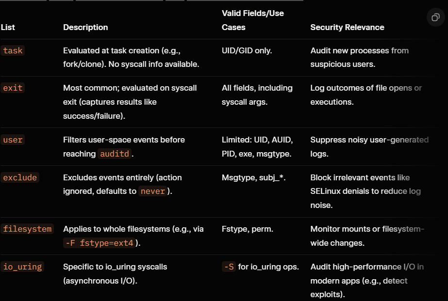

Linux auditing is a critical component of system security, allowing administrators to monitor and log events on a system for compliance, forensics, and threat detection. It helps track user actions, detect unauthorized access, and ensure accountability, especially in environments like servers or enterprise systems where security breaches can have severe consequences.

The Linux Audit system, centered around the auditd daemon, records kernel-level events based on predefined rules. This is essential for standards like PCI-DSS, HIPAA, or NIST compliance.

In the security domain, auditing focuses on:

    Detection: Identifying anomalies, such as failed login attempts or file modifications.
    Prevention: Enforcing policies to limit risks from privileged users.
    Response: Providing logs for incident investigation.

1. Audit Basics:
Auditing in Linux involves capturing system calls, file accesses, and user activities at the kernel level. It's not just logging; it's rule-based monitoring that can alert on suspicious behavior.

* Key Concepts:
    * Events: Actions like file opens, executions, or network connections.
    * Rules: Define what to audit (e.g., watch a specific file or user).
    * Logs: Stored in /var/log/audit/audit.log for analysis.

* Basic Commands:
    * Check status: auditctl -s (shows if auditing is enabled).
    * List rules: auditctl -l.

2. Linux Auditing and auditd

auditd is the user-space daemon that manages the audit subsystem. It collects audit records from the kernel and writes them to logs.

How It Works: The kernel sends events to auditd via a netlink socket. auditd rotates logs, compresses them, and can trigger actions (e.g., email alerts).

Security Benefits:
    Immutability: Logs are tamper-resistant if configured properly (e.g., remote logging).
    Granularity: Audit specific syscalls like execve (program execution) to detect exploits.
    Compliance: Essential for proving due diligence in audits.

    Configuration File: /etc/audit/audit.rules or /etc/audit/rules.d/ (persistent rules).

How Linux Auditing Works?

1. Kernel Audit Subsystem: Embedded in the Linux kernel, it intercepts system calls (syscalls) and other events based on predefined rules. When an event matches a rule, the kernel generates an audit record containing details like timestamp, user ID (UID/AUID), process ID (PID), syscall number, and outcome (success/failure).
2. Netlink Communication: The kernel sends audit records to user space via a multicast netlink socket. auditd listens on this socket as the primary receiver.
3. auditd Daemon: Processes incoming records, applies filters if needed, and writes them to logs. It can also dispatch events to plugins (e.g., for remote logging or real-time analysis).
4. Plugins and Dispatchers: Tools like audispd (audit dispatcher) can forward events to child plugins for additional processing, such as syslog integration or custom scripts.
5. Query Tools: Post-collection, tools like ausearch (search logs) and aureport (generate reports) analyze the data.

The system supports two main rule types:

* Control Rules: Manage the audit system's behavior (e.g., enable/disable auditing, set failure modes).
* Watch Rules: Monitor files/directories or syscalls.

Events are logged in a structured format, e.g.:

    type=SYSCALL msg=audit(1705677600.123:456): arch=c000003e syscall=59 success=yes exit=0 a0=7fffc1234560 a1=7fffc1237890 a2=7fffc123abcd a3=0 items=2 ppid=1234 pid=5678 auid=1000 uid=1000 gid=1000 euid=1000 suid=1000 fsuid=1000 egid=1000 sgid=1000 fsgid=1000 tty=pts0 ses=1 comm="bash" exe="/bin/bash" key="exec"

***********************************************************************************************************************

Configuration:

Configuration is split across files for modularity:

1. /etc/audit/auditd.conf: Main config for auditd. Key parameters include:
    log_file = /var/log/audit/audit.log: Log location.
    max_log_file = 10: Max log size in MB before rotation.
    max_log_file_action = ROTATE: Action on full log (e.g., ROTATE, KEEP_LOGS, SYSLOG, SUSPEND, IGNORE, or HALT).
    space_left = 75: MB left on disk to trigger space_left_action (e.g., EMAIL).
    admin_space_left = 50: Critical low-space threshold (e.g., action HALT to prevent data loss).
    num_logs = 5: Number of rotated logs to keep.
    flush = INCREMENTAL_ASYNC: How data is flushed to disk (options: NONE, INCREMENTAL, INCREMENTAL_ASYNC, DATA, SYNC).
    priority_boost = 4: Nice value adjustment for auditd.
    name_format = HOSTNAME: Format for hostname in logs.
    For performance in high-load systems, tune freq (flush frequency) or use remote logging to offload processing.
2. /etc/audit/audit.rules or /etc/audit/rules.d/: Persistent rules loaded at startup. Rules in rules.d/ are compiled into audit.rules via augenrules --load. Example basic setup:

    ## Remove existing rules
    -D

    ## Set failure mode (1 = silent, 2 = panic on error)
    -f 1

    ## Buffer size (in KB)
    -b 8192
3. /etc/audit/plugins.d/: Config for plugins, e.g., syslog.conf for forwarding to syslog.

    root@2024PUNLTP07415:~# cat /etc/audit/plugins.d/syslog.conf
    # This file controls the configuration of the syslog plugin.
    # It simply takes events and writes them to syslog. The
    # arguments provided can be the default priority that you
    # want the events written with. And optionally, you can give
    # a second argument indicating the facility that you want events
    # logged to. Valid options are LOG_LOCAL0 through 7, LOG_AUTH,
    # LOG_AUTHPRIV, LOG_DAEMON, LOG_SYSLOG, and LOG_USER.

    active = no
    direction = out
    path = /sbin/audisp-syslog
    type = always
    args = LOG_INFO
    format = string
4. root@2024PUNLTP07415:~# cat /etc/audit/audit-stop.rules
    # These rules are loaded when the audit daemon stops
    # if configured to do so.

    # Disable auditing
    -e 0

    # Delete all rules
    -D

Rules Syntax and Examples :-

    1. Core Structure of a Rule:
    auditctl -a <list>,<action> -S <syscall> -F <field=operator value> -k <key>

        -a or -A: Appends (-a) or inserts at the beginning (-A) of a rule list.
        List and Action: Separated by a comma (no space), e.g., exit,always.
        -S: Specifies syscalls to audit.
        -F: Adds conditional fields (multiple allowed, logically ANDed).
        -k: Assigns a searchable key.
        Other modifiers: -d to delete rules, -w for file watches (deprecated).
    2. Rule Lists:
    Lists determine when the rule is evaluated during an event's lifecycle. They are essential for efficiency—e.g., using entry for early checks vs. exit for post-execution details.
    
        entry: Evaluated at syscall entry.
        exit: Evaluated at syscall exit (default).
        task: Evaluated when a task exits.
    
    Best Practice: Use exit for most security audits as it provides exit codes and results. Start with -A to insert suppressive rules (never) early in the list to filter out benign events.
    3. Action Types:
    
        always: Always audit matching events.
        never: Never audit matching events (suppression).

    Actions are paired with lists, e.g., exit,always. In security setups, always is for logging threats, while never prevents log flooding from normal operations.

    4. Fields (-F) and Operators: 

    Fields are conditions that must match for the rule to trigger. Syntax: -F field operator value (e.g., -F auid>=1000).

        Operators: =, !=, <, >, <=, >=, & (bitwise AND), &= (bit test for masks).
        Multiple fields are ANDed; up to 64 per rule.
        Values can be numeric (e.g., UIDs) or strings (e.g., paths); user/group names are resolved to IDs.
    5. Syscall Specifications (-S)

        Syntax: -S syscall_name_or_number (e.g., -S execve or -S 59).
        Multiple: -S open,read,write or separate -S flags.
        all: Audit every syscall (use sparingly with fields to filter).

        On bi-arch systems, syscall numbers differ (e.g., execve is 59 on x86_64, 11 on i386), so always pair with -F arch=.
        Best Practice: List multiple syscalls in one rule for efficiency. Avoid auditing high-volume ones like read/write unless critical—use tools like strace for debugging instead.
    
    6. Deprecated Watch Rules (-w, -p, -W)

        -w path: Watch file (-F path=) or directory (-F dir=).
        -p perms: Trigger on r/w/x/a.
        -W path: Remove watch.
        Why Deprecated?: Inefficient; causes kernel overhead. Migrate to syscall rules for better performance.

        Example Conversion:

        Old: auditctl -w /etc/passwd -p wa -k passwd
        New: auditctl -a always,exit -F path=/etc/passwd -F perm=wa -k passwd

    7. Detailed Examples:
        a. Audit All Failed File Opens:
            auditctl -a always,exit -S openat -F success=0 -k file-fail

            * List/Action: Exit on syscall, always log.
            * Syscall: openat (common file open).
            * Field: Only failures (exit code <0).
            * Security: Detects probing attacks.
        b. Monitor Sudo Executions by Non-Root:
            auditctl -a always,exit -F arch=b64 -S execve -F exe=/usr/bin/sudo -F auid>=1000 -F auid!=unset -k priv_esc

            Arch: 64-bit.
            Syscall: Program execution.
            Fields: Executable is sudo, audit user is non-system (≥1000) and set.
            Security: Tracks privilege escalations.
        c. Recursive Directory Watch for Changes:
            auditctl -a always,exit -F arch=b64 -F dir=/etc/ -F perm=wa -k config-change
            Monitors writes/attributes in /etc/ (e.g., config edits).
            Security: Integrity monitoring for system files.
        d. Exclude Noisy Events:
            auditctl -a never,exclude -F msgtype=AVC -k selinux-noise
            Suppresses SELinux denial messages.
            Security: Reduces false positives in logs.
        e. Detect File Deletions:
            auditctl -a always,exit -F arch=b64 -S unlink,unlinkat,rename,renameat -k file-delete
            Multiple syscalls for deletion/rename.
            Security: Forensic trail for data destruction.
        f. Inter-Field Comparison for Anomalous Access:
            auditctl -a always,exit -F arch=b64 -F dir=/home/ -C auid!=obj_uid -k access-anomaly
            Logs when login user ≠ file owner.
            Security: Detects unauthorized home dir access.

***********************************************************************************************************************

File Watch

File watching audits access or modifications to specific files/directories, crucial for protecting configuration files or data.

Setup:
    Example: Watch /etc/passwd for reads/writes/attribute changes/executes.
    auditctl -w /etc/passwd -p rwa -k passwd_changes
        -w: Path to watch.
        -p rwxa: Permissions (read, write, execute, attribute).
        -k: Key for log searching.
    Persistent Rules: Add to /etc/audit/rules.d/audit.rules and restart auditd.
    Security Relevance: Detects unauthorized changes, like an attacker modifying user accounts or SSH keys. Useful for monitoring web server configs (e.g., /etc/apache2/) to prevent web exploits.

************************************************************************************************************************

