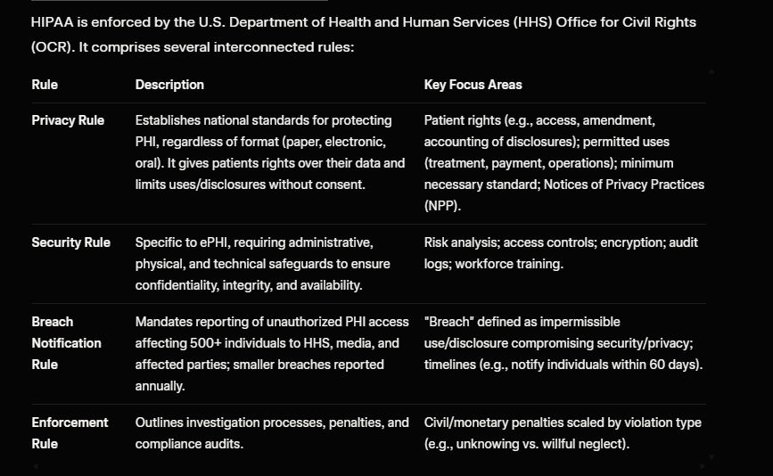
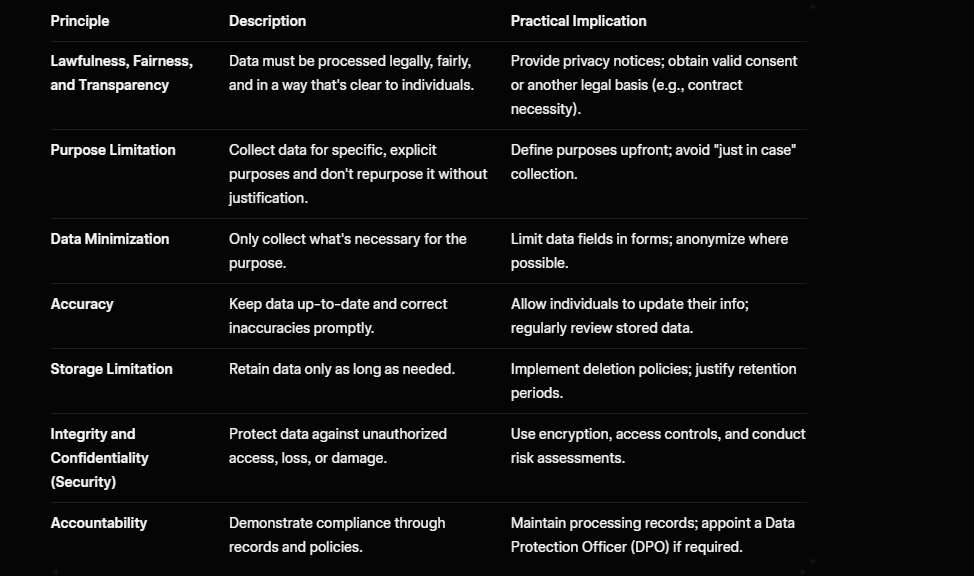

Audit compliance and regulations are essential in ensuring organizations protect sensitive information, manage risks, and adhere to legal standards. This topic covers key U.S. federal and international frameworks that govern data security, privacy, and auditing practices. FISMA and FIPS focus on U.S. government information security, HIPAA protects health data, GDPR safeguards personal data in the EU (with global implications), and audit frameworks like NIST, ISO 27001, and COBIT provide structured approaches for assessments and governance.

These are interconnected: FISMA often relies on NIST standards (which incorporate FIPS), while audit frameworks help implement and verify compliance with regulations like HIPAA and GDPR. Learning them builds knowledge in cybersecurity, risk management, and legal obligations, which is valuable for roles in IT, compliance, or auditing.

FISMA (Federal Information Security Management Act) : The Federal Information Security Modernization Act (FISMA) defines a framework of guidelines and security standards to protect government information and operations.
- A U.S. federal law that mandates federal agencies to develop, document, and implement information security programs.
- Requires regular assessments of information security controls and procedures.
- Emphasizes risk management and the protection of government information systems.

FIPS (Federal Information Processing Standards)
- A set of standards developed by the National Institute of Standards and Technology (NIST) for federal computer systems.
- Includes guidelines for encryption, data integrity, and security protocols.
- Often referenced in FISMA compliance requirements.

HIPAA (Health Insurance Portability and Accountability Act)
- A U.S. law that sets standards for the protection of sensitive patient health information.
- Requires healthcare providers and organizations to implement safeguards to ensure the confidentiality, integrity, and availability of electronic protected health information (ePHI).
- Mandates regular risk assessments and audits to ensure compliance

GDPR (General Data Protection Regulation)
- A comprehensive data protection regulation in the European Union that governs the processing of personal data.
- Applies to organizations worldwide that handle the personal data of EU residents.
- Requires transparency, data subject rights, and stringent data protection measures.
- Imposes significant fines for non-compliance.

Audit Frameworks: Structured methodologies for evaluating compliance and security.
- NIST (National Institute of Standards and Technology): Provides a cybersecurity framework and special publications (e.g., NIST SP 800-53) for managing information security risks. A catalog of security and privacy controls for U.S. federal systems, with 23 families (e.g., Access Control, Incident Response). It's foundational for FISMA and integrates with frameworks like the NIST Cybersecurity Framework (CSF), which organizes practices into Identify, Protect, Detect, Respond, and Recover.
- ISO 27001: An international standard for information security management systems (ISMS). It provides a systematic approach to managing sensitive company information, ensuring its confidentiality, integrity, and availability. It includes requirements for risk assessment, security controls, and continuous improvement.
- COBIT (Control Objectives for Information and Related Technologies): A framework for IT governance and management. It provides best practices for aligning IT with business goals, managing risks, and ensuring compliance with regulations. COBIT emphasizes control objectives, performance measurement, and process improvement.

************************************************************************************************************************************************************************************************************************************************************************************************************************************************************************************************

# FISMA (Federal Information Security Management Act)
Source: https://security.cms.gov/learn/federal-information-security-modernization-act-fisma

The Federal Information Security Modernization Act (FISMA) defines a framework of guidelines and security standards to protect government information and operations.

FISMA defines three security objectives for information and information systems:

Confidentiality: Preserving authorized restrictions on information access and disclosure, including means for protecting personal privacy and proprietary information.

Integrity: Guarding against improper information modification or destruction, and includes ensuring information nonrepudiation and authenticity. 

Availability: Ensuring timely and reliable access to and use of information.

# FISMA compliance:

A key requirement of FISMA is that program officials, and the head of each agency, must conduct annual reviews of information security programs, with the intent of keeping risks at or below specified acceptable levels. 

# Implement continuous monitoring

# Conduct annual security reviews

# Perform risk assessments

# Document the controls in the system security plan

# Meet baseline security controls

# Perform system risk categorization : At CMS, system categorization happens in CFACTS and results in a categorization of “Low”, “Moderate”, or “High” depending on the level of impact that would occur if the information or the information system were compromised.
    Impact level LOW : The loss of confidentiality, integrity, or availability could be expected to have a limited adverse effect on organizational operations, organizational assets, or individuals.
    Impact level MODERATE : The loss of confidentiality, integrity, or availability could be expected
    to have a serious adverse effect on organizational operations, organizational assets, or individuals.
    Impact level HIGH : The loss of confidentiality, integrity, or availability could be expected to have
    a severe or catastrophic adverse effect on organizational operations, organizational assets, or individuals.

************************************************************************************************************************************************************************************************************************************************************************************************************************************************************************************************
# FIPS (Federal Information Processing Standards)

Keeping sensitive data, such as Personally Identifiable Information (PII), secure in every stage of its life is an important task for any organization. To simplify this process, standards, regulations, and best practices were created to better protect data. The Federal Information Protection Standard, or FIPS, is one of these standards. These standards were created by the National Institute of Science and Technology (NIST) to protect government data, and ensure those working with the government comply with certain safety standards before they have access to data.

* Aims to ensure security and interoperability of information systems within the federal government.
* Specifies requirements for cryptographic modules used to protect sensitive information.

One of the most widely used FIPS standards is FIPS 140-2, which outlines the security requirements for cryptographic modules. This standard is essential for organizations that handle sensitive government data, as it ensures that the cryptographic methods used are robust and reliable.
    * Ensures secure and reliable encryption and decryption processes.

    FIPS Standards: 

    # FIPS 140-2 : Security Requirements for Cryptographic Modules. It defines the security requirements for cryptographic modules—hardware, software, firmware, or hybrid systems that perform encryption, decryption, and other cryptographic functions.

    Purpose and Scope: FIPS 140-2 focuses on validating the effectiveness of cryptographic hardware and software to protect data. It covers modules used in IT products for tasks like data encryption, key generation, and authentication. The standard addresses 11 key areas related to secure design:

    * Module specification
    * Ports and interfaces
    * Roles, services, and authentication
    * Finite state model
    * Physical security
    * Operational environment
    * Cryptographic key management
    * Electromagnetic interference/electromagnetic compatibility (EMI/EMC)
    * Self-tests
    * Design assurance
    * Mitigation of other attacks

    Validation Process
    Modules are validated through the Cryptographic Module Validation Program (CMVP), a joint effort between NIST and the Canadian Centre for Cyber Security (CCCS). Independent accredited labs test modules against the standard, and successful ones receive a validation certificate. "FIPS 140-2 validated" means the module meets requirements for its claimed level.

    Transition to FIPS 140-3
    FIPS 140-2 was superseded by FIPS 140-3 in September 2019, which aligns more closely with ISO/IEC 19790:2012 for international compatibility and updates testing requirements. However, 140-2 validations remained accepted until September 2026 for legacy systems. If you're implementing new systems today (January 21, 2026), focus on 140-3, but 140-2 remains relevant for understanding historical and ongoing validations

    # FIPS 140-3:
    Key Changes from FIPS 140-2
    FIPS 140-3 introduces several updates:

    Alignment with ISO standards for international compatibility.
    Non-invasive security requirements (e.g., side-channel mitigation) integrated, especially at higher levels.
    Stricter integrity testing, key zeroization for all sensitive parameters (including public keys), and multi-factor auth at Level 4.
    Deferred self-tests under certain conditions and public security parameters.
    Enhanced documentation and testing rigor.
    Minimum password length increased to 8 characters in some contexts.

    It doesn't patch 140-2 but rewrites parts for modern threats and international alignment.

************************************************************************************************************************************************************************************************************************************************************************************************************************************************************************************************

# HIPAA (Health Insurance Portability and Accountability Act) 

HIPAA, which stands for the Health Insurance Portability and Accountability Act, is a U.S. federal law enacted in 1996 to protect sensitive patient health information while ensuring its portability and accessibility for legitimate purposes. It primarily applies to "covered entities" like healthcare providers, health plans, and clearinghouses, as well as their "business associates" (e.g., vendors handling patient data). The core goal is to safeguard Protected Health Information (PHI), which includes any identifiable health data like medical records, billing info, or even conversations about a patient's care. HIPAA balances privacy, security, and the need for data sharing in healthcare, reducing risks like identity theft or unauthorized disclosures.

Key Components: The HIPAA Rules :-

1. Privacy Rule : Establishes national standards for protecting individuals' medical records and other personal health information. It sets limits on the use and disclosure of PHI without patient authorization and grants patients rights over their health information.
2. Security Rule : Sets standards for safeguarding electronic PHI (ePHI). It requires covered entities to implement administrative, physical, and technical safeguards to ensure the confidentiality, integrity, and availability of ePHI.
3. Breach Notification Rule : Mandates covered entities and business associates to notify affected individuals, the Department of Health and Human Services (HHS), and, in some cases, the media, in the event of a breach of unsecured PHI.
4. Enforcement Rule : Outlines the procedures for investigations, penalties, and hearings related to HIPAA violations.

Compilance Requirements :-

* Appoint Key Roles: Designate a HIPAA Privacy Officer and Security Officer to oversee compliance.
* Conduct Risk Assessments: Regularly evaluate threats to PHI (e.g., cyberattacks, physical theft) and document mitigation plans. This is mandatory and often the root of OCR investigations.
* Develop Policies and Procedures: Create written guidelines for handling PHI, including access controls, data sharing, and incident response.
* Train Workforce: Annual training for all staff on HIPAA rules, with documentation.
* Secure Business Associate Agreements (BAAs): Contracts with vendors ensuring they comply with HIPAA.
* Implement Safeguards:
* Administrative: Policies, training, contingency plans.
* Physical: Locks, secure facilities.
* Technical: Encryption, firewalls, multi-factor authentication (MFA)—increasingly emphasized.
* Monitor and Audit: Regular reviews, including HIPAA audits by OCR.
* Handle Patient Rights: Respond to requests for access (within 30 days), corrections, or restrictions.

Technical Safeguards:- 

* Information systems housing PHI must be protected from intrusion. When information flows over open networks, some form of encryption must be utilized. If closed systems/networks are utilized, existing access controls are considered sufficient and encryption is optional.
* Each covered entity is responsible for ensuring that the data within its systems has not been changed or erased in an unauthorized manner.
* Data corroboration, including checksums, double-keying, message authentication, and digital signature may be used to ensure data integrity.
* Covered entities must also authenticate entities with which they communicate. Authentication consists of corroborating that an entity is who it claims to be. Examples of corroboration include password systems, two- or three-way handshakes, telephone callbacks, and token systems.
* Covered entities must make documentation of their HIPAA practices available to the government to determine compliance.
* In addition to policies and procedures and access records, information technology documentation should also include a written record of all configuration settings on the network's components because these components are complex, configurable, and always changing.
* Documented risk analysis and risk management programs are required. Covered entities must carefully consider the risks of their operations as they implement systems to comply with the act. The requirement of risk analysis and risk management implies that the act's security requirements are a minimum standard and places responsibility on covered entities to take all reasonable precautions necessary to prevent PHI from being used for non-health purposes.

************************************************************************************************************************************************************************************************************************************************************************************************************************************************************************************************************************************************************

# GDPR (General Data Protection Regulation)
GDPR stands for the General Data Protection Regulation, a comprehensive data privacy law enacted by the European Union to protect the personal data and privacy rights of individuals within the EU and EEA (European Economic Area). It applies to any organization—regardless of location—that processes personal data of EU residents, making it extraterritorial in scope. Personal data includes any information that can identify a person directly or indirectly, such as names, email addresses, IP addresses, health records, or online behavior. The regulation emphasizes accountability, transparency, and individual control over data, aiming to harmonize data protection across

Key Components: The 7 Principles of GDPR

Compliance Requirements : - Compliance is proactive and risk-based. Steps to get started:

Map Your Data: Identify what personal data you hold, where it comes from, and how it's used.
Assess Legal Bases: Ensure each processing activity has a valid basis.
Implement Policies: Create privacy notices, consent forms, and data protection policies.
Conduct Risk Assessments: Perform DPIAs and regular audits.
Train Staff: Educate employees on GDPR to avoid breaches.
Secure Data: Adopt technical measures like encryption and pseudonymization.
Handle Transfers and Vendors: Use BAAs or equivalent for processors; restrict international flows.
Monitor and Document: Keep records to prove accountability; review annually.