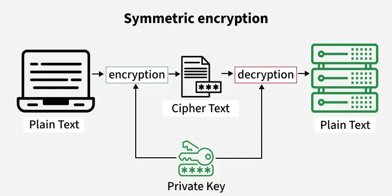
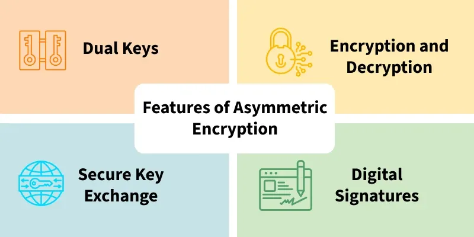
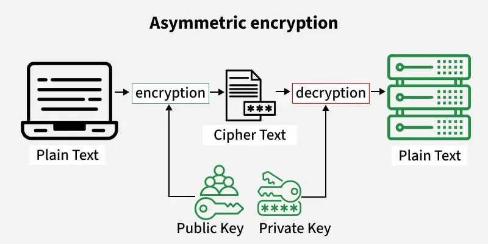

What is a Symmetric Encryption?

When the plain text is encrypted and decrypted using the same key, it is known as symmetric encryption. It is also known as "shared-key" or "private-key" encryption. It ensures confidentiality by ensuring only authorized parties with the key can access the original data.

The key is a piece of a shared secret between the two parties involved, hence it is 'shared-key' and is kept secret, hence the name 'private-key' is justified.

How does Symmetric Encryption Work?

1. key Generation: A secret key is generated using an algorithm. This key must be kept confidential between the sender and receiver. The first step involves selecting a private key. A secure key is generated using algorithms like PBKDF2 (Password-Based Key Derivation Function 2) or hardware random number generators. This key must be securely shared or transferred over the network for future use.

Example: A 256-bit AES key: 3A7F2B4E... (32-byte hexadecimal string).

2. Encryption: In this step, the original message (plain text) is transformed into unreadable text (ciphertext) ,and the plaintext is processed in blocks or streams using an encryption algorithm and the secret key.

Example: AES-256 in CBC (Cipher Block Chaining) mode encrypts a 128-bit block of plaintext with the key and an initialization vector (IV) to produce ciphertext.

3. Transfer of Cipher text:
The encrypted message (ciphertext) is then sent over the network. Even if intercepted, it remains unreadable to the attacker unless they have access to the shared secret key and the algorithm used for encryption.

4. Decryption:
In the final step, the recipient uses the same secret key and a reverse encryption algorithm to convert the cipher text back into the original message (plain text).

Challenges of Symmetric Encryption:
Key Sharing Security: The primary challenge lies in securely sharing the secret key. If the key is compromised, the entire communication becomes vulnerable. So use asymmetric encryption (e.g., RSA) for initial key exchange (hybrid systems)
Key Storage: Safely storing the secret key is another significant concern, as unauthorized access to the key can compromise the security of the encrypted data. So use the Hardware Security Modules (HSMs) for tamper-resistant storage and for cloud use Cloud-based Key Management Services (KMS) like AWS KMS or Azure Key Vault.
Scalability: As the number of users grows, the complexity of securely managing and sharing secret keys increases exponentially, making it more difficult to maintain a robust security framework, so implement hierarchical key structures or automated rotation policies.

Application of Symmetric Encryption:

Due to its speed and efficiency, Symmetric encryption is widely used for securing communications. Some of the most common use-cases of symmetric encryption includes:

File and Disk Encryption: Symmetric encryption is the preferred choice for securing files, databases, and entire drives due to its robust performance and simplicity.
Bulk Data Encryption: For encrypting large volumes of data, symmetric encryption is the go-to method because of its faster processing time compared to asymmetric encryption.
Hybrid Algorithms: While asymmetric encryption is crucial for securing keys and verifying identities, it is not ideal for data encryption. Hybrid systems combine the strengths of both, using asymmetric encryption for key exchange and symmetric encryption for the actual data encryption.

-----------------------------------------------------------------------------------------------------------------
Asymmetric Encryption:

Asymmetric encryption, also known as public-key cryptography, is a type of encryption that uses a pair of keys to encrypt and decrypt data. The pair of keys includes a public key, which can be shared with anyone, and a private key, which is kept secret by the owner.

In asymmetric encryption, the sender uses the recipient's public key to encrypt the data. The recipient then uses their private key to decrypt the data. This approach allows for secure communication between two parties without the need for both parties to have the same secret key.

The Main Features of Asymmetric Encryption (also known as public-key cryptography) are:

Dual keys: Asymmetric encryption uses a pair of keys, including a public key and a private key. The public key can be freely shared with anyone, while the private key is kept secret and known only to the key owner.
Encryption and decryption: Asymmetric encryption uses the public key to encrypt data and the private key to decrypt data. This allows secure communication between two parties without the need to exchange secret keys.
Digital signatures: Asymmetric encryption enables the creation of digital signatures, which can be used to verify the authenticity of data. A digital signature is created by encrypting a hash of the data with the sender's private key.
Secure key exchange: Asymmetric encryption allows for secure key exchange, which is a critical feature in secure communication. For example, the Diffie-Hellman key exchange algorithm uses asymmetric encryption to establish a shared secret key between two parties without exchanging the key itself.

How Does Asymmetric Encryption Works?

Step 1. Key Pair Generation:

* The first step in asymmetric encryption is generating a pair of keys: a public key and a private key.
* The public key is shared openly, while the private key is kept secret

Step 2. Encryption:

The sender uses the public key of the recipient to encrypt the message.
The public key is used because it is freely available and can be used to convert the message into an unreadable format (cipher text).

Step 3. Transmission:

The encrypted message (cipher text) is sent over the network to the recipient. Even if intercepted by someone, it remains unreadable without the corresponding private key.

Step 4. Decryption:

Upon receiving the encrypted message, the recipient uses their private key to decrypt it.
The private key is kept secure and is never shared, ensuring that only the intended recipient can decrypt and read the message.

Step 5. Verification (Digital Signature):

In some cases, the sender may also sign the message using their private key to ensure its authenticity.
The recipient can verify the signature using the sender's public key, confirming that the message was not tampered with and was indeed sent by the intended sender.

Step 6. Result:

Once decrypted, the message is returned to its original form (plain text), and the recipient can read it.
This method ensures both the confidentiality of the message (by using the recipient’s public key) and the integrity and authenticity (via digital signatures using the sender’s private key).

Advantages of Asymmetric Encryption:

Asymmetric encryption also known as public key cryptography is a method of cryptography that uses two different keys to encrypt and decrypt data, here are some advantages of asymmetric encryption: -

Enhanced Security: Asymmetric encryption provides a higher level of security compared to symmetric encryption where only one key is used for both encryption and decryption with asymmetric encryption a different key is used for each process and the private key used for decryption is kept secret by the receiver making, it harder for an attacker to intercept and decrypt the data.
Authentication: It can be used to verify the sender’s identity, meaning the receiver can confirm who sent the message. This is achieved when the sender encrypts a message using their private key, which can only be decrypted using their public key If the receiver can successfully decrypt the message, it proves that the sender owns the corresponding private key..
Non-repudiation: Asymmetric encryption provides non-repudiation, meaning that the sender cannot deny sending the message. This is because the message can only be decrypted using the sender’s public key, which is publicly available. If the receiver can successfully decrypt the message, it proves that the sender sent the message.
Key distribution: Asymmetric encryption eliminates the need for a secure key distribution system that is required in symmetric encryption with symmetric encryption, the same key is used for both encryption and decryption and the key needs to be securely shared between the sender and the receiver asymmetric encryption, on the other hand, allows the public key to be shared openly and the private key is kept secret by the receiver.
Versatility: It be used for a wide range of applications including secure email communication online banking transactions and e-commerce it is also used to secure SSL/TSL connections which are commonly used to secure internet traffic.

Limitations of Asymmetric Encryption
Here are some key limitations of asymmetric encryption:

1. Speed and Efficiency:

Asymmetric encryption is much slower than symmetric encryption because it involves complex mathematical operations. Encrypting large amounts of data can be inefficient, making it less suitable for bulk data encryption.

2. Resource Intensive:

Due to the complex nature of the encryption process, asymmetric encryption requires more computational resources, such as CPU power and memory, which can be an issue on devices with limited resources.

3. Key Management:

Managing large key pairs can become complex, especially when the number of users increases. Securing the private key is essential; if it is lost or compromised, the security of the system is at risk.

Vulnerability to Quantum Attacks:

Asymmetric encryption algorithms, like RSA and ECC, are potentially vulnerable to quantum computing attacks. Quantum computers could break current asymmetric encryption systems by efficiently solving problems like factoring large numbers.

Not Ideal for Real-Time Encryption:

Asymmetric encryption is not suitable for real-time communications or streaming data, where low latency and fast encryption/decryption are required.

Applications of Asymmetric Encryption : 

1. Secure Communication:
Email Encryption: Asymmetric encryption is used to secure email communication. Services like PGP (Pretty Good Privacy) or S/MIME (Secure/Multipurpose Internet Mail Extensions) use public and private keys to ensure that only the intended recipient can decrypt and read the message.
2. Digital Signatures:
Document Signing: Digital signatures use asymmetric encryption to provide authentication, data integrity, and non-repudiation. A sender signs a document with their private key, and the recipient can verify the signature using the sender's public key. This ensures that the document hasn't been tampered with and verifies the sender's identity.
3. Secure Web Browsing (SSL/TLS):
HTTPS: Secure websites use SSL/TLS protocols, which rely on asymmetric encryption for establishing a secure connection. The server sends its public key to the browser, allowing the browser to establish an encrypted session using the server's public key. Once the secure connection is set up, symmetric encryption is often used for data transfer.
4. Cryptocurrency Transactions:
Bitcoin and Other Cryptocurrencies: Asymmetric encryption is used in cryptocurrency systems to secure transactions. A user's private key is used to sign transactions, while the public key is used to verify that the transaction has been made by the legitimate owner.
5. Virtual Private Networks (VPNs):
Secure VPN Connections: Asymmetric encryption is used during the initial setup of a VPN connection to securely exchange keys. Once the public and private keys are exchanged, symmetric encryption is typically used for ongoing data transfer.
6. File Encryption:
Encrypting Files: Asymmetric encryption is used to secure files, especially when files need to be shared across a network. The file is encrypted using the recipient's public key, ensuring that only the recipient can decrypt it with their private key.