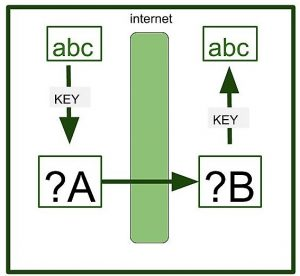

Cryptographic hash functions are mathematical algorithms that transform input data into a fixed-length sequence of characters, referred to as a hash value. Cryptographic hash functions are intended to be fast, deterministic, and one-way, meaning that even a minor change in input yields a very different hash. These functions are important for securing information digitally by allowing data verification and authentication.

Cryptographic hash functions protect data integrity by creating identifying hash values, which enable systems to identify any unauthorized changes to messages or files in real time.
Within cybersecurity, they are the foundation for digital signatures and certificate validation, giving a secure means to verify the authenticity of software and communications.
They provide safe password storage through hashing passwords prior to saving, stopping direct exposure of sensitive credentials even if there happens to be a breach of data.

Working of Cryptography Hash Function:-

Input Processing: Cryptographic hash functions process an input of any length—whether text, file, or data stream—and subject it to a sequence of mathematical operations. The input can range from several bytes to gigabytes of information.
Fixed-Size Output Generation: No matter what the length of the input, the function generates a fixed-size hash value, normally in the form of a hexadecimal string. This uniform output size provides equality regardless of the inputs.
Deterministic Operation: The hash function consistently computes the same hash for the same input. Such a property enables uncompromising data authentication, as any alteration in the input leads to a totally unique hash.
Avalanche Effect: A minor alteration in the input, even the flipping of one bit, significantly alters the resultant hash. The sensitivity ensures that collisions among hashes (two inputs having the same hash) are highly unlikely.
One-Way Computation: The algorithm is made irreversible in the sense that it is computationally impossible to recover the original input from its hash value. This one-way feature protects sensitive information such as passwords and digital signatures.
Collision Resistance: Hash functions used in cryptography are designed to minimize the probability of two distinct inputs generating the same hash value, upholding the integrity and trustworthiness of verification processes.

# Applications of Cryptographic Hash Functions:

Message Authentication : 

Message authentication is a system or service that verifies the integrity of a communication.
It ensures data is received precisely as transmitted, with no modifications, insertions, or deletions, a hash function is used for message authentication, and the value is sometimes referred to as a message digest.
Message authentication often involves employing a message authentication code (MAC).
MACs are widely used between two parties that share a secret key for authentication purposes. A MAC function uses a secret key and data block to generate a hash value, that identifies the protected communication.

Data Integrity Check:

Hash functions are most commonly used to create checksums for data files.
This program offers the user with assurance that the data is correct.
The integrity check allows the user to detect any modifications to the original file.
It does not assure uniqueness. Instead of altering file data, the attacker can update the entire file, compute a new hash, and deliver it to the recipient.

Digital Signatures:
The digital signature application is comparable to message authentication.
Digital signatures operate similarly to MACs.
Digital signatures encrypt message hash values using a user's private key.
The digital signature may be verified by anybody who knows the user's public key.

Popular Cryptographic Hash Algorithms:

MD5 (Message Digest Algorithm 5)
Once widely used for data integrity and digital signatures, MD5 is now considered insecure due to vulnerabilities that allow attackers to generate hash collisions easily. Its speed and simplicity made it popular historically, but it is no longer recommended for security-critical applications.

SHA-1 (Secure Hash Algorithm 1)
SHA-1 improved upon MD5 with a longer hash length and better resistance to collisions. However, advances in computational power and cryptanalysis exposed weaknesses, leading to practical collision attacks. Consequently, SHA-1 is deprecated for most security uses, including SSL/TLS certificates and digital signatures.

SHA-2 Family (SHA-256, SHA-512)
The SHA-2 family is currently the industry standard for cryptographic hashing, offering robust security with longer hash outputs of 256 and 512 bits. These algorithms provide strong collision and pre-image resistance, making them the preferred choice for secure communication protocols, blockchain technologies, and password hashing.

-----------------------------------------------------------------------------------------

# MAC (Message Authentication Code): Message Authentication Codes are the codes which plays their role in two important functions: Authentication Detection and Falsification Detection. 

Where do we need these codes? 
Suppose User A send message to user B with message - 'abc'. A encrypts the message using Shared - Key Cryptosystem for encrypting the message. A sends the key to B using a source key. Key exchange is based on different protocols such as Public - Key Cryptosystem. B uses the key to decrypt the Ciphertext and obtains the message. 

problem: If a malicious user X has falsified the ciphertext during the transmission. Then, in that case, B has no way to realize that it has been falsified. When B decrypts the message, it will get the wrong message. Unknown to the fact B will think wrong information to be the right. Although you can decrypt or encrypt the data later on but these operations, you are applying the wrong data. 

Here comes the role of MAC.
The MAC is generated by applying a cryptographic function that combines the ciphertext with the secret key. The article simplifies this as "Ciphertext + Key = Message Authentication Code," but in practice, this involves a secure algorithm like:
HMAC (Hash-based Message Authentication Code): Uses a hash function (e.g., SHA-256) with the key, such as HMAC(key, message).
CMAC (Cipher-based Message Authentication Code): Uses a block cipher (e.g., AES) to process the message.

The result is a fixed-size tag (e.g., 128-256 bits) appended to the message.
The MAC is generated by applying a cryptographic function that combines the ciphertext with the secret key. The article simplifies this as "Ciphertext + Key = Message Authentication Code," but in practice, this involves a secure algorithm like:
HMAC (Hash-based Message Authentication Code): Uses a hash function (e.g., SHA-256) with the key, such as HMAC(key, message).
CMAC (Cipher-based Message Authentication Code): Uses a block cipher (e.g., AES) to process the message.

The result is a fixed-size tag (e.g., 128-256 bits) appended to the message.
This process detects tampering: Even a small change in the message alters the MAC significantly due to the cryptographic properties.

