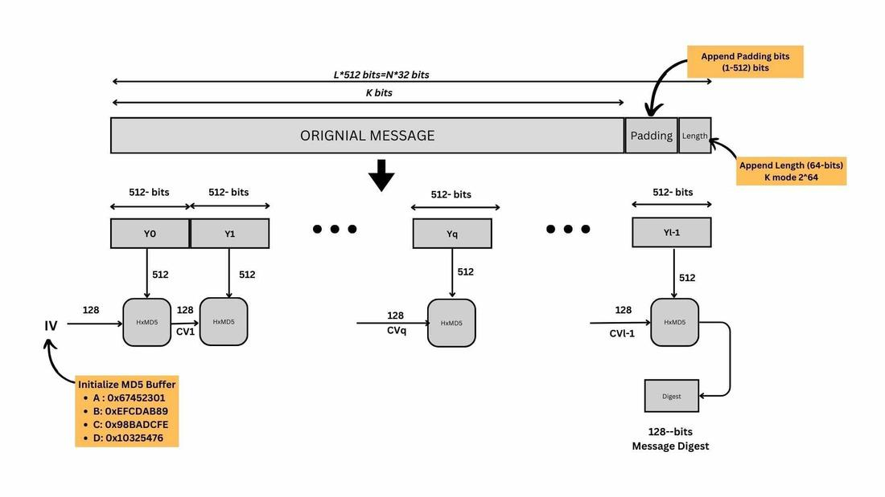

MD5 is a cryptographic hash function algorithm that takes the message as input of any length and changes it into a fixed-length message of 16 bytes. MD5 algorithm stands for the Message-Digest algorithm.the output of MD5 (Digest size) is always 128 bits.

MD5 is still the most commonly used message digest for non-cryptographic functions, such as used as a checksum to verify data integrity, compressing large files into smaller ones securely, etc.

Working of MD5:

1. Append Padding Bits: In the first step, we add padding bits in the original message in such a way that the total length of the message is 64 bits less than the exact multiple of 512.  

Suppose we are given a message of 1000 bits. Now we have to add padding bits to the original message. Here we will add 472 padding bits to the original message.  After adding the padding bits the size of the original message/output of the first step will be 1472 i.e. 64 bits less than an exact multiple of 512 (i.e. 512*3 = 1536).

Length(original message + padding bits) =  512 * i - 64 where i = 1,2,3 . . . 

2. Append Length Bits: In this step, we add the length bit in the output of the first step in such a way that the total number of the bits is the perfect multiple of 512. The length of the original message is represented in 64 bits.output of first step = 512 * n - 64 
length bits = 64. 

3. Initialize MD buffer: Here, we use the 4 buffers i.e. A B, C, and D. The size of each buffer is 32 bits.  

4. Process Each 512-bit Block: This is the most important step of the MD5 algorithm. Here, a total of 64 operations are performed in 4 rounds. In the 1st round, 16 operations will be performed, 2nd round 16 operations will be performed, 3rd round 16 operations will be performed, and in the 4th round, 16 operations will be performed. We apply a different function on each round i.e. for the 1st round we apply the F function, for the 2nd G function, 3rd for the H function, and 4th for the I function. 
We perform OR, AND, XOR, and NOT (basically these are logic gates) for calculating functions. We use 3 buffers for each function i.e. B, C, D.

After applying the function now we perform an operation on each block. For performing operations we need 

add modulo 232
M[i] - 32 bit message.
K[i] - 32-bit constant.
<<<n - Left shift by n bits.
Now take input as initialize MD buffer i.e. A, B, C, D. Output of  B will be fed in C, C will be fed into D, and D will be fed into J. After doing this now we perform some operations to find the output for A.

In the first step, Outputs of B, C, and D are taken and then the function F is applied to them. We will add modulo 232  bits for the output of this with A.
In the second step, we add the M[i] bit message with the output of the first step.
Then add 32 bits constant i.e. K[i] to the output of the second step. 
At last, we do left shift operation by n (can be any value of n) and addition modulo by 232.
After all steps, the result of A will be fed into B. Now same steps will be used for all functions G, H, and I. After performing all 64 operations we will get our message digest.

Output:
After all rounds have been performed, the buffer A, B, C, and D contains the MD5 output starting with the lower bit A and ending with Higher bits D.