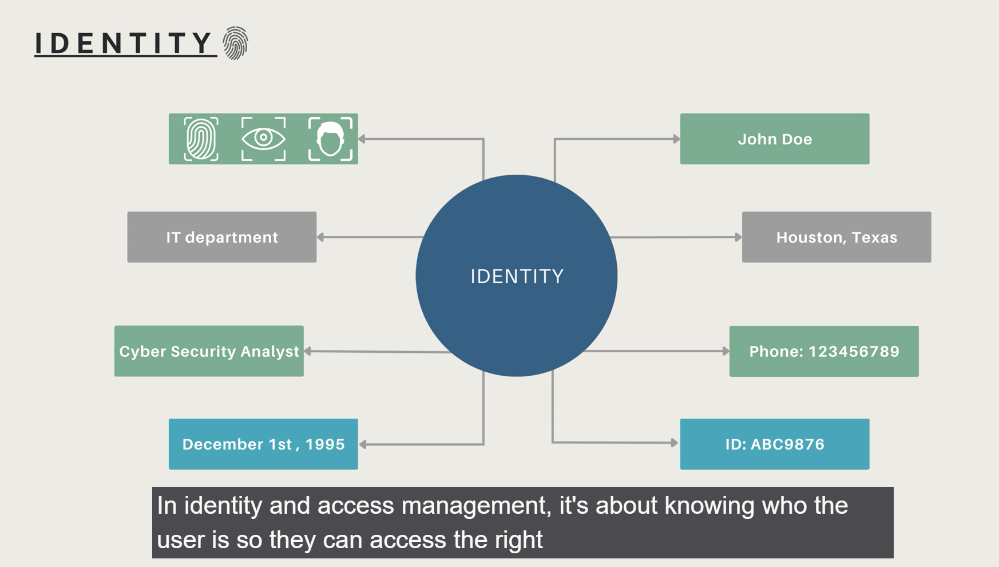
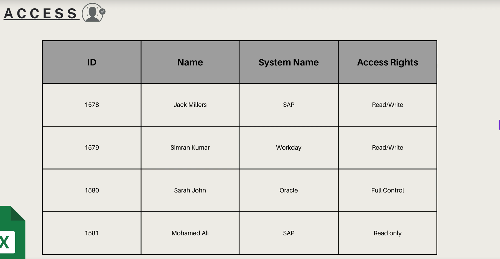

NIST quote " Identity and Access Management is a fundaental and critical cybersecurity capability , to ensure that the right individuals have access to the right resources at the right times for the right reasons. "

# IAM Domains :-

1. Identification, Authentication, Authorization, and Accountability (IAAA)
2. Privileged Access Management (PAM)
3. Identity Governance and Administration (IGA)
4. Data Governance and Protection (DGP)

------------------------------

# What is IAM?

To understand IAM, let's break down the components:

Idenitity : Idenity refers to the unique characteristics and attributes that define an individual or entity. It can include information such as name, email address, role, and other relevant details. Techinally ,it's user account or digital identity that represents a person or system within an organization.

Access : Access refers to the permissions and privileges granted to individuals or entities to interact with resources, systems, or data. It determines what actions a user can perform and what resources they can access based on their identity and assigned roles.

Think of spreadsheet with rows and columns. Each row represents a user, and each column represents a resource or system. The cells in the spreadsheet indicate the level of access or permissions that each user has for each resource.

Management : Management refers to the processes, policies, and technologies used to control and govern access to resources. It involves activities such as user provisioning, access request and approval workflows, role-based access control (RBAC), and monitoring of access activities.

Combining Idenity with Access Management allows organizations to ensure that only authorized individuals have access to sensitive resources, systems, and data. It helps prevent unauthorized access, mitigate security risks, and maintain compliance with regulatory requirements.

# Why do we need IAM?

As organizations grow and adopt digital technologies, the number of users, systems, and resources they need to manage increases significantly. This complexity can lead to security vulnerabilities if not properly addressed. IAM provides a structured approach to managing identities and access, ensuring that only authorized individuals can access critical resources while minimizing the risk of unauthorized access.

IAM helps organizations achieve several key objectives:

1. Security: IAM helps protect sensitive data and resources by ensuring that only authorized users have access. It reduces the risk of data breaches and unauthorized access to critical systems.

2. Compliance: Many industries are subject to regulatory requirements that mandate the protection of sensitive data. IAM helps organizations meet these compliance requirements by enforcing access controls and providing audit trails.

3. Efficiency: IAM streamlines the process of managing user identities and access permissions. It automates tasks such as user provisioning, access requests, and approvals, reducing administrative overhead and improving operational efficiency.

# How Does IAM Work?

Identity and Access Management (IAM) systems manage authentication and authorization to control user access. In IAM, users represent digital identities, including team members, customers, employees, or participants. Digital identities can also represent non-human entities like software, IoT devices, or robotics.

IAM security solutions authenticate users and devices by verifying credentials against a secure database that defines their identity and access permissions. Once authenticated, IAM assigns specific access levels based on user roles, such as “editing” or “viewing,” rather than complete system access. The IAM security tool continuously monitors activity to protect sensitive data and prevent unauthorized actions.

# How Identity and Access Management (IAM) Boosts Cybersecurity ?

The core objective of an IAM platform is to assign one digital identity to each individual or a device. From there, the solution maintains, modifies, and monitors access levels and privileges through each user’s access life cycle.

The core responsibilities of an IAM security system are to:

* Verify and authenticate individuals based on their roles and contextual information such as geography, time of day, or (trusted) networks
* Capture and record user login events
* Manage and grant visibility of the business’s user identity database
* Manage the assignment and removal of users’ access privileges
* Enable system administrators to manage and restrict user access while monitoring changes in user privileges

## Role-Based Access Control :-

IAM frameworks are not only crucial to controlling user access to critical information but also implementing role-based access control. This enables system administrators to regulate access to corporate networks or systems based on individual users’ roles, which are defined by their job titles, levels of authority, and responsibility within the business.

ex. Imagine a hotel with doors that are accessed by a keycard. A guest is given a keycard that accesses a single room, a maid is given a card that accesses any room on an assigned floor, and a maintenance worker is given a card that accesses all doors in the building. All are given cards, but the extent of access is determined by their role.

## Automatic De-Provisioning :-

An Identity and Access Management solution is also crucial to preventing security risks when employees depart a business. Manually de-provisioning access privileges to the apps and services the former employee used can often take time or even be forgotten entirely, leaving a security gap for hackers. IAM prevents this by automatically de-provisioning access rights once a user leaves the company or as their role within the organization changes.

## Human and Device Identification

Digital identities do not just exist for humans, as IAM also manages the identity of devices and applications. This establishes further trust and provides deeper context around whether a user is who they say they are and the applications that users are entitled to access.

# Core Components of Identity and Access Management (IAM) Security Systems:-

1. Single Sign-On
Single sign-on (SSO) is a form of access control that enables users to authenticate with multiple software applications or systems using just one login and one set of credentials. The application or site that the user attempts to access relies on a trusted third party to verify that the user is who they say they are, resulting in:

* Enhanced user experience 
* Reduced password fatigue 
* Simplified password management
* Minimized security risks for customers, partners, and vendors 
* Limited credential usage
* Improved identity protection

2. Multi-Factor Authentication
Multi-factor authentication verifies a user's identity with requirements to enter multiple credentials and provide various factors:

* Something the user knows: a password
* Something the user has: a token or code sent to the user via email or SMS, to a hardware token generator, or to an authenticator application installed on the user’s smartphone 
* Something specific to the user, such as biometric information: fingerprint, facial recognition, or voice recognition

3. Privileged Access Management

Privileged access management protects businesses from both cyber and insider attacks by assigning higher permission levels to accounts with access to critical corporate resources and administrator-level controls. These accounts are typically high-value targets for cybercriminals and, as such, high risk for organizations

4. Risk-Based Authentication

When a user attempts to log in to an application, a risk-based authentication solution looks at contextual features such as their current device, IP address, location, or network to assess the risk level. 

Based on this, it will decide whether to allow the user access to the application, prompt them to submit an additional authentication factor, or deny them access. This helps businesses immediately identify potential security risks, gain deeper insight into user context, and increase security with additional authentication factors.

5. Data Governance

Data governance is the process that enables businesses to manage the availability, integrity, security, and usability of their data. This includes the use of data policies and standards around data usage to ensure that data is consistent, trustworthy, and does not get misused. Data governance is important within an IAM solution as artificial intelligence and machine learning tools rely on businesses having quality data.

6. Federated Identity Management

Federated identity management is an authentication-sharing process whereby businesses share digital identities with trusted partners. This enables users to use the services of multiple partners using the same account or credentials. Single sign-on is an example of this process in practice.

7. Zero Trust
A Zero-Trust approach moves businesses away from the traditional idea of trusting everyone or everything that is connected to a network or behind a firewall. This view is no longer acceptable, given the adoption of the cloud and mobile devices extending the workplace beyond the four walls of the office and enabling people to work from anywhere.  IAM is crucial in this approach, as it allows businesses to constantly assess and verify the people accessing their resources.

8. Identity Governance and Administration (IGA)
Identity Governance and Administration (IGA) enables security administrators to manage user identities and access across the organization. It ensures that users can access systems and data based on their roles while maintaining compliance with security policies. It combines Identity Governance (visibility, role management, attestation, and reporting) with Identity Administration (account provisioning, credential management, and entitlement control). IGA thus strengthens security by ensuring users have only the access they need.