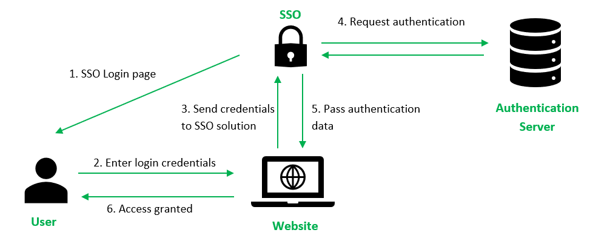

# Introduction of Single Sign On (SSO)

Single Sign On(SSO) is a session and user authentication service that allows a user to access various apps using a single set of login credentials, such as a username and password. SSO is used by every organization as well as individuals to manage multiple credentials more efficiently.

# What is a Single Sign On(SSO)?

Single sign-on (SSO) is an authentication solution that allows users to securely authenticate to multiple applications and websites using a single set of credentials. For example, logging in to your Google account once will allow you to access Google applications such as Google Docs, Gmail, and Google Drive.

Without an SSO solution, the website maintains a database of login credentials - usernames and passwords. Each time the user logs in to the website, it checks the user's credentials against its database and authenticates the user.

With the SSO solution, the website does not store login credentials in its database. Instead, Single Sign On (SSO) makes use of a shared cluster of authentication servers where users are only required to enter their login credentials once for authentication. With this feature of one login and multiple access, it is crucial to protect login credentials in SSO systems. Hence it is highly recommended to integrate SSO with other strong authentication means such as smart tokens or one-time passwords to achieve multi-factor authentication.

# How does SSO Login work?

* The user enters login credentials on the website and the website checks to see if the user has already been authenticated by SSO solution. If so, the SSO solution would give the user access to the website. Otherwise, it presents the user with the SSO solution for login.

* The user enters a username and password on the SSO solution.

* The user's login credentials are sent to the SSO solution.

* The SSO solution seeks authentication from the identity provider, such as an Active Directory, to verify the user's identity. Once the user's identity is verified, the identity provider sends a verification to the SSO solution.

* The authentication information is passed from the SSO solution to the website where the user will be granted access to the website.

* Upon successful login with SSO, the website passes authentication data in the form of tokens as a form of verification that the user is authenticated as the user navigates to a different application or web page.

Types of SSO configurations

* Kerberos-Based SSO: When user credentials are submitted in a Kerberos-based configuration, a ticket-granting ticket (TGT) is generated. The TGT retrieves service tickets for other apps that the user wants to access without requiring the user to enter their credentials.

* SAML SSO: SAML is an Extensible Markup Language standard that allows for the sharing of user authentication and authorization data across secure domains. SAML-based SSO services require communication between the user, an identity provider that manages the user directory, and a service provider.

* Smart card-based SSO: Smart card-based SSO requires an end user to utilize a card that contains the sign-in credentials for the first login. Once the card is used, the user is not required to enter usernames or passwords. SSO smart cards can store either certificates or passwords.

* Enterprise SSO: Enterprise single sign-on (eSSO) software and services are password managers that use client and server components to log users into target apps by repeating their credentials.

# What is an SSO Token?
An SSO token is a collection of data or information that is transferred between systems as part of the SSO procedure. The data can be as simple as a user's email address and the system from which the token is sent. Tokens must be digitally signed for the token receiver to verify that it is from a reliable organization. The certificate required for this digital signature is transferred during the initial configuration process.

# How do SSO authentication tokens work?

The ability to pass an authentication token to external apps and services is crucial in the SSO process. This is what enables identity verification to take place separately from other cloud services, making SSO possible. Think of an exclusive event that only a few people are allowed into. One way to indicate that the guards at the entrance to the event have checked and approved a guest is to stamp each guest's hand. Event staff can check the stamps of every guest to make sure they are allowed to be there. However, not just any stamp will do; event staff will know the exact shape and color of the stamp used by the guards at the entrance. In this analogy, the stamp is the authentication token. The guards at the entrance are the identity provider, and the event staff are the service providers. The stamp (authentication token) is used to verify that a guest (user) has been authenticated by the guards (identity provider) and is allowed to access the event (service provider). Just like how the event staff can check the stamp to ensure that only authorized guests are allowed in, service providers can check the authentication token to ensure that only authenticated users are granted access to their services.

# How does SSO fit into an access management strategy?

SSO is only one aspect of managing user access. It must be combined with access control, permission control, activity logs, and other measures for tracking and controlling user behavior within an organization's internal systems. SSO is a crucial element of access management, however. If a system does not know who a user is, there is no way to allow or restrict that user's actions. SSO provides a way to identify users and verify their identities, which is essential for access management. By implementing SSO, organizations can ensure that only authenticated users have access to their systems and resources, which helps to improve security and reduce the risk of unauthorized access. Additionally, SSO can help to streamline the user experience by allowing users to access multiple applications and services with a single set of credentials, which can improve productivity and reduce the likelihood of password-related issues. Overall, SSO is an important component of an effective access management strategy.

Case Study : https://sandeep.dev/blog/how-hashnode-implements-sso-for-blogs-running-on-custom-domains

Hashnode's core authentication happens on hashnode.com, where users log in and maintain sessions. However, when users access content on a blog's custom domain, the platform needs to verify if they're logged in to enable interactive features. Initially, Hashnode relied on third-party cookies: the custom domain's frontend would make API calls to hashnode.com to fetch the logged-in user's details, leveraging cookies set on the parent domain. This worked fine until browsers began restricting third-party cookies for privacy reasons—Safari and Brave blocked them early on, and Chrome followed suit with plans to phase them out entirely. As a result:

Authentication broke on these browsers, preventing users from interacting without manual logins.
As a workaround for Safari, Hashnode implemented a redirection-based SSO flow, but this was suboptimal: it redirected every request through hashnode.com for auth checks, bypassing CDN caching (which speeds up static content delivery) and leading to higher latency, slower page loads, and increased server load.

The core issue was balancing secure, cross-domain authentication with performance, especially in a cookie-hostile browser environment, without compromising the benefits of custom domains and edge caching.
How They Resolved It
Hashnode adopted a modern SSO approach using Cloudflare Workers (serverless edge computing) to handle authentication efficiently while preserving CDN caching. The solution involves a quick redirection for session verification, token generation, and secure exchange, ensuring low-latency performance (time to first byte under 500ms) across global users. Here's a step-by-step breakdown:

Initial Request to Custom Domain: When a user visits a blog on a custom domain (e.g., yourblog.com), the request hits Cloudflare's edge network. A Cloudflare Worker intercepts it and checks for an existing auth token. If none exists, it redirects the user to https://hashnode.com/identity with the original hostname as a query parameter (e.g., ?hostname=yourblog.com).
Session Check and Token Generation at Hashnode: On hashnode.com, the server verifies if the user has a valid login cookie (from their Hashnode session). If authenticated:
It generates a short-lived JSON Web Token (JWT) containing the user's details.
It creates a unique GUID (Globally Unique Identifier) and stores the JWT against this GUID in Cloudflare Workers KV (a key-value store for fast, distributed storage).
The user is then redirected back to the original custom domain URL, appending the GUID as a query parameter (e.g., yourblog.com/post?guid=abc123).

Token Exchange on the Client Side: Once back on the custom domain, the blog's JavaScript (running in the browser) detects the GUID in the URL. It makes an API call to a Hashnode endpoint to exchange the GUID for the JWT. The server retrieves the JWT from Workers KV using the GUID, verifies it, and returns it to the client.
Using the Token for Authenticated Requests: The frontend stores the JWT locally (e.g., in memory or localStorage) and includes it in subsequent API requests via an x-auth-token header. This allows secure, authenticated interactions without relying on third-party cookies.

Key technical enablers:

Cloudflare Workers: Deployed globally for edge-side logic, ensuring redirects and KV operations happen close to the user (geo-proximity) to minimize latency.
Workers KV: Provides temporary, secure storage for JWTs (with expiration to prevent abuse).
JWT Security: Tokens are signed and verified with a secret key, ensuring tamper-proof transmission.
Performance Optimizations: The redirection is one-time per session, and subsequent requests hit the CDN directly. No full-page reloads are needed after the initial auth, keeping the experience smooth.

This setup resolves the cookie-blocking issue, maintains high performance, and scales for Hashnode's distributed user base, all while keeping the implementation lightweight and browser-compatible.

# Advantages of SSO:-

* For Users :-

    * The risk of access to third-party sites is mitigated as the website database does not store the user's login credentials.
    * Increased convenience for users as they only need to remember and key in login information once.
    * Increased security assurance for users as website owners do not store login credentials.

* For Businesses :-

    * Increase customer base and satisfaction as SSO provides a lower barrier to entry and seamless user experience.
    * Reduce IT costs for managing customer’s usernames and passwords.

# Disadvantages of SSO:-

    * If the SSO solution is compromised, all connected applications are at risk.
    * If the SSO solution experiences downtime, users may be unable to access any connected applications.
    * Implementing SSO can be complex and may require significant changes to existing systems and processes.