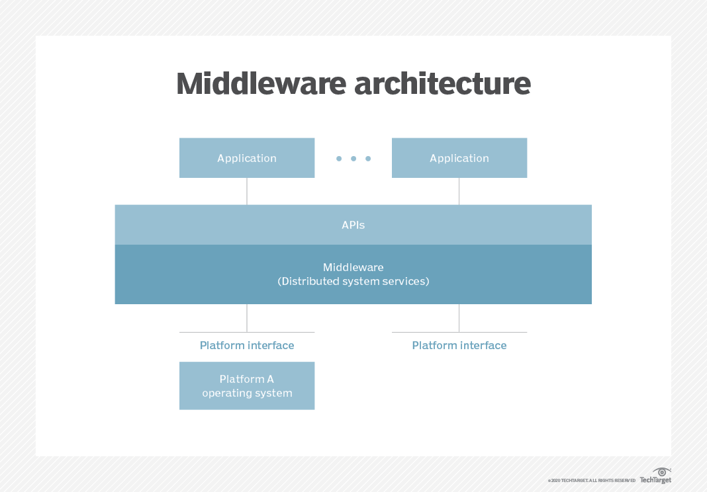

# System for Cross-domain Identity Management (SCIM), a set of application-level protocols, is helping securely manage and communicate user data across multiple domains. SCIM clients can be integrated to manage CRUD (create, replace, update, delete) operations, apply queries and filters, create user groups within your organization, and more. SCIM is designed to make user provisioning and management easier and more efficient, especially in cloud-based applications and services.

# What is SCIM?

System for Cross-domain Identity Management (SCIM), is an open standard that allows you to manage user identities by automating provisioning and deprovisioning processes. By clearly defining client (usually the IdP) and server roles, it allows secure communication between them. SCIM also allows you to automate user lifecycle management and maintain user accounts across platforms. 

Why is user lifecycle management so important? This is because of the complexity that this introduces. Hiring the right people is great, but the businesses also need to provision the right SaaS apps that they need to succeed in their jobs. This needs to be done while adhering to security policies, applying periodic patches, and updating accounts as they progress. But this is only the tip of the iceberg when it comes to user lifecycle management.

Revoking access is also needed when they leave their organization or when they move to another position or geolocation. You probably have many freelancers and third-parties that need to be taken care of as well. When done manually, this causes a lot of overhead and error risks.

With the SCIM protocol in place, employees don’t have to individually sign into all of the accounts. Because all user data is stored in a consistent way and transferred automatically, it can be shared with different SaaS apps. That said, complex exchanges are simplified and the risk of error is reduced significantly.

Implementing SCIM improves your overall security posture and reduces the attack surface. Furthermore, as the various teams in your organization enforce new workflows and add new SaaS apps to their toolkits, you can still make sure that there are no data privacy loopholes and ensure that data privacy is still being prioritized.

# How Does SCIM Work?

As mentioned earlier, the client is usually an Identity Provider (IdP) that handles all user IDs. There’s also the Service Provider (SP), usually a SaaS application that requires information subsets from the identities stored in the IdP.  Changes in the IdP automatically trigger new SCIM integrations. All changes automatically sync to the service provider as per the SCIM protocol.

The identity provider is also able to read IDs from the service provider which it can then add to its directory, while also picking up any incorrect values in the service provider that could create new vulnerabilities and security loopholes. End users can have smooth and continuous access to apps that have been assigned to them. Here are some key SCIM components you should be familiar with:

# The SCIM Protocol: 
A SCIM protocol is a HTTP-based application-level protocol that provisions and manages ID data both on the web and in cross-domain environments like inter-cloud scenarios or enterprise-to-cloud service providers There are many ways to authenticate and authorize users with the SCIM protocol – Bearer Tokens, PoP Token, HOBA Authentication, TLS Client Authentication. Transport Layer Security (TLS) is used to encrypt data for added safety.

# The SCIM Rest API
The SCIM Rest API supports actions like patching specific attributes or making bulk updates. Admins can also use Response functions to create a complete User resource. SCIM provides three endpoints, all supporting specific attribute details:

GET /Schemas – Introspect attribute extensions and resources
GET /ServiceProviderConfig – Spec compliance, authentication schemes
GET /ResourceTypes – Endpoint used to discover available resource types

Once you have implemented RESTful SCIM APIs for the application that is being used, you can make use of the specific calls based on your specific use cases and requirements. Here are just a few of the calls that you can use as per your needs: Create User, Get User by ID, Update User, Get User with “User Name” filter, Delete User, Get Users, Create Group, Get Groups, Patch Group. 

# SCIM Provisioning

In simple words, provisioning is like “saving a seat” for a user in a platform, while handling updates or deletions, also known as de-provisioning. SCIM provisioning eliminates the friction that admins often face while provisioning user accounts in SaaS applications. Things get even more challenging while having to manage, modify, or remove them. SCIM solves this issue by automating the account creation and deleting processes. Furthermore, it also becomes much easier to sync between SaaS applications and their core directory.

How does the SCIM provisioning specification operate? It uses HTTP request methods like POST, GET, DELETE, and more. Everything is done by using one specific programming language. This allows the smooth management of data throughout the entirety of the identity’s life cycle. 

Identity resources like groups and users are referred to as SCIM endpoints. Once the company defines them and sets them up, admins can start inputting and encoding ID data items like usernames, addresses, and other vital information. All SCIM objects then start operating inside a joint core schema that in turn exchanges with various domains and cloud applications as required.

SCIM Enabled API Examples
Azure SCIM API – Here, the SCIM 2.0 protocol is used for automatic provisioning. It connects to the SCIM endpoint and uses the SCIM user object schema along with REST APIs to automate provisioning and deprovisioning.
GitHub SCIM API – This API is used by SCIM-enabled IdPs for the automatic provisioning of GitHub membership. The GitHub SCIM endpoint that IdPs must use is attached.

Benefits of SCIM
SCIM makes cross-domain identity management much more effective, smooth, and secure. Here are some benefits companies can see after implementing SCIM.

Automation of Mundane IT Tasks: Provisioning accounts? Making new connections? Need to synchronize groups and permissions from the database? SCIM automates everything and allows IT teams to focus on more important tasks, while also reducing cross-department friction.
Smoother Identity Management in Cloud-Based Applications: More and more businesses are turning towards cloud-based apps and services for obvious reasons (ROI, scalability, etc). SCIM allows the management of identities in an efficient, organized, and accurate manner.  
Improved Security: Once you have implemented SCIM, you can manage your applications smoothly while significantly reducing the attack surface. This is a big boost to your security posture and data privacy (GDPR, CCPA, HIPAA, etc.) standards.
Reducing Frustrating Data Inconsistencies: SCIM updates all user IDs automatically, which means that time-consuming data inconsistencies go away. There’s less loss of information and less impact on your database data integrity. The possibility of human error or data redundancy is low.
Acts As a Standard System Linking Method: As your company starts scaling up, more and more SaaS apps and services are introduced into the ecosystem. SCIM serves as a standard system linking method where all kinds of user ID data can be modified or deleted automatically.

# SPML: Services Provisioning Markup Language is an Open Source XML-based standard that facilitates the exchange of account provisioning information among applications, services and organizations. SPML allows organizations to securely create, update and delete end-user accounts for many web services and applications using a single request from a central point.

Provisioning, as defined in the standard, is "the automation of all the steps required to manage (set up, amend and revoke) user or system access entitlements or data relative to electronically published services." SPML primarily focuses on user accounts, but can also be relevant for service or automated account objects.
technical working group within the Organization for the Advancement of Structured Information Standards (OASIS) first released SPML in 2003. SPML Version 1 is built on the OASIS Directory Services Markup Language (DSML). SPML version 2, released in 2006, is an XML representation of the Lightweight Directory Access Protocol (LDAP) and is based on the XML Schema Definition (XSD) language. SPML version 2 is the current version of the standard and is widely used in identity management and access control systems. SPML defines a set of operations for managing user accounts, including create, read, update, delete, and search operations. It also defines a set of data types and structures for representing user account information, such as user attributes, group memberships, and access control policies. SPML can be used in a variety of contexts, including enterprise identity management, cloud-based services, and federated identity management.

# Why use SPML?
As organizations use more web services and microservices, the need to create and maintain single user accounts across these systems becomes more complex. Service oriented architecture (SOA) defines many small web services instead of a single large service. Enterprise application integration (EAI) initiatives also try in integrate these disparate services together.

SPML is part of a family of standards designed to ease the implementation of web services and to establish interoperability among provisioning systems. SPML can be used in conjunction with Security Assertion Markup Language (SAML) to manage identity for web services. Middleware may use SPML to orchestrate accounts among many services.

As an example of how an organization could use SPML, imagine a new person is hired. A single new account request is entered into the service orchestration software. It creates a SPML request that creates new accounts in the company internal workflow system, the company Wi-Fi manager and the public web-based storage platform the company uses.

When the employee sets an initial password, the service orchestration software using SPML sends it to each service. When the employee leaves it can delete each of these accounts, increasing security and reducing the likelihood of paying for a service for an employee that no longer works for the organization.

# What are SPML capabilities?

* SPML provides the capability to manage the entire account lifecycle. This includes creating, finding, updating and deleting objects or accounts on the target service.
* Add: Creates a new object.
* Delete: Removes an existing object.
* Lookup: Requests information that represents the object. It can also search, list and iterate objects.
* Modify: Changes the attributes of an object.
* Passwords: Sets, resets and expires passwords associated with an object.
* Bulk operations: Runs bulk operations to modify or delete objects.x`